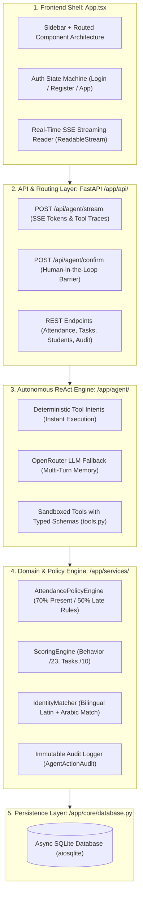

# AGENTS.md — StudentOps AI Workspace Guide

Welcome to StudentOps AI. This document provides unified instructions, architectural patterns, operational commands, and coding standards for all AI coding agents working within this repository.

---

## Project Overview

StudentOps AI is an AI-driven operations and HR platform for student communities, organizations, and leadership teams. It combines deterministic policy engines (attendance, scoring, scheduling) with an autonomous ReAct AI agent equipped with streaming tool execution and human-in-the-loop confirmation barriers.

### Core Stack
- Backend: Python 3.11+ / FastAPI / SQLAlchemy (Async SQLite with aiosqlite) / uv package manager / OpenRouter API (httpx SSE streaming).
- Frontend: React 19 / TypeScript 5.7+ / Vite 6 / Tailwind CSS / Lucide React / CVA (class-variance-authority).
- Data Engine: Deterministic policy engines for attendance scoring, multi-tier identity matching, and member performance evaluation.

---

## Development and Tooling Commands

### Python Environment (uv is mandatory)
> Rule: Always use uv for Python dependency management and running commands. Do NOT use raw pip or standard python without uv run.

```bash
# Install / sync backend dependencies
cd backend
uv sync

# Run database seed
uv run python -m app.seed.seed_data

# Start backend development server (Port 8000)
uv run uvicorn app.main:app --reload --host 127.0.0.1 --port 8000

# Run automated tests
uv run pytest tests -v
```

### Frontend Environment (npm and Vite)
```bash
cd frontend

# Install dependencies
npm install

# Run Vite dev server (Port 5173 with proxy to :8000)
npm run dev

# Run TypeScript typecheck & production build (Strict zero-error policy)
npm run build
```

### Launching Both Services
```powershell
# PowerShell one-click launcher from repo root
& ".\start-dev.ps1"
```

---

## Architecture and Layering Rules



### Critical Architecture Rules
1. **Never Give LLM Direct DB/API Access**: The LLM must interact through registered, typed tools in `app/agent/tools.py`.
2. **Human-in-the-Loop Barrier**: Any action categorized as sensitive (e.g., sending real-world reminders/messages via `send_reminder`) MUST require user confirmation (`requires_confirmation=True`).
3. **Deterministic First**: Inquiries matching known operational patterns (attendance, student scores, upcoming calendar events, pending tasks) are resolved via domain services directly to avoid LLM hallucinations.
4. **Zero Exposed Secrets**:
   - Never commit `.env`.
   - Always maintain `.env.example` with clear dummy placeholders.
   - Read secrets strictly through `app.core.config.Settings`.

---

## UI/UX Design System and Anti-Slop Standards

When creating or modifying frontend components, prompts, responses, or documentation, adhere strictly to the **2026 SaaS/AI standard** (Linear, Vercel, Stripe, Claude UI):

- **No Emoji Slop**: Strictly avoid emojis in UI components, headings, agent responses, prompts, documentation, and commit messages. Use clean SVG/Lucide icons or typographic hierarchy instead.
- **No AI Slop Visuals**: Avoid tacky neon cyan-on-black glows, meaningless pulsing particles, or generic low-density dashboard templates.
- **Light Mode Hierarchy**: Soft canvas background (`#F8FAFC`), crisp white cards (`bg-white border border-slate-200/80 shadow-sm`), muted uppercase headers (`text-[11px] font-semibold text-slate-500 uppercase tracking-wider`).
- **Typography**:
  - Main text: `Inter` / `system-ui`.
  - Numbers, metrics, timestamps, IDs: Tabular monospaced (`font-mono`).
  - Arabic strings: Crisp Arabic font rendering (`Cairo`).
- **Data Density**: Clean, edge-to-edge data tables with quiet hover states and no vertical borders.
- **Micro-Interactions**: Subtle scale transitions (`active:scale-[0.98]`), clear focus rings, and animated streaming tokens with a blinking cursor.

---

## Security and Code Hygiene Checklist

Before submitting code or committing changes:
- [ ] Run `npm run build` inside `frontend/` to ensure **0 TypeScript or JSX errors**.
- [ ] Run `uv run pytest tests -v` inside `backend/` to verify test suite passes.
- [ ] Ensure no private tokens, API keys, or credentials are hardcoded in source files.
- [ ] Verify zero emoji slop in new strings, UI components, prompts, and agent responses.
- [ ] Keep bilingual support intact (Arabic + English strings aligned cleanly).
