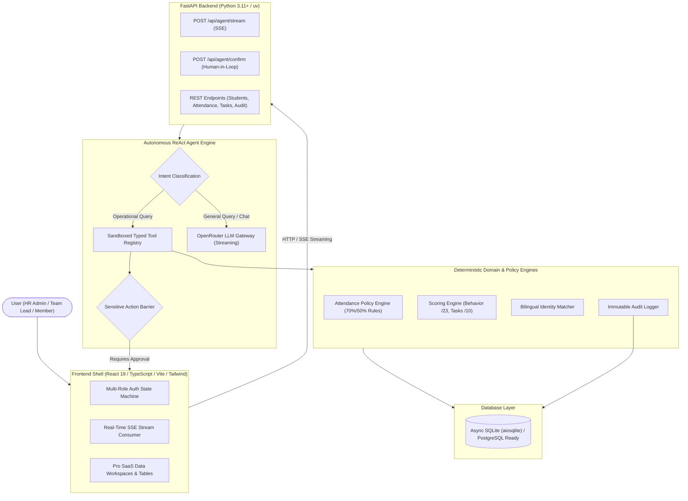

# StudentOps AI — Autonomous HR & Student Operations Platform

StudentOps AI is an enterprise-grade, agentic AI platform purpose-built for student organizations, university branches, technical clubs, and youth leadership teams.

It replaces fragmented spreadsheets, manual Google Meet tracking, and uncoordinated group messaging with an **Autonomous ReAct AI Agent** that executes operations through sandboxed tools, enforces deterministic evaluation policies, and requires explicit human approval before taking sensitive actions.

---

## Architecture Overview



---

## Core Modules & Capabilities

### 1. Multi-Role Authentication & Access Control
- **HR Admin**: Full administrative control across all operations, AI agent tools, and immutable audit logs.
- **Team Lead**: Manage team members, task submissions, meeting attendance, and reviews.
- **Member**: Personal dashboard to view attendance records, task deadlines, and evaluation scorecards.

### 2. Autonomous ReAct Agent with Token Streaming
- **Deterministic First**: Inquiries matching operational patterns (attendance, student scores, upcoming deadlines, pending tasks) are resolved instantly via domain policy engines with zero hallucination.
- **OpenRouter LLM Fallback**: Natural conversation, advice, and general HR queries stream token-by-token directly from OpenRouter.
- **Collapsible Tool Traces**: Tool execution metadata, parameters, and outputs render cleanly in collapsible accordion chips above the response text.

### 3. Human-in-the-Loop Confirmation Barrier
- Sensitive external actions (e.g., dispatching mass WhatsApp/SMS reminders to absent students) are intercepted before execution.
- The agent generates a message preview, compiles recipient contacts, and waits for explicit user confirmation before dispatching.

### 4. Deterministic Evaluation & Attendance Policies
- **Attendance Rules**:
  - `PRESENT`: Joined within 10 minutes of start time and attended at least 70% of meeting duration.
  - `LATE`: Joined after 10 minutes and attended at least 50% of meeting duration.
  - `EXCUSED`: Official excuse accepted by HR leadership.
  - `ABSENT`: Did not join or attended less than 50% of duration without an excuse.
- **Evaluation Scoring Standard**:
  - Task Quality: Average score across assignments (out of 10.0 pts).
  - Behavior & Discipline: Group Interaction (/5) + Social Media Engagement (/5) + Hierarchy & Rules (/5) + Polite Conduct (/8) = **Total /23.0 pts**.

### 5. Dedicated Workspaces & Pages
- **Overview Dashboard**: High-density operational telemetry, live KPI cards, quick actions, and meeting snapshots.
- **Agent Console**: Claude/Gemini-style centered chat stream with live token animation, tool accordions, and bottom-anchored input.
- **Member Registry**: Searchable directory with status filters, role pills, avatar initials, and contact details.
- **Meet Attendance**: Meeting session breakdown with attendance ratio bars and Present/Late/Absent counters.
- **Evaluations Scoreboard**: Ground-truth ranking table showing attendance stats, task averages, and behavior points.
- **Schedule & Calendar**: Unified timeline syncing Google Meet sessions, deadlines, and milestones.
- **Tasks & Sprints**: Linear-style issue tracker with issue IDs (e.g., `TSK-1`), submission counts, and max scores.
- **Task Reviews**: Split-panel grading console with interactive score chips (1-10) and reviewer notes.
- **Reminders & Notifications**: Multi-channel notification composer with pre-built operational templates and dispatch history.
- **Audit Log**: Immutable, terminal-style developer log viewer tracking all agent tool executions and authorization events.

---

## Getting Started

### Prerequisites

Ensure you have the following installed on your machine:
- **Python**: Version 3.11 or higher
- **uv**: Modern, fast Python package manager (`pip install uv` or `curl -LsSf https://astral.sh/uv/install.sh | sh`)
- **Node.js**: Version 18 or higher with `npm`
- **Git**: For version control

---

### Step 1: Obtain an OpenRouter API Key

StudentOps AI uses [OpenRouter](https://openrouter.ai/) as its primary LLM gateway, supporting free and paid models without vendor lock-in.

1. Navigate to [openrouter.ai](https://openrouter.ai/) and create an account (or sign in with GitHub/Google).
2. Go to [openrouter.ai/keys](https://openrouter.ai/keys).
3. Click **Create Key**.
4. Name your key (e.g., `StudentOps-Dev`) and click **Create**.
5. Copy your secret key (`sk-or-v1-...`). Keep this key private.

> **Note on Free Models**: You can run StudentOps AI at zero cost by selecting a free-tier model on OpenRouter such as `nvidia/nemotron-3-super-120b-a12b:free`, `meta-llama/llama-3.3-70b-instruct:free`, or `google/gemini-2.0-flash-exp:free`.

---

### Step 2: Configure Environment Variables

1. Navigate to the backend directory:
   ```bash
   cd backend
   ```
2. Create your `.env` file by copying the provided example:
   ```bash
   cp .env.example .env
   ```
   *(On Windows PowerShell: `Copy-Item .env.example .env`)*

3. Open `backend/.env` in your editor and configure your OpenRouter key and desired model:
   ```env
   # OpenRouter LLM Gateway
   OPENROUTER_API_KEY=sk-or-v1-your-actual-api-key-here
   OPENROUTER_MODEL=nvidia/nemotron-3-super-120b-a12b:free

   # Application Environment
   ENVIRONMENT=development
   DEBUG=true

   # Messaging Provider ("mock" logs to console, "whatsapp" uses Twilio)
   MESSAGING_PROVIDER=mock
   ```

---

### Step 3: Backend Installation & Setup

1. From the `backend/` directory, sync dependencies using `uv`:
   ```bash
   uv sync
   ```
2. Initialize and seed the SQLite database with baseline member records, attendance logs, and tasks:
   ```bash
   uv run python -m app.seed.seed_data
   ```
3. Start the FastAPI backend server:
   ```bash
   uv run uvicorn app.main:app --reload --host 127.0.0.1 --port 8000
   ```
   - API Server: `http://127.0.0.1:8000`
   - Interactive OpenAPI Documentation: `http://127.0.0.1:8000/docs`

---

### Step 4: Frontend Installation & Launch

1. Open a new terminal and navigate to the frontend directory:
   ```bash
   cd frontend
   ```
2. Install frontend dependencies:
   ```bash
   npm install
   ```
3. Start the Vite development server:
   ```bash
   npm run dev
   ```
   - Application Web UI: `http://localhost:5173`

> The Vite dev server is pre-configured to proxy all `/api` calls directly to the FastAPI server at `http://127.0.0.1:8000`.

### WhatsApp Agent Test Mode

The HR Admin-only `/whatsapp-agent` workspace sends one manually entered message through pywhatkit and WhatsApp Web.

1. Install the backend dependency with `cd backend && uv add pywhatkit` (or run `uv sync` after the dependency is present in `pyproject.toml`).
2. Copy `.env.example` to `.env` and configure `WHATSAPP_SENDER_PHONE`, `WHATSAPP_WAIT_TIME`, and `WHATSAPP_TAB_CLOSE`.
3. Start the backend and frontend using the commands above.
4. Log the intended sender account into WhatsApp Web in the browser session pywhatkit will use.
5. Open `/whatsapp-agent`, enter an international recipient number and test message, then click **Send WhatsApp Message**.
6. Verify the message arrives and review the success or failure status in the page.

`WHATSAPP_SENDER_PHONE` is metadata only. pywhatkit does not accept a sender phone parameter; the sender is whichever account is currently logged into WhatsApp Web. Messages are not stored by this test endpoint.

### Automated Task Reminders

The backend starts a cancellable background scheduler with the FastAPI lifespan. It checks overdue tasks at the configured interval and calls `check_task_followups()` in the task follow-up service. The initial stage runs once after `TASK_REMINDER_DELAY_HOURS` (24 hours by default) and only considers active members who have not submitted the task and have a valid phone number.

Configure the workflow in `backend/.env`:

```env
TASK_REMINDER_ENABLED=true
TASK_REMINDER_DELAY_HOURS=24
TASK_REMINDER_CHECK_INTERVAL_MINUTES=60
```

The HR Admin can view the current status, timestamps, and eligible/sent/failed/skipped counts in the WhatsApp Agent workspace and can temporarily enable or disable the scheduler there. Each task/member/stage claim is stored in `task_reminders` with a unique constraint, so repeated or concurrent scheduler runs cannot send the same stage twice. Failed deliveries remain recorded as `FAILED` and do not crash later reminders.

Automatic messages are generated from backend-provided member name, task title, deadline, overdue hours, and stage context, then sent through the existing `send_whatsapp_message` tool. Automated tests mock that tool and never open WhatsApp Web. For real testing, the intended sender account must already be authenticated in the WhatsApp Web browser session used by pywhatkit; the scheduler cannot bypass that authentication.

#### Safe Autonomous E2E Test

For a real browser-automation test, set these values in `backend/.env`:

```env
TASK_REMINDER_ENABLED=true
WHATSAPP_TEST_MODE=true
WHATSAPP_TEST_RECIPIENT=+20XXXXXXXXXXX
WHATSAPP_TEST_DELAY_MINUTES=1
```

Start the backend with `cd backend; uv run uvicorn app.main:app --reload --port 8000`, log the intended sender account into WhatsApp Web, then start the frontend and open **StudentOps → WhatsApp Agent**. Confirm the warning says `TEST MODE`, verify the displayed recipient, enter a test message, and click **Start Automated Test**. The endpoint only creates an isolated synthetic test record; the background scheduler waits for the configured delay and then runs the same agent and `send_whatsapp_message` tool used by production follow-ups. Keep the browser/session available and wait for the scheduler interval.

After verification, disable it and remove the recipient:

```env
WHATSAPP_TEST_MODE=false
WHATSAPP_TEST_RECIPIENT=
```

The result appears in the page status panel. HR Admins can also open **Audit Log** and look for `AUTOMATIC_TASK_REMINDER_TEST`, `send_whatsapp_message`, and `automatic_task_reminder_test`; the audit result contains `SENT` or `FAILED` and any safe failure reason. Synthetic test records live in `task_reminder_tests` and cannot create production member reminders or duplicates.

---

### Alternative: One-Click Startup (PowerShell)

On Windows systems, you can start both the backend and frontend simultaneously with the root launch script:

```powershell
& ".\start-dev.ps1"
```

---

## Supported LLM Models on OpenRouter

You can change the active model at any time in `backend/.env` by updating `OPENROUTER_MODEL`:

| Model Identifier | Provider / Type | Description |
|---|---|---|
| `nvidia/nemotron-3-super-120b-a12b:free` | NVIDIA (Free) | 120B MoE model optimized for agentic reasoning and long context. |
| `meta-llama/llama-3.3-70b-instruct:free` | Meta (Free) | High-performance open-source instruction model. |
| `google/gemini-2.0-flash-exp:free` | Google (Free) | Fast, low-latency reasoning and conversational model. |
| `anthropic/claude-3.5-sonnet` | Anthropic (Paid) | Industry standard for nuanced reasoning, formatting, and coding. |
| `openai/gpt-4o` | OpenAI (Paid) | Flagship multimodal model with structured response handling. |

---

## Automated Testing & Validation

### Backend Test Suite
The backend includes automated unit, integration, and end-to-end evaluation tests:

```bash
cd backend
uv run pytest tests -v
```

Test coverage includes:
- `tests/unit/test_attendance_policy.py`: On-time, late, excused, and absence duration logic.
- `tests/unit/test_identity_matcher.py`: Multi-tier bilingual matching (exact email, transliterated Latin, normalized Arabic).
- `tests/unit/test_scoring.py`: Mathematical verification of task and behavior scoring models.
- `tests/integration/test_agent_tools.py`: Tool execution sandbox and sensitive confirmation interception.
- `tests/evals/test_demo_workflow.py`: Multi-turn conversational evaluation of the complete HR workflow.

### Frontend TypeScript Verification
Ensure all TypeScript definitions and JSX components compile with zero errors:

```bash
cd frontend
npm run build
```

---

## Repository Structure

```
StudentOps AI/
├── .github/
│   ├── ISSUE_TEMPLATE/       # Structured Bug, Feature, and Agent Tool issue forms
│   ├── workflows/ci.yml      # Automated GitHub Actions CI pipeline (Python + Node)
│   ├── copilot-instructions.md
│   └── pull_request_template.md
├── backend/
│   ├── app/
│   │   ├── agent/            # ReAct loop, prompt definitions, tool registry
│   │   ├── api/              # FastAPI routers (/agent/stream, /students, /tasks, etc.)
│   │   ├── core/             # Pydantic Settings, Async Database session
│   │   ├── models/           # SQLAlchemy DB entities and Pydantic schemas
│   │   ├── providers/        # Google Workspace, Twilio/WhatsApp, OpenRouter clients
│   │   ├── seed/             # Database seeder with sample data
│   │   └── services/         # Attendance policy, scoring, identity matcher, audit
│   ├── tests/                # Automated pytest suite (unit, integration, evals)
│   ├── .env.example          # Environment variable template
│   └── pyproject.toml        # Backend dependencies (managed via uv)
├── frontend/
│   ├── src/
│   │   ├── api/              # Typed fetch client (proxied to :8000)
│   │   ├── components/       # UI pages and components
│   │   │   ├── auth/         # Login and Register pages
│   │   │   └── ui/           # Reusable primitives (Card, Button, Badge, ProgressBar)
│   │   ├── types/            # Shared TypeScript interfaces
│   │   ├── App.tsx           # Auth state machine and sidebar navigation shell
│   │   └── main.tsx
│   ├── package.json
│   └── tailwind.config.js
├── AGENTS.md                 # Universal guidelines for AI coding agents
├── CLAUDE.md                 # Specific instructions for Claude Code CLI
├── .cursorrules              # Rules for Cursor IDE
├── start-dev.ps1             # One-click dev launcher
└── README.md
```

---

## Security & Privacy Guidelines

- **Zero Hardcoded Secrets**: Secrets and API keys are strictly read through `app.core.config.Settings` from environment variables. `.env` is permanently excluded via `.gitignore`.
- **Sandboxed Agent Operations**: The LLM operates strictly through typed, registered tools with input validation. It has no direct database or arbitrary network access.
- **Human Authorization**: Any external or disruptive action requires human review and confirmation before execution.
- **Immutable Audit Trail**: Every tool call, confirmation decision, and system query is permanently logged to `AgentActionAudit`.

---

## License

This project is licensed under the MIT License.
