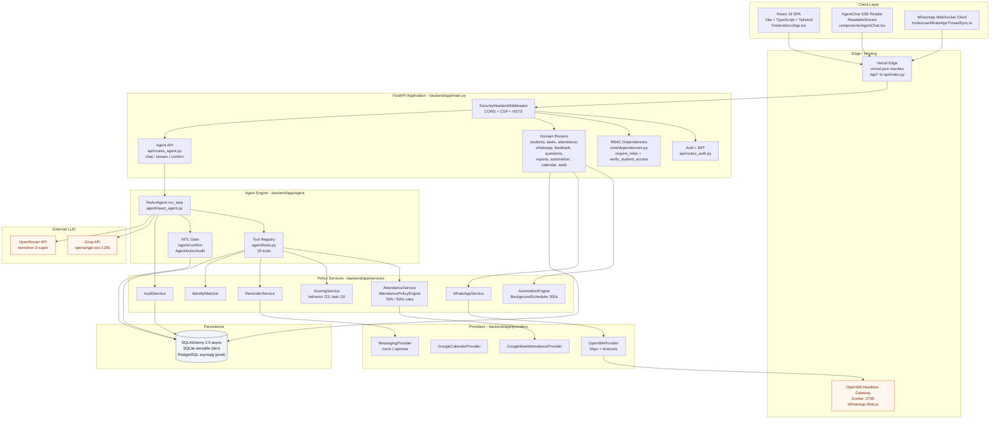
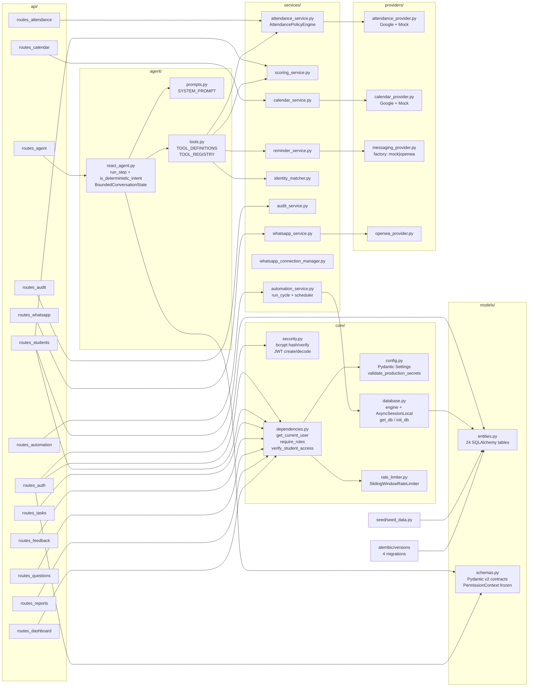
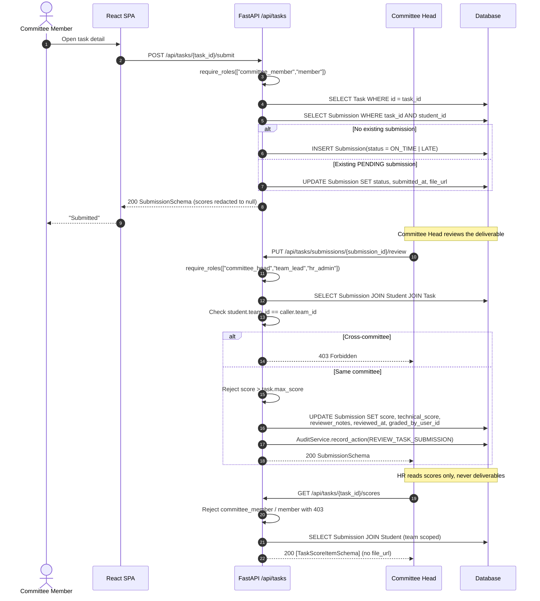
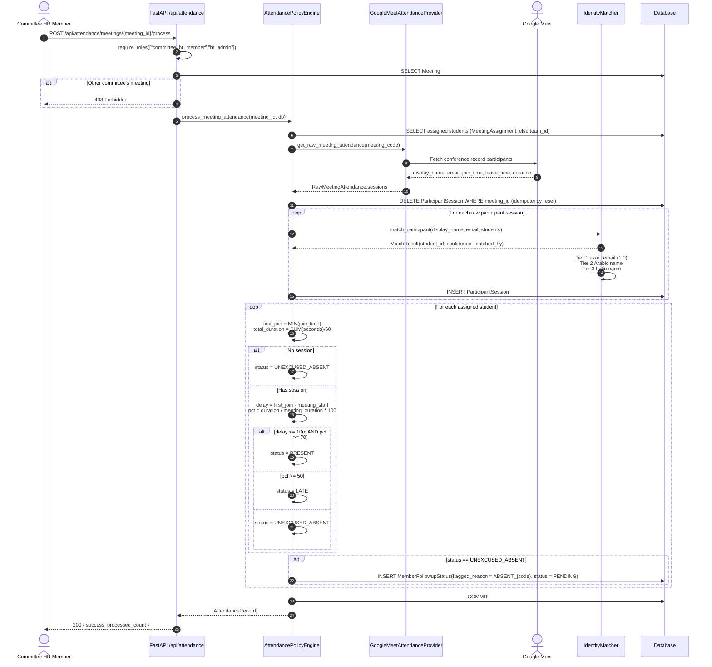
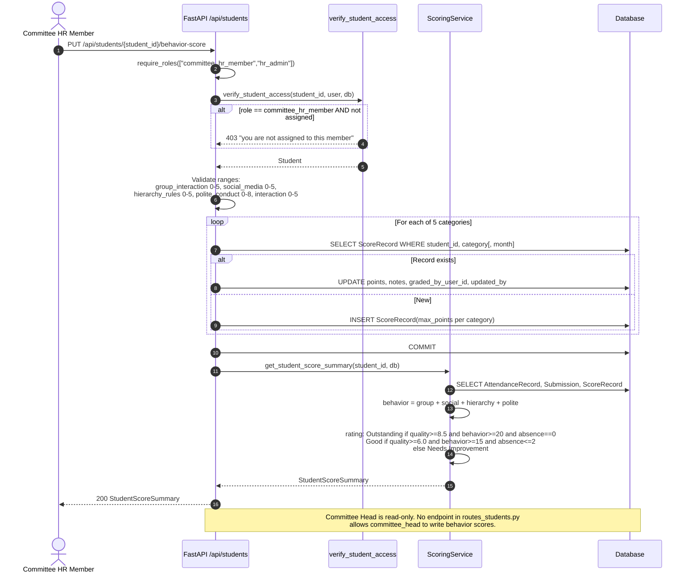
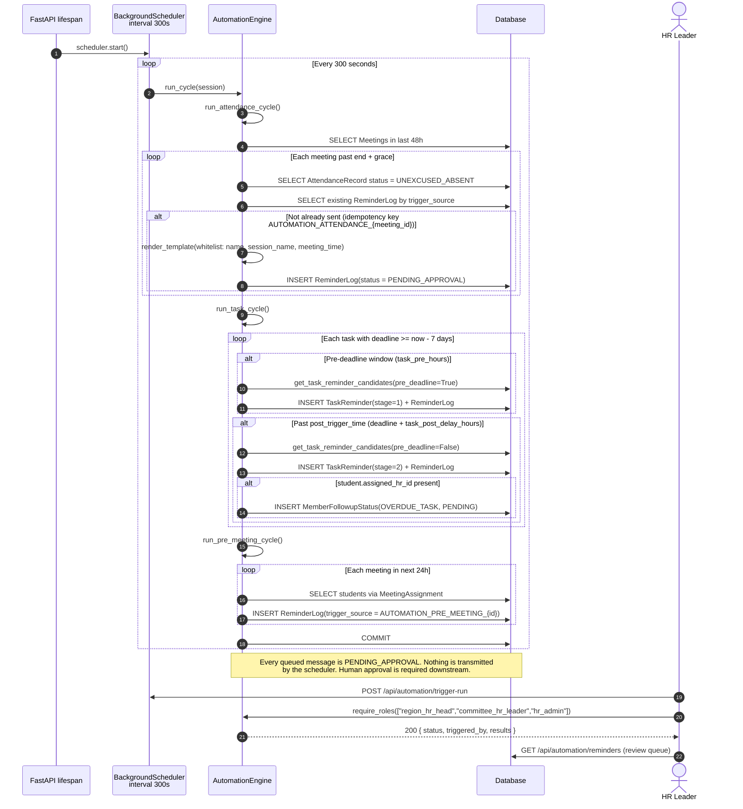
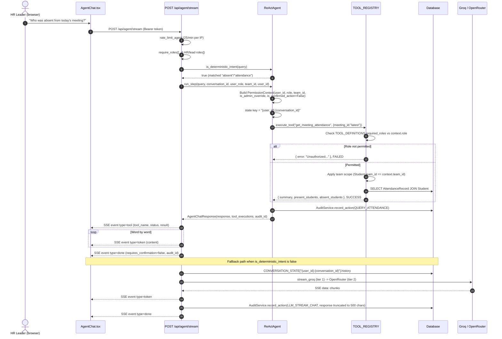
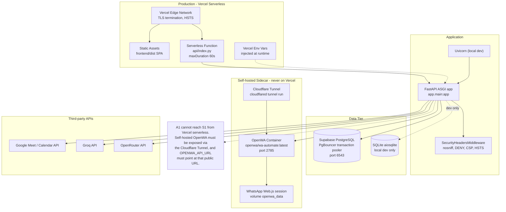

# 01 — System Design

> Confidence tags: **[VERIFIED]** read directly in the cited file/function · **[INFERRED]** deduced from structure · **[UNKNOWN]** could not be determined.

## 1. Purpose and scope

StudentOps AI is a bilingual (Arabic/English) operations and HR platform for student organizations. It manages committees, members, meetings with attendance capture, tasks and submissions, behavior/task scoring, calendar events, member Q&A, member feedback on HR staff, committee reports, scheduled reminders, and a WhatsApp channel. An AI agent answers natural-language operational questions and can dispatch reminders behind a human-in-the-loop confirmation gate.

**In scope:** the FastAPI backend, the React SPA, the deterministic policy engines, the ReAct agent, the WhatsApp/OpenWA channel, the background automation scheduler, and the persistence layer.

**Out of scope in this codebase:** a real Google Meet integration (stubbed), a real Google Calendar integration (stubbed), any AWS service usage (boto3 is declared but never imported), and the meaning of the `total_score` formula (explicitly deferred).

## 2. Users and primary journeys

Roles are the eight strings in `ROLE_EQUIVALENTS` (`backend/app/core/dependencies.py:106`). Journeys below are traced from route guards in `backend/app/api/routes_*.py`.

| Role | Primary journey | Entry points |
|---|---|---|
| `region_hr_head` | Monitor all committees, read aggregated reports, acknowledge reports, oversight WhatsApp threads, manage nothing operationally | `GET /api/reports`, `POST /api/reports/{id}/acknowledge`, `GET /api/whatsapp/threads?oversight=true` |
| `hr_admin` | System administration: create teams, change user roles, read audit logs, cross-committee override | `POST /api/auth/teams`, `PATCH /api/auth/users/{id}/role`, `GET /api/audit/logs` |
| `committee_hr_leader` | Own a committee: view cohort scores, review and action member feedback, assign cohorts, submit reports upward, read escalation list | `POST /api/students/assign-cohort`, `PATCH /api/feedback/{id}/status`, `POST /api/reports/submit-to-head` |
| `committee_head` / `team_lead` | Technical side: create tasks and meetings, review submissions, assign technical scores. **Read-only on behavior scores. Blocked from member feedback.** | `POST /api/tasks`, `PUT /api/tasks/submissions/{sid}/review`, `POST /api/attendance/meetings` |
| `committee_hr_member` | HR side: process attendance, correct statuses, write behavior scores /23, WhatsApp their assigned cohort, escalate | `POST /api/attendance/meetings/{id}/process`, `PUT /api/students/{id}/behavior-score` |
| `committee_member` / `member` | Submit tasks, view own attendance, submit feedback about HR, ask questions, read own reminders | `POST /api/tasks/{id}/submit`, `POST /api/feedback`, `POST /api/questions` |

**Blocked for committee members entirely:** `/api/students/scoreboard/all`, `/api/students/{id}/score`, `/api/tasks/{id}/scores`, `/api/tasks/submissions/{sid}/score`, and all of `/api/agent/*`. **[VERIFIED]** `routes_students.py:191`, `routes_students.py:245`, `routes_tasks.py:315`, `routes_tasks.py:534`, `routes_agent.py:30`.

## 3. High-level architecture

*Shows every runtime component and its dependency direction. Use it to orient yourself before reading any specific module.*

Standalone source: [`diagrams/01-architecture.mmd`](diagrams/01-architecture.mmd) · rendered: [`rendered/01-architecture.svg`](diagrams/rendered/01-architecture.svg)

## 4. Component responsibilities

*Module-level dependency map. Use it to find which file owns a behavior before changing it.*

Standalone source: [`diagrams/01-components.mmd`](diagrams/01-components.mmd)

| Component | File | Responsibility | Notable detail |
|---|---|---|---|
| Settings | `app/core/config.py` | All env config, `.env` loading, production secret guard | `validate_production_secrets` raises at import if `ENVIRONMENT=production` and `JWT_SECRET_KEY` is the dev default or `DATABASE_URL` contains `sqlite` **[VERIFIED]** |
| DB session | `app/core/database.py` | Async engine, `get_db()` dependency, `init_db()` | Relative SQLite paths anchored to `backend/`; pooled Postgres URLs disable prepared-statement caches **[VERIFIED]** `database.py:41-52` |
| Auth crypto | `app/core/security.py` | bcrypt (rounds=12), access/refresh JWT, invitation tokens | Refresh tokens carry a `jti`; invitations are SHA-256 hashed before storage **[VERIFIED]** |
| RBAC | `app/core/dependencies.py` | `get_current_user`, `get_current_active_user`, `require_roles`, `verify_student_access` | `verify_student_access` has a `mode` of `read` / `write` / `chat` with different rules per role **[VERIFIED]** `dependencies.py:163-253` |
| Rate limiter | `app/core/rate_limiter.py` | In-memory sliding-window log | Keyed on `request.client.host`; ignores `X-Forwarded-For` **[VERIFIED]** `get_client_ip` |
| Policy: attendance | `app/services/attendance_service.py` | Fetch raw logs, match identities, aggregate, classify | Idempotent: deletes `ParticipantSession` rows per meeting before reinsert; preserves existing `excuse_status` **[VERIFIED]** |
| Policy: scoring | `app/services/scoring_service.py` | Build `StudentScoreSummary` | `total_score` is hard-coded `None` with `total_score_status="PENDING_FORMULA_DEFINITION"` **[VERIFIED]** `scoring_service.py:68-70` |
| Identity | `app/services/identity_matcher.py` | Match Meet participants to students | Arabic normalization (أ/إ/آ→ا, ى/ي, ة→ه) then token-set Jaccard confidence **[VERIFIED]** |
| Automation | `app/services/automation_service.py` | 3 cycles + scheduler | Every message written with `status="PENDING_APPROVAL"`; the scheduler never transmits **[VERIFIED]** |
| Agent | `app/agent/react_agent.py` | Intent routing, tool execution, LLM fallback | Keyword intent matching, not LLM function-calling **[VERIFIED]** |
| Tools | `app/agent/tools.py` | 15 registered handlers, role allowlist, team scoping | `PermissionContext` is the only channel for authz into tools **[VERIFIED]** |
| Audit | `app/services/audit_service.py` | Write and read `AgentActionAudit` | Table protected by DB triggers against DELETE and critical-field UPDATE **[VERIFIED]** `entities.py:475-546` |

## 5. Tech stack

Versions from `backend/pyproject.toml` and the resolved `uv.lock` / `backend/requirements.txt`.

| Layer | Technology | Version constraint | Source |
|---|---|---|---|
| Language | Python | `>=3.11` (local venv on 3.14) | `pyproject.toml:5` |
| Web framework | FastAPI | `>=0.115.0` | `pyproject.toml:7` |
| ASGI server | Uvicorn (standard) | `>=0.32.0` | `pyproject.toml:8` |
| Validation | Pydantic v2 + pydantic-settings | `>=2.9.0` / `>=2.5.0` | `pyproject.toml:9-10` |
| ORM | SQLAlchemy (async) | `>=2.0.35` | `pyproject.toml:12` |
| DB drivers | `aiosqlite` (dev), `asyncpg` (prod) | `>=0.20.0` / `>=0.30.0` | `pyproject.toml:13,20` |
| Migrations | Alembic | `>=1.19.2` | `pyproject.toml:23` |
| Auth crypto | `pyjwt`, `bcrypt` | `>=2.8.0` / `>=4.0.0` | `pyproject.toml:18-19` |
| HTTP client | `httpx` | `>=0.27.2` | `pyproject.toml:17` |
| LLM HTTP | `httpx` direct (no SDK) | — | `agent/react_agent.py` |
| LLM providers | Groq, OpenRouter | REST `/chat/completions` | `core/config.py:48-58` |
| Frontend | React | 19 | `frontend/package.json` |
| Build | Vite + TypeScript strict | — | `frontend/package.json` |
| Styling | Tailwind CSS | — | `frontend/tailwind.config.js` |
| Icons | Lucide React | — | `frontend/package.json` |
| Hosting | Vercel serverless + static | `maxDuration: 60` | `vercel.json` |
| Messaging | OpenWA (`openwa/wa-automate`) via Docker | — | `docker-compose.yml` |
| CI | GitHub Actions | — | `.github/workflows/ci.yml` |

**Correction to the design notes:** `boto3>=1.35.0` is declared in `pyproject.toml:15` and pinned to `1.43.80` in `requirements.txt:19`, but a repository-wide search of `backend/app/` and `api/` finds **zero** `import boto3`. The AWS SDK is not used by the running application. **[VERIFIED]**

## 6. Key flows

### 6.1 Task submission and review

*The submit → review → score-collection split across three roles. Use it to understand why HR cannot see deliverables.*

Standalone source: [`diagrams/01-flow-task-submission.mmd`](diagrams/01-flow-task-submission.mmd)

The deliberate separation: `committee_hr_member` writes **behavior** scores (`/23`) but is **forbidden** (`403`) from `GET /api/tasks/{task_id}/submissions` and `GET /api/tasks/submissions/{sid}`; `committee_head` writes **technical** scores (`/10`) but is **forbidden** from `PUT /api/students/{id}/behavior-score`. **[VERIFIED]** `routes_tasks.py:394-399`, `routes_students.py:266`.

### 6.2 Attendance capture

*The deterministic attendance pipeline. Use it when debugging why a member was or was not marked absent.*

Standalone source: [`diagrams/01-flow-attendance.mmd`](diagrams/01-flow-attendance.mmd)

Policy thresholds come from settings, not literals: `ATTENDANCE_LATE_THRESHOLD_MINUTES=10`, `ATTENDANCE_MIN_PRESENT_PERCENT=70.0`, `ATTENDANCE_MIN_LATE_PERCENT=50.0`. **[VERIFIED]** `core/config.py:82-84`. A per-call `late_threshold_minutes` override exists on `AttendancePolicyEngine.evaluate_status` and `process_meeting_attendance` but no REST endpoint passes it — it is always `None` in the current API. **[VERIFIED]**

### 6.3 Score assignment

*Behavior-score upsert across five categories and the rating rule. Use it when changing the /23 rubric.*

Standalone source: [`diagrams/01-flow-score-assignment.mmd`](diagrams/01-flow-score-assignment.mmd)

The `INTERACTION` category (max 5) is written by this endpoint and returned as `interaction_score`, but it is **excluded** from `total_behavior_score` (which sums only group + social + hierarchy + polite = 5+5+5+8 = 23). **[VERIFIED]** `scoring_service.py:60-64`.

### 6.4 Reminder job

*Scheduler lifecycle, the three cycles, and idempotency keys. Use it when adding or debugging an automated notification.*

Standalone source: [`diagrams/01-flow-reminder-job.mmd`](diagrams/01-flow-reminder-job.mmd)

| Property | Value | Source |
|---|---|---|
| Schedule | `asyncio` task, `interval_seconds = 300` | `automation_service.py:459` |
| Trigger | Started in the FastAPI `lifespan` handler; stopped on shutdown | `main.py:39,45` |
| Idempotency | `ReminderLog.trigger_source` = `AUTOMATION_ATTENDANCE_{meeting.id}` / `AUTOMATION_TASK_PRE_{task.id}` / `AUTOMATION_TASK_POST_{task.id}` / `AUTOMATION_PRE_MEETING_{meeting.id}`; also `TaskReminder(task_id, student_id, stage)` uniqueness check | `automation_service.py:152-160,232-241,296-305` |
| Multi-instance | None. The scheduler starts per process. Two workers would double-run, but the `trigger_source` pre-fetch prevents duplicate `ReminderLog` rows within a run. **[INFERRED]** | `automation_service.py:441-459` |
| Failure handling | The whole cycle is wrapped in `try/except`; a failure logs and the loop sleeps, so it never crashes the app | `automation_service.py:447-450` |
| Template safety | `render_template` replaces only `{name}`, `{task_name}`, `{deadline}`, `{session_name}`, `{meeting_time}` — no `eval`, no format-string injection | `automation_service.py:41-66` |
| Actual sending | Never. All rows are written with `status="PENDING_APPROVAL"`. Only the agent HITL path (`tool_send_reminder` after `/api/agent/confirm`) actually calls `provider.send_batch` | `automation_service.py:180,246,309,368` |

### 6.5 Agent chat request

*One full agent turn, deterministic branch and LLM fallback. Use it when debugging why the agent called the LLM when it should not have.*

Standalone source: [`diagrams/01-flow-agent-chat.mmd`](diagrams/01-flow-agent-chat.mmd)

## 7. Deployment and infrastructure

*Where each piece runs and what can reach what. Use it to reason about network reachability and the serverless constraint.*

Standalone source: [`diagrams/01-deployment.mmd`](diagrams/01-deployment.mmd)

| Environment | Definition | Behavior |
|---|---|---|
| Local dev | `ENVIRONMENT=development`, `DATABASE_URL=sqlite+aiosqlite:///./studentops.db` | `init_db()` creates tables, `seed_all()` runs automatically on startup, mock providers are selected, `DEBUG=true` leaks exception text in 500 responses | 
| Production | `ENVIRONMENT=production` | `config.py` refuses to start on the default `JWT_SECRET_KEY` or a SQLite `DATABASE_URL`; HSTS header added; `DEBUG` defaults `False` in the code path used by the exception handler; **seeding is skipped**; live providers selected |

**Secrets handling.** All secrets come from environment variables via `pydantic-settings` (`Settings` in `app/core/config.py`), loaded from `backend/.env` with `override=False` so real env vars win. `backend/.env.example` is the template. CI fails the build if `backend/.env` is tracked in git and runs a TruffleHog `--only-verified` scan. **[VERIFIED]** `.github/workflows/ci.yml:52-68`.

**Notable deployment constraint:** `BackgroundScheduler.start()` runs in the FastAPI lifespan. On Vercel serverless that means the 300-second automation loop never fires (a function is torn down well before 300 s of continuous execution, and `maxDuration` is 60 s). `POST /api/automation/trigger-run` is therefore the only working path on Vercel. **[INFERRED]** from `vercel.json` `maxDuration: 60` and `main.py:39`.

## 8. Non-functional characteristics

### Error handling

- A global `@app.exception_handler(Exception)` in `main.py:96` returns a generic message in production and the exception text only when `DEBUG and ENVIRONMENT == "development"`.
- Domain handlers raise `HTTPException` with explicit codes. Validation errors are Pydantic v2 (422).
- **Leaked `str(e)` in one production path:** `AttendanceService.process_meeting_attendance` raises `ValueError(f"Meeting with ID/code '{meeting_id}' not found.")`, which `POST /api/attendance/meetings/{id}/process` converts to a 404 body containing that text. Low severity — it echoes back the caller's own input. **[VERIFIED]** `routes_attendance.py:236-237`
- `global_exception_handler` logs `exc_info=True`, so tracebacks go to the server log but not the response in production.

### Logging

- `logging.getLogger("studentops.security")` for the app and `logging.getLogger("studentops.automation")` for the scheduler. No structured logging, no request IDs, no correlation IDs. **No logging configuration is set up** — the default `logging` behaviour applies (WARNING to stderr for the root logger; `logger.info` calls in `automation_service.py` will not be emitted unless the app configures logging). **[VERIFIED]**

### Rate limits

| Key | Limit | Window | Applied to |
|---|---|---|---|
| `rate_limit_login` | 60 | 60 s | `POST /api/auth/login`, `POST /api/auth/token` |
| `rate_limit_register` | 5 | 60 s | `POST /api/auth/register` |
| `rate_limit_refresh` | 30 | 60 s | `POST /api/auth/refresh` |
| `rate_limit_agent` | 25 | 60 s | `POST /api/agent/chat`, `POST /api/agent/stream` |
| `rate_limit_webhook` | 120 (hard-coded) | 60 s | `POST /api/whatsapp/webhook` |

`RATE_LIMIT_GENERAL_PER_MINUTE = 120` is **declared in `config.py:102` but never used** — no general dependency is created. **[VERIFIED]**

### Security headers

Set by `SecurityHeadersMiddleware` (`main.py:52-77`): `X-Content-Type-Options: nosniff`, `X-Frame-Options: DENY`, `Referrer-Policy: strict-origin-when-cross-origin`, a restrictive `Permissions-Policy`, a CSP with `frame-ancestors 'none'`, and HSTS when `ENVIRONMENT=production`.

### Scalability limits

- **Rate limiting is per-process and in-memory.** With more than one worker, effective limits multiply. **[VERIFIED]**
- **Agent conversation state is in-memory** (`BoundedConversationState`, LRU 1000, TTL 24 h). It is lost on restart and not shared between instances, so a chat cannot span a cold start or a second replica. **[VERIFIED]** `react_agent.py:22-146`
- **Provider selection happens at import time** (`tools.py:37-38`). Changing `MESSAGING_PROVIDER` requires a process restart. **[VERIFIED]**
- `ScoringService.get_all_summaries` runs 3 queries per student in a Python loop — an N+1 that grows linearly with member count. Called by `GET /api/students/scoreboard/all` and `tool_get_scores`. **[VERIFIED]** `scoring_service.py:95-106`
- `routes_tasks.py:list_tasks` issues 3 queries per task in a loop (assignment count, submissions, assignment count again). **[VERIFIED]**

### Known trade-offs

1. **Deterministic-first agent.** Keyword intent matching before any LLM call keeps operational answers exact and free, at the cost of brittleness on novel phrasings. A miss silently falls through to the LLM, which is instructed not to answer operational questions.
2. **Score/submission separation.** A clean confidentiality boundary, but it means no single role can see the full picture of a submission's grading.
3. **`create_all` over Alembic at startup.** Convenient for a demo; it makes the migration history non-authoritative. See [05-database.md](05-database.md) §5.
4. **Mock providers as the default.** Demos and tests are deterministic and offline; a production deployment must set `ENVIRONMENT=production` or `MESSAGING_PROVIDER=openwa` or it will silently run on fakes.

## 9. Gaps and open questions

| # | Item | Severity |
|---|---|---|
| 1 | `boto3` is a declared dependency with no usage. Either remove it or the AWS integration is unfinished. | Low |
| 2 | `GoogleMeetAttendanceProvider` and `GoogleCalendarProvider` are stubs. Attendance in any non-mock environment returns an empty session list, which makes every student `UNEXCUSED_ABSENT`. | **High (functional)** |
| 3 | The background scheduler cannot run on Vercel serverless (`maxDuration: 60`). Automation is effectively dead in production unless a long-lived host is used. | **High (functional)** |
| 4 | No logging configuration. `automation_service` `logger.info` calls are silently dropped. | Medium |
| 5 | `RATE_LIMIT_GENERAL_PER_MINUTE` is dead config. | Low |
| 6 | The ReAct loop has no max-step cap because it is a single-pass intent router, not an iterative loop. If a true iterative ReAct loop is intended, a step limit and token budget do not exist yet. | Medium (design) |
| 7 | `openwa_provider.py` is 746 lines in a single module, mixing transport parsing, phone normalization, throttling, and response shaping. | Low (maintainability) |
| 8 | `route` handlers mix authorization, business logic, and response construction; there is no service layer between `api/` and `services/` for most domains. | Low (maintainability) |
