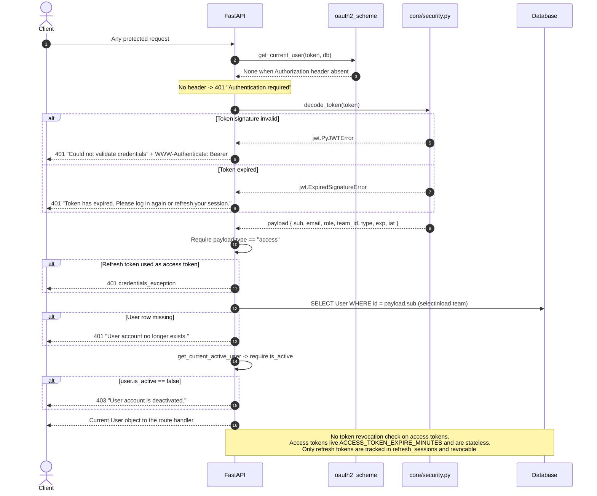
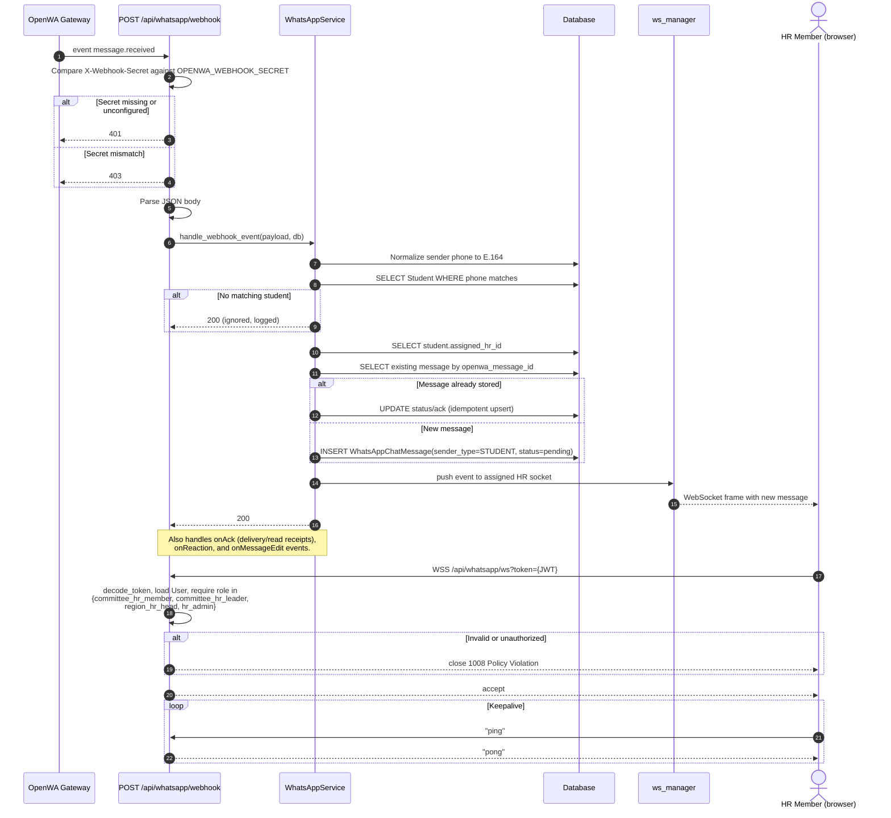
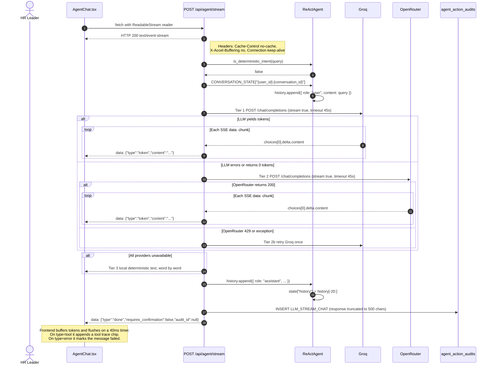

# 02 — API Reference

> **[VERIFIED]** unless tagged otherwise. Endpoint list generated from `app.openapi()` — 64 paths, exported to [`openapi.yaml`](openapi.yaml) (and [`openapi.json`](openapi.json)).

## 1. Conventions

| Property | Value |
|---|---|
| Base URL (local) | `http://127.0.0.1:8000` |
| Base URL (prod) | `https://studentops-ai.vercel.app` |
| API prefix | `/api` (`settings.API_V1_STR`) |
| Versioning | **None.** No `/v1` segment, no `Accept-Version` header. The version lives in the `info.version` field of the OpenAPI document only. |
| Auth scheme | `OAuth2PasswordBearer` with `tokenUrl=/api/auth/login`, `auto_error=False` |
| Content type | `application/json` everywhere except `POST /api/whatsapp/threads/{student_id}/media` (`multipart/form-data`) and the webhook (any) |
| Interactive docs | `/docs` (Swagger UI), `/redoc`, `/openapi.json` |

### Authentication header

```
Authorization: Bearer <access_token>
```

`auto_error=False` means FastAPI does not auto-reject; `get_current_user` raises 401 itself with a more specific message. **[VERIFIED]** `dependencies.py:37-46`

### Error format

All errors use FastAPI's standard envelope:

```json
{ "detail": "human readable string" }
```

Validation failures (422) use the richer Pydantic v2 form:

```json
{ "detail": [ { "type": "string_too_short", "loc": ["body", "title"], "msg": "...", "input": "x" } ] }
```

429 responses also carry a `Retry-After` header. **[VERIFIED]** `rate_limiter.py:118-121`

There is **no** application-level error code, machine-readable error identifier, or request ID. Errors are free-text strings. A full catalog of what triggers which status is in §6.

### Pagination and filtering

**There is no pagination.** Every list endpoint returns a full array. The only limit-ish parameters are:

| Parameter | Endpoints | Type |
|---|---|---|
| `limit` | `GET /api/audit/logs` (default 50) | int, unbounded |
| `limit` | `GET /api/automation/reminders`, `/api/automation/logs` (default 50) | int, unbounded |
| `limit` | `GET /api/calendar/events` (default 20) | int, unbounded |
| `limit` | `GET /api/whatsapp/threads/{student_id}/sync` | int, `ge=1, le=200` — the only bounded one |
| `limit` | agent tools `get_upcoming_events`, `get_upcoming_meetings` | int, unbounded |

Query filters: `role`, `status_filter`, `assigned_only` on `GET /api/students`; `oversight` on `GET /api/whatsapp/threads`; `status` on `GET /api/feedback` and `GET /api/questions`. Everything else is path parameters. **[VERIFIED]**

**No sorting or cursor support** on list endpoints. Ordering is whatever the query returns unless the handler sets `ORDER BY` explicitly.

## 2. Resource map

```mermaid
flowchart TB
    subgraph Public["Public"]
        R0["GET /"]
        R1["POST /api/auth/register"]
        R2["POST /api/auth/login"]
        R3["POST /api/auth/refresh"]
        R4["POST /api/auth/logout"]
    end

    subgraph Auth["Auth"]
        A1["GET /api/auth/me"]
        A2["GET /api/auth/teams"]
        A3["POST /api/auth/teams<br/>hr_admin"]
        A4["PATCH /api/auth/users/{user_id}/role<br/>hr_admin"]
        A5["POST /api/auth/link-student"]
        A6["POST /api/auth/logout-all"]
    end

    subgraph Students["Students"]
        S1["GET /api/students"]
        S2["POST /api/students"]
        S3["GET /api/students/scoreboard/all"]
        S4["GET /api/students/{student_id}"]
        S5["GET /api/students/{student_id}/score"]
        S6["PUT /api/students/{student_id}/behavior-score"]
        S7["POST /api/students/assign-cohort"]
        S8["PATCH /api/students/{student_id}/phone"]
        S9["POST /api/students/{student_id}/bonus"]
        S10["POST /api/students/{student_id}/invitation"]
    end

    subgraph Tasks["Tasks"]
        T1["GET /api/tasks"]
        T2["POST /api/tasks"]
        T3["GET /api/tasks/{task_id}"]
        T4["POST /api/tasks/{task_id}/assign"]
        T5["GET /api/tasks/{task_id}/scores"]
        T6["GET /api/tasks/{task_id}/submissions"]
        T7["GET /api/tasks/submissions/{submission_id}"]
        T8["GET /api/tasks/submissions/{submission_id}/score"]
        T9["PUT /api/tasks/submissions/{submission_id}/review"]
        T10["POST /api/tasks/{task_id}/submit"]
    end

    subgraph Attendance["Attendance"]
        AT1["GET /api/attendance/meetings"]
        AT2["POST /api/attendance/meetings"]
        AT3["GET /api/attendance/meetings/{meeting_id}"]
        AT4["POST /api/attendance/meetings/{meeting_id}/process"]
        AT5["PUT /api/attendance/meetings/{meeting_id}/records/{student_id}/status"]
    end

    subgraph AgentR["Agent"]
        G1["POST /api/agent/chat"]
        G2["POST /api/agent/stream<br/>SSE"]
        G3["POST /api/agent/confirm<br/>HITL"]
        G4["GET /api/agent/tools"]
    end

    subgraph Whats["WhatsApp"]
        W1["GET /api/whatsapp/status"]
        W2["GET /api/whatsapp/qr"]
        W3["POST /api/whatsapp/send-official"]
        W4["POST /api/whatsapp/generate-link"]
        W5["GET /api/whatsapp/escalations"]
        W6["GET /api/whatsapp/threads"]
        W7["GET /api/whatsapp/threads/{sid}/messages"]
        W8["POST /api/whatsapp/threads/{sid}/messages"]
        W9["POST /api/whatsapp/threads/{student_id}/sync"]
        W10["POST /api/whatsapp/threads/{student_id}/media"]
        W11["POST /api/whatsapp/threads/{student_id}/messages/{message_id}/reaction"]
        W12["PUT /api/whatsapp/threads/{student_id}/messages/{message_id}"]
        W13["POST /api/whatsapp/webhook<br/>X-Webhook-Secret"]
        W14["WS /api/whatsapp/ws?token="]
    end

    subgraph Ops["Operations"]
        O1["GET /api/automation/settings"]
        O2["PUT /api/automation/settings"]
        O3["POST /api/automation/trigger-run"]
        O4["GET /api/automation/reminders"]
        O5["GET /api/automation/logs"]
        O6["GET /api/automation/reminders/{reminder_id}"]
        O7["GET /api/audit/logs<br/>hr_admin"]
        O8["GET /api/dashboard/stats"]
        O9["GET /api/calendar/events"]
        O10["POST /api/calendar/events"]
    end

    subgraph Comms["Communications"]
        C1["POST /api/feedback"]
        C2["GET /api/feedback"]
        C3["PATCH /api/feedback/{feedback_id}/status"]
        C4["POST /api/questions"]
        C5["GET /api/questions"]
        C6["POST /api/questions/{question_id}/answer"]
        C7["GET /api/reports/committee/summary"]
        C8["POST /api/reports/submit-to-head"]
        C9["GET /api/reports"]
        C10["POST /api/reports/{report_id}/acknowledge"]
    end

    R2 --> A1
    A1 --> S1
    S1 --> S3
    S1 --> T1
    T1 --> T3
    T3 --> T7
    T7 --> T9
    AT1 --> AT3
    AT3 --> AT4
    AT4 --> AT5
    S1 --> G1
    G1 --> G2
    G2 --> G3
    G4 -.introspects.-> G1
    S1 --> W6
    W6 --> W7
    W7 --> W8
    W8 --> W9
    W9 --> W14
    W13 --> W14
    S1 --> O1
    O1 --> O3
    O3 --> O4
    S1 --> C1
    C1 --> C2
    C2 --> C3
    C4 --> C5
    C5 --> C6
    C7 --> C8
    C8 --> C9
    C9 --> C10
    W1 --> W2
    W2 --> W3
    O1 --> O9
```



*Grouping of all 64 paths and how the resources chain together. Use it to find the router that owns a feature. All 64 paths use their exact OpenAPI parameter names; the same diagram is available as [`02-resource-map.mmd`](diagrams/02-resource-map.mmd).*

Standalone source: [`diagrams/02-resource-map.mmd`](diagrams/02-resource-map.mmd)

## 3. Authentication and token lifecycle



*What `get_current_user` does on every protected call, and where it can reject. Use it when debugging a 401 that is not an expired token.*

Standalone source: [`diagrams/02-auth-sequence.mmd`](diagrams/02-auth-sequence.mmd)

### Auth endpoints

#### `POST /api/auth/register` — 201
Rate limited to 5/min per IP.

Body (`UserRegisterRequest`): `email` (EmailStr), `password` (8–128), `full_name` (1–100), `arabic_name` (optional), `role` (**accepted and ignored**), `team_id` (optional), `invitation_token` (optional).

**Server-side guarantees:** role is always forced to `"member"`; password strength is re-validated (≥1 letter and ≥1 digit/punct, not whitespace-only, ≤128); the account is linked to a `Student` profile **only** with a valid single-use invitation token whose email matches the registering email.

| Status | Cause |
|---|---|
| 400 | Password too weak, duplicate email, invalid/used/expired invitation token, token bound to a different email, student profile already claimed |
| 404 | `team_id` not found, or invitation's student row missing |
| 429 | Rate limit |
| 422 | Pydantic validation |

#### `POST /api/auth/login` — 200
Rate limited to 60/min per IP. Body: `email` **or** `username` **or** `identifier`, plus `password`. If the identifier has no `@`, the server also tries `{identifier}@studentops.org`. The response is `TokenResponse` and a `RefreshSession` row is created.

| Status | Cause |
|---|---|
| 400 | Empty identifier |
| 401 | Bad credentials (identical message for unknown user and wrong password) |
| 403 | `is_active == false` |
| 429 | Rate limit |

#### `POST /api/auth/token` — 200 (alias of `/login`, `include_in_schema=False`)
Same as login but `form-urlencoded`, for the Swagger "Authorize" popup. Excluded from the OpenAPI schema (`include_in_schema=False`), which is why it does not appear in the 64-path count. It is a real, callable endpoint.

#### `POST /api/auth/refresh` — 200
Rate limited to 30/min. Body: `refresh_token`. Validates type, looks up `RefreshSession` by `jti`, and **rotates**: revokes the old session and issues a new pair.

| Status | Cause |
|---|---|
| 401 | Wrong token type, expired, malformed, session not found, user inactive, **or a revoked token was reused — in which case every session for that user is revoked** |
| 429 | Rate limit |

#### `POST /api/auth/logout` — 200
Body: `refresh_token`. Sets `revoked_at` on that session only. **The access token stays valid until it expires.** Returns 200 even if the token is not found.

#### `POST /api/auth/logout-all` — 200
Revokes all unrevoked sessions for the caller. Returns the count.

#### `GET /api/auth/me` — 200
Returns `UserResponse`: `id, email, full_name, arabic_name, role, team_id, team_name, student_id, is_active, created_at`.

#### `GET /api/auth/teams` — 200
**Unauthenticated.** Returns all teams with `member_count` (a `COUNT` query per team — N+1).

#### `POST /api/auth/teams` — 201 · `hr_admin` only
Body: `name`, `code`, `description`. 400 on duplicate name or code. ID format `team_{uuid8}`.

#### `PATCH /api/auth/users/{user_id}/role` — 200 · `hr_admin` only
Body `UserRoleUpdateRequest.role` is constrained by regex to the eight known role strings. Audited. Refuses to demote the last active `hr_admin`. 404 if the target user is missing.

#### `POST /api/auth/link-student` — 200
Links the **already authenticated** account to a `Student` profile using an HR-issued invitation token. Requires: account not already linked, token valid/unused/unexpired, student not already claimed, and `student.email == current_user.email`. Sets `team_id` from the student if the user has none.

## 4. Domain endpoints

### 4.1 Students

#### `GET /api/students` — 200
Query: `role` (ILIKE), `status_filter` (exact, upper-cased), `assigned_only` (bool).

Scoping by role:

| Role | Rows returned |
|---|---|
| `region_hr_head`, `hr_admin` | All students |
| `committee_head`, `committee_hr_leader`, `team_lead` | `team_id == caller.team_id` |
| `committee_hr_member` | `assigned_hr_id == caller.id` OR `team_id == caller.team_id`; with `assigned_only=true`, only the first |
| `committee_member`, `member` | Only `id == caller.student_id` |

#### `POST /api/students` — 201
Roles: `region_hr_head`, `committee_hr_leader`, `committee_head`, `team_lead`, `hr_admin`, `committee_hr_member`.

| Status | Cause |
|---|---|
| 403 | Caller is committee-scoped and `body.team_id` is a different team |
| 404 | `team_id` or `assigned_hr_id` does not exist |
| 409 | Duplicate `email`, `phone`, or `student_code` |
| 422 | Empty `full_name`, `arabic_name`, or `phone` |

Auto-generates `student_code` as `ST-2026-{6 hex}` when not supplied, and `id` as `stu_{uuid12}`.

#### `GET /api/students/{student_id}` — 200
Delegates entirely to `verify_student_access(..., mode="read")`. 404 if the student does not exist; 403 on scope violation.

#### `GET /api/students/scoreboard/all` — 200
Note the route order: `scoreboard/all` is declared **before** `/{student_id}` in the router, so it is not captured by the path parameter.
**403 for `committee_member`** ("Scores are confidential and not visible to committee members"). Note: the legacy `member` role is *not* blocked — it receives its own scorecard only.

| Role | Result |
|---|---|
| `region_hr_head`, `hr_admin` | Every student's summary |
| `committee_head`, `committee_hr_leader`, `team_lead` | Filtered to their team |
| `committee_hr_member` | `assigned_hr_id == caller.id` OR (same team AND `assigned_hr_id IS NULL`) |
| `member` | Own summary only |

#### `GET /api/students/{student_id}/score` — 200
**403 for `committee_member`**, then `verify_student_access(..., mode="read")`, then 404 if no summary exists. Returns `StudentScoreSummary` with `total_score` always `null` and `total_score_status` always `"PENDING_FORMULA_DEFINITION"`.

#### `PUT /api/students/{student_id}/behavior-score` — 200
Roles: `committee_hr_member`, `hr_admin` only. **Committee Head is structurally excluded.**

Body `BehaviorScoreUpdate`: `student_id` (required), `group_interaction` 0–5, `social_media` 0–5, `hierarchy_rules` 0–5, `polite_conduct` 0–8, `interaction` 0–5 (default 5), `month` (`"YYYY-MM"`, optional), `notes`.

Upserts one `ScoreRecord` per category. If `month` is supplied it becomes part of the lookup, but the table's unique constraint is `(student_id, category, month)` while the update query filters on `student_id, category[, month]` — with SQL NULL semantics on `month`, multiple un-monthly records can coexist. **[VERIFIED]**

Returns the recomputed `StudentScoreSummary`.

#### `POST /api/students/assign-cohort` — 200
Roles: `committee_hr_leader`, `region_hr_head`, `hr_admin`. 403 if a `committee_hr_leader` targets an HR user outside their team. 404 if the HR user or any student is missing.

**Known behavior:** for `committee_hr_leader`, students outside their team are `continue`d but the response still reports `assigned_count = len(students)`, which overstates the number actually assigned. **[VERIFIED]** `routes_students.py:344-352`

#### `PATCH /api/students/{student_id}/phone` — 200
Roles: `committee_hr_leader`, `hr_admin`, `committee_hr_member`. `verify_student_access(..., mode="write")`. 409 on duplicate phone. Body: `phone`, 7–25 chars.

#### `POST /api/students/{student_id}/bonus` — 200
Roles: `committee_hr_leader`, `hr_admin` only. Body: `points` 0.5–10.0, `notes`. Capped: the stored total is `min(10.0, existing + points)`. Notes are appended with ` | `.

#### `POST /api/students/{student_id}/invitation` — 201
Any authenticated user; authorization is `verify_student_access(..., mode="write")`.

| Status | Cause |
|---|---|
| 403 | Caller cannot write this student (this is what blocks `committee_member`) |
| 400 | Student profile already claimed by a user |

Returns the **raw token once** — only its SHA-256 hash is stored. Default expiry 7 days, `ge=1, le=30`.

### 4.2 Tasks and submissions

#### `GET /api/tasks` — 200
Team-scoped for `committee_head`, `team_lead`, `committee_hr_leader`, `committee_hr_member`. Returns `[]` if a committee role has no `team_id`.

**For `committee_member` / `member`:** tasks with explicit assignments are filtered to assigned ones, and `max_score` and `score_rule` are returned as `null`.

#### `POST /api/tasks` — 201
Roles: `committee_head`, `team_lead`, `hr_admin`. `task_number` auto-increments via `MAX+1` (**race-prone under concurrent creates** — no sequence, no unique-conflict retry). Supplying `assigned_student_ids` creates both a `TaskAssignment` and a `PENDING` `Submission` per student.

#### `GET /api/tasks/{task_id}` — 200
403 if the task belongs to another committee (non-admin) or, for a member, the task has assignments and the caller is not among them. `max_score`/`score_rule` nulled for members.

#### `POST /api/tasks/{task_id}/assign` — 200
Roles: `committee_head`, `team_lead`, `hr_admin`. 404 if any student id is missing; 403 if any target student is outside the caller's team. Idempotent per student (existing assignment is skipped) and creates a `PENDING` submission if none exists.

#### `GET /api/tasks/{task_id}/scores` — 200
The HR score-collection view. **403 for `committee_member` and `member`.** 404 if the task is missing, 403 if the task is in another committee. Returns `TaskScoreItemSchema` — deliberately **excludes `file_url`**.

#### `GET /api/tasks/{task_id}/submissions` — 200
The technical view. **403 for `region_hr_head`, `committee_hr_leader`, `committee_hr_member`.** This is the mirror of the endpoint above.

| Role | Result |
|---|---|
| `committee_head`, `team_lead` | All submissions of their team, with scores |
| `committee_member`, `member` | Own submission only; `score`, `technical_score`, `reviewer_notes`, `graded_by_user_id` returned as `null` |
| `hr_admin` | All |

#### `GET /api/tasks/submissions/{submission_id}` — 200
Same 403 block for HR roles. Members get 403 on another member's submission and a score-redacted payload for their own.

#### `GET /api/tasks/submissions/{submission_id}/score` — 200
**403 for members**, open to all HR and leadership roles with team scoping on both the student and the task. Returns `TaskScoreItemSchema`.

#### `PUT /api/tasks/submissions/{submission_id}/review` — 200
Roles: `committee_head`, `team_lead`, `hr_admin`. Sets `score`, `technical_score`, `reviewer_notes`, `reviewed_at`, `graded_by_user_id`. **400 if `score > task.max_score`.** Flips `PENDING` to `ON_TIME`. Audited as `REVIEW_TASK_SUBMISSION`.

#### `POST /api/tasks/{task_id}/submit` — 200
Roles: `committee_member`, `member` only. Requires `user.student_id` (400 otherwise). Accepts `file_url` in the body or as a query parameter. Computes `ON_TIME` or `LATE` against the deadline. Response always has scores set to `null`.

Note: the handler does not check `TaskAssignment`. Any member can submit for any task ID that exists. **[VERIFIED]**

### 4.3 Attendance and meetings

#### `GET /api/attendance/meetings` — 200
- Members: meetings assigned to them via `MeetingAssignment`, or their team's meetings.
- Committee roles: their team's meetings, or `[]` if `team_id` is null.
- Region/admin: all.

Includes aggregated `total_expected`, `present_count`, `late_count`, `absent_count` (absent counts anything containing `ABSENT` or `REJECTED`).

#### `POST /api/attendance/meetings` — 201
Roles: `committee_head`, `team_lead`, `hr_admin`. IDs: `meet_{uuid10}`, code `sync_{uuid6}`. `team_id` defaults to `body.team_id or caller.team_id or "team_media"`. Optional `assigned_student_ids` creates `MeetingAssignment` rows.

#### `GET /api/attendance/meetings/{meeting_id}` — 200
Accepts either `id` or `meeting_code`. **Read-only** — an earlier auto-processing side effect was deliberately removed (comment `ISSUE-13`). Filtering:

| Role | Records |
|---|---|
| `region_hr_head`, `hr_admin` | All |
| Committee roles | Their team; `[]` if no `team_id` |
| Members | Only their own record |

#### `POST /api/attendance/meetings/{meeting_id}/process` — 200
Roles: `committee_hr_member`, `hr_admin`. 403 if the meeting is in another committee. Runs the full deterministic pipeline (see [01-system-design.md §6.2](01-system-design.md)). 404 if the meeting is unknown.

#### `PUT /api/attendance/meetings/{meeting_id}/records/{student_id}/status` — 200
Roles: `committee_hr_member`, `committee_hr_leader`, `hr_admin`, `region_hr_head`. 403 if the meeting or the student is in another committee. Body: `status` (required), `excuse_reason`, `excuse_status`. Upserts the record.

**Caveat:** `status` is upper-cased but not validated against the six legal values, and setting `excuse_status` here is the only manual override of the policy engine. **[VERIFIED]**

### 4.4 Agent

#### `POST /api/agent/chat` — 200
Roles: `region_hr_head`, `committee_hr_leader`, `committee_head`, `committee_hr_member`, `hr_admin`, `team_lead`. Rate limited to 25/min. Returns `AgentChatResponse` (see [03-ai-agent.md](03-ai-agent.md)).

#### `POST /api/agent/stream` — 200 · SSE
Same roles and rate limit. See §5.

#### `POST /api/agent/confirm` — 200
Same roles. Body: `action_id`, `confirmed` (required), `user_id` (**accepted but ignored** — the real user is taken from the token).

| Status | Cause |
|---|---|
| 400 | Action not `PENDING_CONFIRMATION`, or already confirmed, or the tool is not `send_reminder` |
| 403 | A `committee_*` role with no `team_id`, or targeting a student outside their team |
| 404 | Unknown `action_id` |
| 409 | Lost the atomic `UPDATE ... WHERE status='PENDING_CONFIRMATION'` race |
| 422 | Missing `action_id` or `confirmed` |

#### `GET /api/agent/tools` — 200
Any active user. Returns `TOOL_DEFINITIONS` verbatim — the full tool catalog with roles, categories, and JSON parameter schemas. This is an information disclosure surface: it reveals the exact tool names and required roles. It is gated on authentication only, not on HR role. **[VERIFIED]** `routes_agent.py:268`

### 4.5 WhatsApp

| Endpoint | Method | Roles | Notes |
|---|---|---|---|
| `/api/whatsapp/status` | GET | any active user | Session is `ops-official` for `region_hr_head`/`hr_admin`, otherwise `hr_{user.id}` |
| `/api/whatsapp/qr` | GET | region, admin, HR leader, HR member | Returns QR payload or a status message |
| `/api/whatsapp/send-official` | POST | `region_hr_head`, `hr_admin` | Body `phone_number`, `message`. 502 on hard failure; **200 with `is_uncertain: true` on timeout** to prevent blind retries |
| `/api/whatsapp/generate-link` | POST | any active user (scoped by `verify_student_access`) | Returns a `wa.me` link. **Side effect:** flips a `PENDING` `MemberFollowupStatus` to `CONTACTED` |
| `/api/whatsapp/escalations` | GET | HR leader, region, admin, HR member | HR member sees only their own flags; HR leader sees their team |
| `/api/whatsapp/threads` | GET | HR member, HR leader, region, admin | `oversight=true` widens to the whole team (or the whole org for region/admin) |
| `/api/whatsapp/threads/{student_id}/messages` | GET/POST | same four roles | 403 if the HR member is not assigned |
| `/api/whatsapp/threads/{student_id}/sync` | POST | same four roles | `limit` 1–200. Upserts by `openwa_message_id` |
| `/api/whatsapp/threads/{student_id}/media` | POST | same four roles | `multipart/form-data`: `file`, `caption`, `reply_to_message_id`. **No size limit is declared** |
| `/api/whatsapp/threads/{student_id}/messages/{message_id}/reaction` | POST | same four roles | Body `reaction`, 1–10 chars |
| `/api/whatsapp/threads/{student_id}/messages/{message_id}` | PUT | same four roles | Edits an outgoing HR message |
| `/api/whatsapp/webhook` | POST | `X-Webhook-Secret` header | 120/min. 401 if the secret is unconfigured or missing, 403 if it mismatches |
| `/api/whatsapp/ws` (WebSocket, not in the OpenAPI schema) | WebSocket | JWT in `?token=` query, then a role allowlist of 4 HR roles | Closes with 1008 on any failure; `ping`/`pong` keepalive |

**Query-parameter token exposure:** the WebSocket authenticates via `?token=<access_token>`. Tokens in query strings land in proxy and server access logs. **[VERIFIED]** `routes_whatsapp.py:531-537`

### 4.6 Automation

| Endpoint | Method | Roles | Notes |
|---|---|---|---|
| `/api/automation/settings` | GET | any active user | Returns the caller's `AutomationSettings` row, or a synthesized system default when none exists |
| `/api/automation/settings` | PUT | region, HR leader, admin | Upserts the caller's own row |
| `/api/automation/trigger-run` | POST | region, HR leader, admin | Runs `run_cycle` synchronously. **The only way automation runs on Vercel** |
| `/api/automation/reminders` and `/api/automation/logs` | GET | any active user | Same handler, two decorators, two paths |
| `/api/automation/reminders/{reminder_id}` | GET | any active user | 403 for a member reading someone else's reminder, or a committee role reading another team's |

Reminder log scoping: members see only reminders addressed to them (fail-closed to `[]` when `student_id` is null); committee roles see their team's; region/admin see all.

### 4.7 WhatsApp webhook and realtime delivery



*Inbound message routing from the gateway to the assigned HR member's live socket, plus the WebSocket handshake. Use it when debugging a message that arrives but is not shown.*

Standalone source: [`diagrams/02-flow-whatsapp-webhook.mmd`](diagrams/02-flow-whatsapp-webhook.mmd)

The handler is event-shape driven: `message.received` creates a `STUDENT` message, `onAck` updates `status` and `ack_status`, `onReaction` merges into the JSON `reactions` column, and `onMessageEdit` sets `is_edited`. Unmatched sender phones are accepted with 200 and dropped, so the gateway does not retry indefinitely. **[VERIFIED]** `routes_whatsapp.py:489-527`

### 4.8 Feedback, Q&A, reports, dashboard, calendar, audit

| Endpoint | Method | Roles | Notes |
|---|---|---|---|
| `/api/feedback` | POST | any active user with a linked student | 403 without a `Student` profile. Auto-targets the assigned HR, else the team's first `committee_hr_member`, else the literal string `"Social Media HR Member"` |
| `/api/feedback` | GET | any active user | **403 for `committee_head`/`team_lead` and `committee_hr_member`** — the confidentiality boundary. Members see their own; HR leader sees their team; region/admin see all |
| `/api/feedback/{feedback_id}/status` | PATCH | `committee_hr_leader` | Body `status` (`REVIEWED`/`ACTIONED`), `notes`. 403 for another team's feedback |
| `/api/questions` | POST | any active user with a linked student | 403 without one. `team_id` defaults to `caller.team_id or "team_media"` |
| `/api/questions` | GET | any active user | Members own; committee roles their team; region/admin all |
| `/api/questions/{question_id}/answer` | POST | `committee_head`, `team_lead`, `hr_admin`, `region_hr_head` | 403 for another team's question |
| `/api/reports/committee/summary` | GET | `committee_hr_leader`, `region_hr_head`, `hr_admin` | 403 if an HR leader has no `team_id`. Returns live aggregates |
| `/api/reports/submit-to-head` | POST | `committee_hr_leader`, `hr_admin` | Snapshots `get_committee_summary` into `metrics_summary` as JSON |
| `/api/reports` | GET | `region_hr_head`, `committee_hr_leader`, `hr_admin` | HR leaders see their own team's |
| `/api/reports/{report_id}/acknowledge` | POST | `region_hr_head`, `hr_admin` | Sets `acknowledged_at` |
| `/api/dashboard/stats` | GET | any active user | Fully role-scoped. `pending_submissions_count` is `null` for HR roles |
| `/api/calendar/events` | GET | any active user | `limit` default 20. Reads the `events` table, **not** Google |
| `/api/calendar/events` | POST | `hr_admin`, `team_lead` | Persists and calls the provider (a no-op stub) |
| `/api/audit/logs` | GET | `hr_admin` (router-level guard) | `limit` default 50. Returns full `parameters` and `result` JSON |
| `GET /` | GET | public | Health check with a `SELECT 1` probe |

## 5. SSE streaming endpoint

`POST /api/agent/stream` returns `text/event-stream`. Response headers: `Cache-Control: no-cache`, `X-Accel-Buffering: no`, `Connection: keep-alive`. **[VERIFIED]** `routes_agent.py:161-167`



*Event ordering, provider cascade, and how the client terminates. Use it when adding a new SSE event type.*

Standalone source: [`diagrams/02-flow-sse-stream.mmd`](diagrams/02-flow-sse-stream.mmd)

### Event types

Every event is a single `data: {json}\n\n` frame. There are no `event:` names — the type is a field in the JSON. **[VERIFIED]**

| `type` | Payload | When |
|---|---|---|
| `tool` | `tool_name`, `status`, `result`, `reasoning_summary` | Once per `ToolCallExecution`, emitted first, before any tokens |
| `token` | `content` (string delta) | Repeated. On the deterministic path the pre-built response is split on spaces; on the LLM path these are true provider deltas |
| `done` | `requires_confirmation` (bool), `pending_confirmation` (object or null), `audit_id` (string or null) | Always the last event; the generator then returns and the connection closes |
| `error` | `message` | **Declared in the docstring but never emitted.** The implementation catches provider exceptions and streams a friendly fallback string instead. |

`pending_confirmation` shape: `{ action_id, tool_name, description, target_count, preview_data }`.

### Client consumption

`frontend/src/components/AgentChat.tsx:90-175`:
1. `fetch` with an `AbortController`, then `res.body.getReader()`.
2. Decode with `TextDecoder({ stream: true })`, split on `\n\n`, keep the trailing partial in `buffer`.
3. Skip frames not starting with `data: `, `JSON.parse` the rest, swallow parse errors.
4. `token` events accumulate into a buffer flushed on a **40 ms timer** to avoid a React re-render per token.
5. `tool` / `done` / `error` flush the buffer immediately.
6. The loop ends when `reader.read()` returns `done: true`.

**Errors before the stream starts** (`!res.ok`) surface as thrown `Error`s: 401 produces "Authentication required or session expired. Please sign in again.".

**No `retry:` or heartbeat frames.** A proxy with an idle timeout can silently cut a long LLM turn. **[VERIFIED]**

## 6. Error-code catalog

| Status | Meaning | Representative triggers |
|---|---|---|
| 200 | OK | — |
| 201 | Created | Student, task, meeting, feedback, question, report, invitation, registration |
| 400 | Bad request | Weak password; duplicate team name/code; missing `file_url`; unlinked user submitting; `score > max_score`; action not pending; unsupported confirm tool; invalid token on logout; already-claimed student profile |
| 401 | Unauthenticated | Missing header; bad signature; expired; wrong token type; deleted user; bad credentials; invalid/expired/used refresh token; revoked-token reuse; webhook secret unconfigured or missing |
| 403 | Forbidden | Role not allowed; deactivated account; cross-team resource; member blocked from scores; member blocked from submissions; HR blocked from feedback; HR member not assigned; member reading another's submission; member reading another's reminder; last-admin demotion; invalid webhook secret |
| 404 | Not found | Unknown student, task, meeting, submission, team, report, question, feedback, agent action, reminder; unknown meeting code during processing |
| 409 | Conflict | Duplicate student email/phone/code; duplicate phone on PATCH; concurrent `/agent/confirm` |
| 422 | Unprocessable | Pydantic schema validation (body, query, path) |
| 429 | Too many requests | Any rate-limited endpoint; includes `Retry-After` |
| 502 | Bad gateway | OpenWA hard delivery failure on `/send-official` |
| 500 | Internal error | Unhandled exception; message is generic outside development |

**No `403` carries a machine-readable code.** Parsing `detail` strings is the only option, and several messages embed the caller's own role name.

## 7. Rate limits and idempotency

| Surface | Limit | Key | Source |
|---|---|---|---|
| `POST /api/auth/login`, `/api/auth/token` | 60 / 60 s | client IP | `RATE_LIMIT_LOGIN_PER_MINUTE` |
| `POST /api/auth/register` | 5 / 60 s | client IP | `RATE_LIMIT_REGISTER_PER_MINUTE` |
| `POST /api/auth/refresh` | 30 / 60 s | client IP | `RATE_LIMIT_REFRESH_PER_MINUTE` |
| `POST /api/agent/chat`, `/stream` | 25 / 60 s | client IP | `RATE_LIMIT_AGENT_PER_MINUTE` |
| `POST /api/whatsapp/webhook` | 120 / 60 s | client IP | hard-coded in `dependencies.py:245` |
| Everything else | **unlimited** | — | `RATE_LIMIT_GENERAL_PER_MINUTE` is defined but never wired |

**Keying:** `f"{key_prefix}:{request.client.host}"`. `X-Forwarded-For` is deliberately ignored to prevent spoofing. Behind a proxy or on Vercel, `request.client.host` is the proxy or platform IP, so **the login limit is effectively global**, not per-user. **[VERIFIED]** `rate_limiter.py:96-104`

**Idempotency:**

| Operation | Mechanism |
|---|---|
| `POST /api/attendance/meetings/{meeting_id}/process` | Deletes and recreates `ParticipantSession`; upserts `AttendanceRecord`; preserves `excuse_status` |
| `POST /api/automation/trigger-run` | `ReminderLog.trigger_source` pre-fetch; `TaskReminder(task, student, stage)` existence check |
| `POST /api/whatsapp/threads/{student_id}/sync` | Upsert keyed on `openwa_message_id` |
| `POST /api/whatsapp/webhook` | Upsert keyed on `openwa_message_id` |
| `POST /api/agent/confirm` | Atomic `UPDATE ... WHERE status='PENDING_CONFIRMATION'`; 409 on loss |
| `POST /api/tasks/{task_id}/assign` | Skips students who already have an assignment |
| `POST /api/auth/refresh` | Rotates and revokes; a replayed old token triggers full session revocation |
| `POST /api/tasks` | **None.** `MAX(task_number)+1` is not concurrency-safe |
| `POST /api/students` | Unique constraints on `email` and `student_code`; `phone` is checked in code but has **no unique constraint** |

**No `Idempotency-Key` header support anywhere.**

## 8. Copy-paste examples

```bash
# 1. Log in
curl -sS -X POST http://127.0.0.1:8000/api/auth/login \
  -H 'Content-Type: application/json' \
  -d '{"email":"region.head@studentops.org","password":"head123"}'
# -> { "access_token": "...", "refresh_token": "...", "token_type": "bearer", "user": {...} }

# 2. Today's attendance, team-scoped
curl -sS http://127.0.0.1:8000/api/attendance/meetings \
  -H "Authorization: Bearer $ACCESS_TOKEN"

# 3. Deterministic agent turn (non-streaming)
curl -sS -X POST http://127.0.0.1:8000/api/agent/chat \
  -H 'Content-Type: application/json' \
  -H "Authorization: Bearer $ACCESS_TOKEN" \
  -d '{"query":"Who was absent from today'\''s meeting?","conversation_id":"conv_demo"}'

# 4. Stream the agent and follow the confirmation gate
curl -sSN -X POST http://127.0.0.1:8000/api/agent/stream \
  -H 'Content-Type: application/json' \
  -H "Authorization: Bearer $ACCESS_TOKEN" \
  -d '{"query":"Send a reminder to the absentees","conversation_id":"conv_demo"}'
# Copy action_id from the final data: {"type":"done",...,"pending_confirmation":{...}}

# 5. Confirm the pending action
curl -sS -X POST http://127.0.0.1:8000/api/agent/confirm \
  -H 'Content-Type: application/json' \
  -H "Authorization: Bearer $ACCESS_TOKEN" \
  -d '{"action_id":"act_rem_1750000000000","confirmed":true}'
```

## 9. Gaps and open questions

| # | Item | Severity |
|---|---|---|
| 1 | No pagination on any list endpoint. `GET /api/students` and `/api/students/scoreboard/all` return unbounded arrays. | Medium |
| 2 | `GET /api/auth/teams` is unauthenticated and leaks team names, codes, and member counts. | Low |
| 3 | `GET /api/agent/tools` is gated on authentication only, disclosing tool names, required roles, and schemas to any logged-in member. | Medium |
| 4 | Rate-limit keying on `request.client.host` collapses to a single global bucket behind any proxy or on Vercel. | **High (security)** |
| 5 | `POST /api/tasks` `task_number` uses `MAX+1` with no sequence or retry — duplicate-key errors under concurrency. | Medium |
| 6 | `students.phone` is checked for duplicates in the handler but has no unique constraint, so concurrent creates can race. | Medium |
| 7 | WebSocket auth via `?token=` puts the access token in URLs and access logs. | Medium |
| 8 | `POST /api/whatsapp/threads/{student_id}/media` has no declared upload size limit; the whole file is base64-encoded into memory and into a `Text` column. | Medium |
| 9 | `PUT /api/attendance/meetings/{meeting_id}/records/{student_id}/status` accepts an arbitrary `status` string with no enum validation. | Low |
| 10 | `POST /api/tasks/{task_id}/submit` does not verify `TaskAssignment`. | Low |
| 11 | The SSE `error` event type is documented but never emitted. | Low |
| 12 | No API version prefix. Breaking changes ship silently. | Medium |
| 13 | `assigned_count` in `POST /api/students/assign-cohort` over-reports when students are skipped. | Low |
| 14 | `SELECT MAX(task_number)` and the scoreboard N+1 both scale badly; no composite index supports the hot queries. See [05-database.md §7](05-database.md). | Medium |
