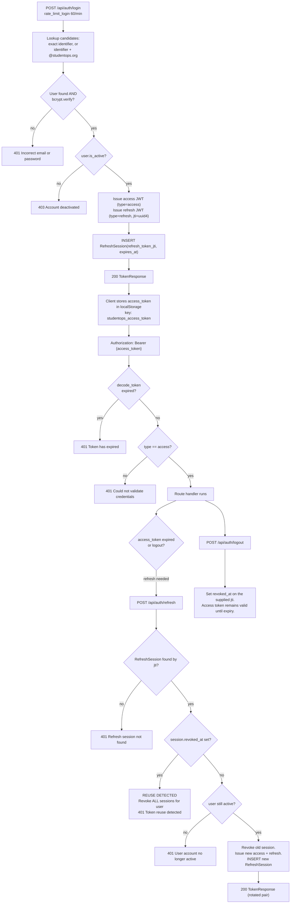
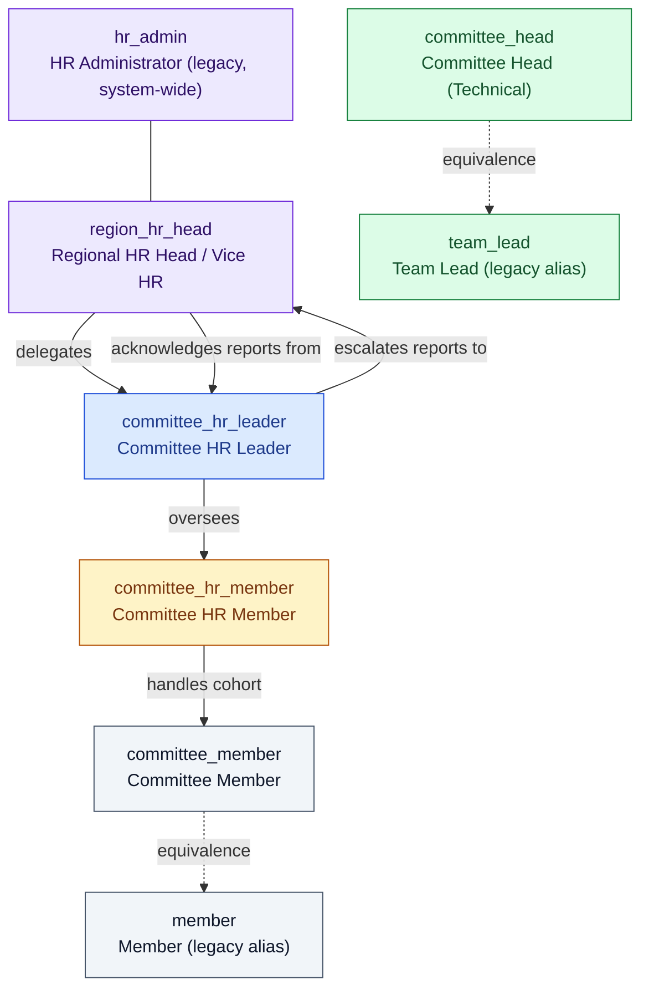
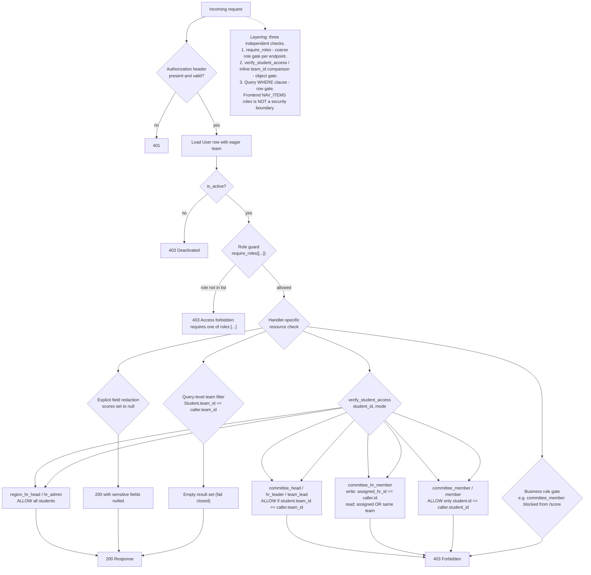
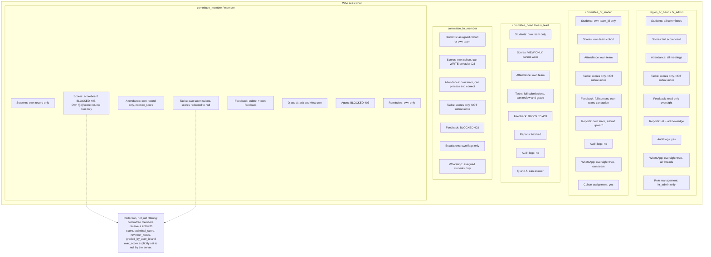
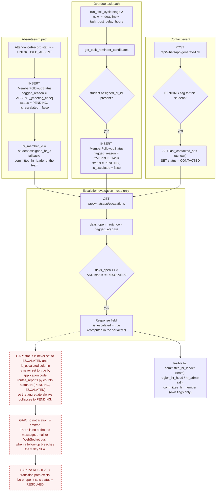

# 04 — Authorization and Access Model

> All claims **[VERIFIED]** against `backend/app/core/dependencies.py`, `backend/app/api/routes_*.py`, and `backend/app/agent/tools.py` unless tagged.

## 1. Authentication

### Token structure

Two JWTs, both HS256, both signed with `settings.JWT_SECRET_KEY`.

| Claim | Access token | Refresh token |
|---|---|---|
| `sub` | `User.id` | `User.id` |
| `email`, `role`, `team_id` | Yes | Yes |
| `type` | `"access"` | `"refresh"` |
| `exp` | `now + ACCESS_TOKEN_EXPIRE_MINUTES` (default 30) | `now + REFRESH_TOKEN_EXPIRE_DAYS` (default 30) |
| `iat` | Yes | Yes |
| `jti` | **No** | `uuid4()` — the revocation key |

**[VERIFIED]** `core/security.py:60-104`

**Critical:** `role` and `team_id` are baked into the access token, but **the server never trusts them.** `get_current_user` reads only `sub` and `type`, then loads the `User` row from the database. Role changes take effect immediately rather than at the next token refresh. **[VERIFIED]** `dependencies.py:68-96`

### Flow

*Login, per-request validation, rotation, reuse detection, and logout. Use it to reason about session lifetime.*

Standalone source: [`diagrams/04-token-flow.mmd`](diagrams/04-token-flow.mmd)

### Refresh rotation and theft detection

`POST /api/auth/refresh` looks up `RefreshSession` by `jti`. If `revoked_at` is set, the server assumes token theft and **revokes every session for that user**, then returns 401. **[VERIFIED]** `routes_auth.py:360-374`

Dead code worth knowing about: line 362 runs a `SELECT RefreshSession WHERE user_id = user_id` whose result is discarded, with the comment "Just logic outline". Harmless, but confusing. **[VERIFIED]**

### Account takeover controls

| Control | Behavior |
|---|---|
| Self-registration role | Always forced to `"member"` regardless of the submitted `role` field |
| Student auto-linking | **Never by email.** Requires a valid single-use, unexpired, email-bound `invitation_token` |
| Invitation binding | `student.email.lower() != registering_email` → 400 "Invitation token is bound to a different email address" |
| Claim-once | 400 if a `User` already has that `student_id` |
| Password policy | ≥8, ≤128 (bcrypt 72-byte truncation + DoS), ≥1 letter, ≥1 digit or punctuation, not whitespace |
| Last admin | Cannot demote the final active `hr_admin` |
| Enumeration | Login returns one message for unknown-user and wrong-password alike; registration returns a distinct 400 for a taken email (**this does leak account existence**) |
| Storage | bcrypt cost 12; invitation tokens stored as SHA-256 hex; refresh tokens stored only as `jti` |

Covered by `tests/security/test_09_account_takeover.py` and `test_registration_account_takeover_prevention.py`. **[VERIFIED]**

## 2. Role hierarchy

*Delegation and reporting lines. Note that this is a workflow graph, not an inheritance chain — no role implicitly inherits another.*

Standalone source: [`diagrams/04-role-hierarchy.mmd`](diagrams/04-role-hierarchy.mmd)

| Role | Meaning | `team_id` | `student_id` |
|---|---|---|---|
| `region_hr_head` | Regional HR Head / Vice HR. Oversight and acknowledgment only. | null | null |
| `hr_admin` | Legacy system administrator. Cross-committee, role management, audit. | null | null |
| `committee_hr_leader` | Committee HR Leader. Manages the committee's HR and reports upward. | required | null |
| `committee_head` | Committee Head, technical side. Tasks, meetings, grading. | required | may be set |
| `team_lead` | Legacy alias of `committee_head` | required | may be set |
| `committee_hr_member` | Committee HR Member. Attendance and behavior scores for a cohort. | required | null |
| `committee_member` | Committee Member. Submits work, views own records. | required | required |
| `member` | Legacy alias of `committee_member` | may be null | required |

`ROLE_EQUIVALENTS` makes `committee_head` ⟷ `team_lead` and `committee_member` ⟷ `member` interchangeable in every `require_roles` check. **[VERIFIED]** `dependencies.py:106-115`

**The hierarchy is not enforced structurally.** A `committee_member` is not a subset of `committee_hr_member` in any code sense; each endpoint lists its roles explicitly. Adding a role means auditing every `require_roles` call by hand. **[VERIFIED]**

## 3. Where authorization is enforced

*The three independent authorization layers. Use it to know which layer to touch for a given kind of rule.*

Standalone source: [`diagrams/04-authz-decision.mmd`](diagrams/04-authz-decision.mmd)

| Layer | Mechanism | Example location |
|---|---|---|
| Transport | `SecurityHeadersMiddleware`, CORS allowlist + LAN regex | `main.py:52-92` |
| Authentication | `get_current_user` → `get_current_active_user` | `dependencies.py:46-107` |
| Coarse RBAC | `require_roles([...])` as a route dependency | every router |
| Object-level | `verify_student_access(student_id, user, db, mode)` | `dependencies.py:163-253` |
| Row-level | `WHERE Student.team_id == current_user.team_id` in the query | most handlers |
| Field-level | Explicit `score=None`, `max_score=None` in the response construction | `routes_tasks.py:126-131,430-437` |
| Business rule | Inline `if role in (...): raise 403` | `routes_students.py:191` |
| Agent | `TOOL_DEFINITIONS.required_roles` + per-handler `team_id` filter | `agent/tools.py` |
| **Frontend only** | `NAV_ITEMS[].roles` filters sidebar tabs; `NAV_ITEMS.find(...).id \|\| 'dashboard'` redirects | `Sidebar.tsx:65-186`, `App.tsx:34` |

**The frontend guard is a UX affordance only.** A member can hand-edit the URL to `/app/scoreboard`; the app redirects to `/dashboard`, but if they call `GET /api/students/scoreboard/all` directly the server returns 403. Server-side enforcement is what matters and it is present on every restricted route. **[VERIFIED]**

## 4. Permission matrix

Legend: **—** none · **V** view · **C** create · **E** edit · **D** delete · **O** own-only · **A** aggregated/team-scoped · **R** own team only · **X** explicitly blocked (403)

| Resource / action | region_hr_head | hr_admin | committee_hr_leader | committee_head / team_lead | committee_hr_member | committee_member / member |
|---|---|---|---|---|---|---|
| **Students** — list | V (all) | V (all) | R | R | R (cohort + team) | O |
| **Students** — create | V (any team) | V (any team) | R (own team) | R (own team) | R (own team) | X |
| **Students** — read one | V | V | R | R | R (assigned or team) | O |
| **Students** — phone edit | — | V | V | X | V (assigned) | X |
| **Students** — cohort assign | V | V | V (own team) | X | X | X |
| **Students** — bonus | — | V | V | X | X | X |
| **Students** — issue invitation | V | V | V (own team) | V (own team) | V (assigned) | X |
| **Scores** — full scoreboard | V | V | R | **V (read-only)** | R (cohort) | **X (403)** |
| **Scores** — one student | V | V | R | **V (read-only)** | R (cohort) | **X (403)** |
| **Scores** — write behavior /23 | X | V | **X** | **X (read-only by design)** | V (assigned cohort) | X |
| **Scores** — award bonus | X | V | V | X | X | X |
| **Tasks** — list | V | V | R | R | R | R (assigned only) |
| **Tasks** — create | X | V | X | V | X | X |
| **Tasks** — assign students | X | V | X | V | X | X |
| **Tasks** — see `max_score` | V | V | V | V | V | **X (nulled)** |
| **Tasks** — see submissions (files) | **X (403)** | V | **X (403)** | V (own team) | **X (403)** | O (own, scores nulled) |
| **Tasks** — see scores only | V | V | V | V | V | **X (403)** |
| **Tasks** — review / grade | X | V | X | V | X | X |
| **Tasks** — submit own work | X | X | X | X | X | V (own only) |
| **Attendance** — list meetings | V | V | R | R | R | R (assigned + team) |
| **Attendance** — create meeting | X | V | X | V | X | X |
| **Attendance** — run processor | X | V | X | X | V | X |
| **Attendance** — manual status edit | V | V | V | X | V (own team) | X |
| **Attendance** — read records | V (all) | V (all) | R | R | R | **O (own record)** |
| **Evaluations** — `member_feedbacks` create | V | V | V | V | V | V (own) |
| **Evaluations** — read feedback | V (all) | V (all) | R | **X (403)** | **X (403)** | O (own) |
| **Evaluations** — action feedback | — | X | V | X | X | X |
| **FAQ/Q&A** — ask | V | V | V | V | V | V (own) |
| **FAQ/Q&A** — list | V (all) | V (all) | R | R | R | O (own) |
| **FAQ/Q&A** — answer | V | V | X | V (own team) | X | X |
| **Calendar** — read events | V | V | V | V | V | V |
| **Calendar** — create event | X | V | X | X (`team_lead` only via `require_roles(["hr_admin","team_lead"])`) | X | X |
| **Reports** — committee summary | V | V | R | X | X | X |
| **Reports** — submit upward | X | V | V | X | X | X |
| **Reports** — list | V (all) | V (all) | R (own team) | X | X | X |
| **Reports** — acknowledge | V | V | X | X | X | X |
| **Reminders** — list logs | V | V | R | R | R | **O (own)** |
| **Reminders** — read one | V | V | R | R | R | O (own) |
| **Automation** — read settings | V (own row) | V | V | V | V | V |
| **Automation** — write settings | V | V | V | X | X | X |
| **Automation** — trigger run | V | V | V | X | X | X |
| **WhatsApp** — status / QR | V | V | V | V | V | **X (403 on /qr)** |
| **WhatsApp** — official broadcast | V | V | X | X | X | X |
| **WhatsApp** — generate link | V | V | R | R | R | O |
| **WhatsApp** — threads | V (oversight) | V (oversight) | R (oversight) | X (listed in `require_roles` but returns `[]` from `get_authorized_threads`) | **O (assigned only)** | X |
| **WhatsApp** — escalations | V (all) | V (all) | R | X | O (own flags) | X |
| **Admin** — create team | X | V | X | X | X | X |
| **Admin** — change role | X | V | X | X | X | X |
| **Admin** — audit logs | X | V | X | X | X | X |
| **Agent** — chat / stream / confirm | V | V | V | V | V (limited tools) | **X (403)** |
| **Agent** — list tools | V | V | V | V | V | V (any active user) |
| **Auth** — list teams | V | V | V | V | V | V (**unauthenticated**) |

### Notable cells

1. **`committee_head` is view-only on behavior scores by design** — `PUT /api/students/{id}/behavior-score` is `require_roles(["committee_hr_member", "hr_admin"])`. The docstring says explicitly "Committee Head is strictly read-only and cannot call this endpoint."
2. **HR roles are blocked from task submissions.** `region_hr_head`, `committee_hr_leader`, and `committee_hr_member` all get 403 on `GET /api/tasks/{id}/submissions` and `GET /api/tasks/submissions/{sid}` — the exact mirror of members being blocked from scores.
3. **`committee_head` is blocked from member feedback.** Members file feedback *about* HR; the HR leader reviews it. A technical head in between is deliberately excluded.
4. **`hr_admin` cannot action feedback** — `PATCH /api/feedback/{id}/status` is `committee_hr_leader` only, even though `hr_admin` can read everything else.
5. **`committee_head` appears in `require_roles` for `/api/whatsapp/threads`** but `WhatsAppService.get_authorized_threads` has no branch for it, so it returns `[]`. Not a leak, but a misleading guard.

## 5. Who sees what

*Field-level and record-level visibility per role. Use it when adding a column to a response and asking who should see it.*

Standalone source: [`diagrams/04-who-sees-what.mmd`](diagrams/04-who-sees-what.mmd)

### Sensitive field inventory

| Field | Where | Who can read it | Protection |
|---|---|---|---|
| `Student.phone` | `/api/students`, `/api/students/{id}` | Everyone in scope for their role; members only their own | Row scoping only. No masking, no encryption |
| `Student.email` | Same | Same | Same |
| `ScoreRecord.points` (behavior) | `/api/students/{id}/score`, `/scoreboard/all`, agent `get_student_score` | All roles **except** `committee_member` | 403 for members; no masking |
| `Submission.score` / `technical_score` | `/api/tasks/submissions/{sid}`, `/api/tasks/{id}/submissions` | `committee_head`, `hr_admin`; own record for members with `null` | 403 for HR roles; field nulling for members |
| `Submission.file_url` | Same | Same as above | **Returned to members for their own submission.** The member is submitting a URL, so this is the member's own data |
| `Submission.reviewer_notes` | Same | `committee_head`, `hr_admin`; `null` for members | Field nulling |
| `AttendanceRecord.excuse_reason` | `/api/attendance/meetings/{id}` | Any role, but records are role-scoped first | A member sees only their own excuse |
| `MemberFeedback.content` | `/api/feedback` | HR leader (own team), region, admin, own author | 403 for `committee_hr_member` and `committee_head` |
| `MemberQuestion.content` | `/api/questions` | Committee roles (own team), region, admin, own author | Row scoping |
| `whatsapp_chat_messages.content` | `/api/whatsapp/threads/...` | Assigned HR member, or oversight roles | Assignment check inside `WhatsAppService` |
| `User.hashed_password` | Never | Never | Not in any response schema |
| Audit `parameters` / `result` | `/api/audit/logs` | `hr_admin` only | **Contains phone numbers and full message bodies** |
| `ReminderLog.message_content` + `recipient_phone` | `/api/automation/reminders` | Role-scoped; members see only their own | Row scoping |
| `GoogleMeetAttendanceProvider` raw payloads | `participant_sessions` | Not exposed by any endpoint | Stored, unexposed |

**No encryption at rest, no column masking, no PII scrubbing in logs or audit records.** Protection is entirely row-scoping, role gates, and field nulling. **[VERIFIED]**

## 6. Data scoping rules

| Scope key | Rule |
|---|---|
| `region_hr_head`, `hr_admin` | `is_admin_override = True` on the agent side; no team filter on student queries |
| `committee_hr_leader`, `committee_head`, `team_lead` | `team_id == current_user.team_id`. If `team_id` is null, most handlers return `[]` (fail closed) |
| `committee_hr_member` | Read: `assigned_hr_id == user.id OR team_id == user.team_id`. Write: `assigned_hr_id == user.id` only. Scoreboard narrows further to `assigned OR (same team AND assigned_hr_id IS NULL)` |
| `committee_member`, `member` | `student.id == current_user.student_id` |

`verify_student_access(..., mode)` is the canonical implementation of these rules, and it is the only place the `chat` mode exists: `committee_hr_member` requires explicit assignment; `committee_member` is refused outright ("HR chat privileges required"). **[VERIFIED]** `dependencies.py:186-206`

**Fail-closed behavior is consistent but not universal.** `verify_student_access` raises 403; most list handlers return `[]`; agent tools return a `{message: "Unauthorized: Missing team scope."}` payload with a 200 status. Three different failure conventions for the same conceptual condition. **[VERIFIED]**

## 7. Escalation and notification rules

*The exact escalation logic in code, with the three missing pieces marked. Use it before implementing the notification half.*

Standalone source: [`diagrams/04-escalation-flow.mmd`](diagrams/04-escalation-flow.mmd)

### Exact logic, as implemented

**Flag creation — two sources, both in `automation_service.py`:**

1. `run_attendance_cycle` is not the source. `AttendanceService.process_meeting_attendance` creates the flag inline: on `status == "UNEXCUSED_ABSENT"`, if the student is not already flagged for this meeting (`LIKE '%ABSENT_{meeting_code}%'`), insert `MemberFollowupStatus(flagged_reason=f"ABSENT_{meeting.meeting_code}", status="PENDING", hr_member_id=student.assigned_hr_id or <first committee_hr_leader of the team>)`. **[VERIFIED]** `attendance_service.py:207-221`
2. `run_task_cycle` stage 2: after `now >= deadline + task_post_delay_hours`, if `student.assigned_hr_id` is set and no `OVERDUE_TASK` flag with `status != "RESOLVED"` exists, insert one. **[VERIFIED]** `automation_service.py:311-341`

**Contact marking:** `POST /api/whatsapp/generate-link` sets `last_contacted_at = utcnow()` and `status = "CONTACTED"` on the student's `PENDING` flag. This is the only transition out of `PENDING`. **[VERIFIED]** `routes_whatsapp.py:246-255`

**Escalation:** `GET /api/whatsapp/escalations` computes `days_open = (utcnow() - flagged_at).days` and `is_over_sla = days_open >= 3 and status != "RESOLVED"`, then returns `"is_escalated": followup.is_escalated or is_over_sla`. **[VERIFIED]** `routes_whatsapp.py:295-320`

### What is missing

| Missing piece | Evidence | Severity |
|---|---|---|
| **`status` never becomes `ESCALATED`** | `grep '"ESCALATED"'` finds only the entity comment and `routes_reports.py:84`'s `IN ("PENDING","ESCALATED")` filter. Nothing writes it. | Medium |
| **`is_escalated` column never set to `true`** | Written only as `False` in `automation_service.py:334`; read in `routes_whatsapp.py:316`; `True` appears only in seed data. | Medium |
| **No notification on breach** | No email, no WhatsApp, no WebSocket push fires when the SLA is breached. HR must poll `GET /api/whatsapp/escalations`. | **High (functional)** |
| **No `RESOLVED` transition** | No endpoint or tool writes the literal. The `status != "RESOLVED"` guards in two places are permanently true. | Medium |
| **`open_followup_flags` is misleading** | Because `ESCALATED` is never written, `routes_reports.py:82-88` counts only `PENDING` — the aggregate can never reflect an escalation. | Low |
| **Flag not tied to a specific HR deadline** | `flagged_at` never resets. A member contacted on day 1 and again on day 5 still shows `days_open = 5` even though `status = CONTACTED`. Escalation depends on `status != "RESOLVED"`, so a `CONTACTED` flag still escalates after 3 days from the original flag, not from the last contact. | Medium |

## 8. Security review

### Positive findings

| Control | Evidence |
|---|---|
| Layered defense | Every restricted endpoint has both a role gate and a scope check |
| Server-side role source of truth | Role is read from the DB, not the token |
| Fail-closed defaults | Null `team_id` returns `[]` rather than everything |
| Field redaction | Scores, notes, and `max_score` nulled server-side for members |
| Immutability | DB triggers block `DELETE` and critical-field `UPDATE` on `agent_action_audits` |
| Replay protection | Atomic `UPDATE ... WHERE status='PENDING_CONFIRMATION'` |
| Reuse detection | Revoked refresh token → revoke all sessions |
| SQL injection defence | Parameterized SQLAlchemy throughout; `escape_like` for the handful of `ILIKE` searches |
| Production secret guard | `config.py` refuses to boot on the default JWT key or SQLite in production |
| Security headers | CSP, `frame-ancestors 'none'`, nosniff, DENY, HSTS in production |
| 20 dedicated security tests | IDOR sweep, privilege audit, rate limits, account takeover, HITL, WebSocket, webhook, question IDOR, report scope, task scope, meeting IDOR |

### Findings

| # | Finding | Severity | Evidence |
|---|---|---|---|
| 1 | **Rate limiting keys on `request.client.host`.** Behind Vercel or any proxy this is a single shared IP, so the 60/min login limit is global — an unauthenticated attacker can lock out every user. `X-Forwarded-For` is deliberately ignored. | **High** | `rate_limiter.py:96-104` |
| 2 | **Rate limits are per-process and in-memory.** Multiple workers multiply the effective limit; a restart clears all counters. | **High** | `rate_limiter.py:78` |
| 3 | **WebSocket authenticates via `?token=`.** Access tokens land in URLs, proxy logs, and browser history. | Medium | `routes_whatsapp.py:531-537` |
| 4 | **`GET /api/auth/teams` is unauthenticated**, leaking team names, codes, and headcounts. | Low | `routes_auth.py:422` |
| 5 | **`GET /api/agent/tools` is gated on authentication only**, disclosing tool names, required roles, and schemas to any logged-in member. | Medium | `routes_agent.py:268` |
| 6 | **Registration reveals account existence** with a distinct 400 for a taken email, while login correctly does not. Enables enumeration of HR accounts. | Medium | `routes_auth.py:92-97` |
| 7 | **`students.phone` has no unique constraint**, though the create handler checks for duplicates. A race allows duplicate phones, breaking `generate-link` targeting. | Medium | `entities.py:92` |
| 8 | **`POST /api/tasks/{id}/submit` does not check `TaskAssignment`.** Any member can submit for any task ID. | Low | `routes_tasks.py:663` |
| 9 | **Access tokens cannot be revoked.** `POST /api/auth/logout` only revokes the refresh token. A stolen access token is valid for up to `ACCESS_TOKEN_EXPIRE_MINUTES` (`.env.example` shows 1440). | Medium | `routes_auth.py:627-646` |
| 10 | **`/api/agent/confirm` does not bind the action to its creator.** Any HR-eligible user in the same team can confirm another user's pending reminder. | Medium | `routes_agent.py:186-201` |
| 11 | **`PENDING_CONFIRMATION` never expires.** A leaked `action_id` stays confirmable forever. | Medium | `entities.py:271` |
| 12 | **No media upload size limit.** `send_thread_media` reads the whole file into memory and stores a base64 data URI in a `Text` column — a memory-exhaustion and storage-bloat vector. | Medium | `routes_whatsapp.py:401-408` |
| 13 | **No CSRF protection, and tokens are in `localStorage`.** Any XSS yields a full session. The CSP is `script-src 'self'` with no nonce, which mitigates injection but does not eliminate the risk. | Medium | `client.ts:33-37` |
| 14 | **Exceptions surface internal text to clients in two places**: `call_openrouter` returns `f"...{str(e)}"`, and `execute_tool` returns `{"error": str(e)}` to the model. | Medium | `react_agent.py:272`, `react_agent.py:410` |
| 15 | **`committee_hr_member` can `PATCH /api/students/{id}/phone`** via `verify_student_access(..., mode="write")`, which requires `assigned_hr_id == user.id`. Narrow, but phone is PII. | Low | `routes_students.py:364` |
| 16 | **Audit logs contain full request/response JSON including phone numbers and message bodies**, readable by `hr_admin`. No redaction. | Low | `routes_audit.py:26-30` |
| 17 | **`students.phone` and `email` are stored in plaintext.** No encryption at rest, no hashing — both are needed operationally for contact, but that should be a conscious decision. | Low | `entities.py:92-93` |
| 18 | **ID enumeration is inconsistent.** `verify_student_access` returns 404 for a nonexistent student and 403 for an out-of-scope one — the classic IDOR tell. The tests accept either. | Low | `dependencies.py:180-184` |
| 19 | **No `is_active` re-check after token issue is impossible** (it is re-checked per request) — this one is fine. Listed for completeness. | — | `dependencies.py:97-107` |
| 20 | **`assigned_count` over-reports** in `assign-cohort` when students are skipped. Informational, not a security issue. | Low | `routes_students.py:352` |

### Privilege-escalation paths considered

| Path | Status |
|---|---|
| Self-registering as `hr_admin` | **Closed.** `role` is force-set to `"member"` in `register_user`. |
| Changing your own role | **Closed.** `PATCH /api/auth/users/{id}/role` requires `hr_admin`; the last-admin demotion is blocked. |
| Creating a team you then lead | **Closed.** `POST /api/auth/teams` is `hr_admin` only. |
| Invitation token to claim another student | **Closed.** Token is single-use, expiring, and bound to the student's exact email. |
| Confirming another user's agent action | **Open** (finding 10). Bounded by team scope. |
| Agent `is_admin_override` on a committee user | **Closed.** Requires a `region_hr_head`/`hr_admin` role string, or a team-less `HR_LEAD`. |
| `get_meeting` bypassing the tool allowlist | **Open.** It is in `TOOL_REGISTRY` but not `TOOL_DEFINITIONS`, so `execute_tool` skips the role check. Not reachable by any user through `/api/agent/*` because the agent intents never call it. |
| Horizontal escalation via a `team_lead` with no `team_id` | **Closed.** Most handlers return `[]`; `verify_student_access` raises 403. |

## 9. Role-by-role test checklist

Each row is an assertion to add. The existing `backend/tests/security/` suite covers items marked ✅.

### As `committee_member`

| # | Request | Expected | Covered |
|---|---|---|---|
| 1 | `GET /api/students/scoreboard/all` | 403 | ✅ `test_17_get_read_only` |
| 2 | `GET /api/students/{other_student_id}/score` | 403 | ✅ `test_05_idor_sweep` |
| 3 | `GET /api/tasks/{id}/scores` | 403 | ✅ `test_task_score_authorization` |
| 4 | `GET /api/tasks/submissions/{sid}/score` | 403 | ✅ `test_task_score_authorization` |
| 5 | `GET /api/feedback` — another member's feedback | empty list | ✅ `test_11_feedback_idor` |
| 6 | `POST /api/agent/chat` | 403 | ✅ `test_06_ai_agent_hitl` |
| 7 | `GET /api/students/{other_student_id}` | 403 | ✅ `test_05_idor_sweep` |
| 8 | `GET /api/attendance/meetings/{id}` | 200, only own record | ✅ `test_14_meeting_idor` |
| 9 | `GET /api/tasks/{id}` — unassigned task | 403 | ✅ `test_15_task_scope` |
| 10 | `GET /api/tasks/submissions/{other_submission_id}` | 403 | ✅ `test_10_hr_task_score` |
| 11 | `GET /api/whatsapp/threads` | 403 | ⚠️ add |
| 12 | `GET /api/audit/logs` | 403 | ⚠️ add |
| 13 | `GET /api/whatsapp/qr` | 403 | ⚠️ add |
| 14 | `GET /api/automation/reminders` | 200, own only | ⚠️ add |
| 15 | `GET /api/reports` | 403 | ⚠️ add |
| 16 | `GET /api/tasks/{id}/submissions` | 200, own with `score: null` | ⚠️ add |
| 17 | `PUT /api/students/{own_id}/behavior-score` | 403 | ⚠️ add |

### As `committee_hr_member`

| # | Request | Expected | Covered |
|---|---|---|---|
| 18 | `GET /api/tasks/{id}/submissions` | 403 | ✅ `test_10_hr_task_score` |
| 19 | `GET /api/tasks/submissions/{sid}` | 403 | ✅ `test_10_hr_task_score` |
| 20 | `GET /api/feedback` | 403 | ✅ `test_11_feedback_idor` |
| 21 | `PUT /api/students/{id}/behavior-score` — assigned | 200 | ✅ `test_hr_task_score_collection` |
| 22 | `PUT /api/students/{id}/behavior-score` — unassigned | 403 | ⚠️ add |
| 23 | `POST /api/attendance/meetings/{other_team_meeting}/process` | 403 | ✅ `test_05_idor_sweep` |
| 24 | `GET /api/whatsapp/threads` — unassigned student absent | 200, filtered | ✅ `test_roles_and_whatsapp` |
| 25 | `POST /api/students/{id}/bonus` | 403 | ⚠️ add |
| 26 | `POST /api/reports/submit-to-head` | 403 | ✅ `test_16_report_scope` |
| 27 | `GET /api/students/scoreboard/all` | 200, cohort only | ⚠️ add |
| 28 | `GET /api/whatsapp/escalations` | 200, own flags only | ⚠️ add |

### As `committee_head` / `team_lead`

| # | Request | Expected | Covered |
|---|---|---|---|
| 29 | `PUT /api/students/{id}/behavior-score` | 403 — **the key invariant** | ✅ `test_hr_task_score_collection` |
| 30 | `GET /api/feedback` | 403 | ✅ `test_11_feedback_idor` |
| 31 | `PUT /api/tasks/submissions/{sid}/review` — own team | 200 | ✅ `test_social_media_committee_workflow` |
| 32 | `PUT /api/tasks/submissions/{sid}/review` — other team | 403 | ✅ `test_15_task_scope` |
| 33 | `PUT /api/tasks/submissions/{sid}/review` — `score > max_score` | 400 | ⚠️ add |
| 34 | `POST /api/students/{id}/bonus` | 403 | ⚠️ add |
| 35 | `GET /api/students/scoreboard/all` | 200, team only, read-only | ⚠️ add |
| 36 | `PATCH /api/feedback/{id}/status` | 403 | ⚠️ add |

### As `committee_hr_leader`

| # | Request | Expected | Covered |
|---|---|---|---|
| 37 | `GET /api/tasks/submissions/{sid}` | 403 | ✅ `test_10_hr_task_score` |
| 38 | `PATCH /api/feedback/{other_team_id}/status` | 403 | ✅ `test_11_feedback_idor` |
| 39 | `POST /api/students/assign-cohort` — other-team students | 403 or skipped | ⚠️ add |
| 40 | `POST /api/reports/{id}/acknowledge` | 403 | ✅ `test_16_report_scope` |
| 41 | `GET /api/reports` | 200, own team only | ✅ `test_16_report_scope` |
| 42 | `POST /api/agent/confirm` — cross-team targets | 403 | ✅ `test_06_ai_agent_hitl` |

### As `region_hr_head`

| # | Request | Expected | Covered |
|---|---|---|---|
| 43 | `GET /api/audit/logs` | 403 | ✅ `test_07_privilege_audit` |
| 44 | `PATCH /api/auth/users/{id}/role` | 403 | ✅ `test_07_privilege_audit` |
| 45 | `POST /api/auth/teams` | 403 | ⚠️ add |
| 46 | `PATCH /api/feedback/{id}/status` | 403 — oversight is read-only | ⚠️ add |
| 47 | `GET /api/tasks/{id}/submissions` | 403 | ⚠️ add |
| 48 | `POST /api/reports/{id}/acknowledge` | 200 | ⚠️ add |

### As `hr_admin`

| # | Request | Expected | Covered |
|---|---|---|---|
| 49 | `PATCH /api/auth/users/{last_admin_id}/role` | 400 | ⚠️ add |
| 50 | `POST /api/auth/teams` — duplicate code | 400 | ⚠️ add |
| 51 | `GET /api/audit/logs` | 200 | ✅ `test_07_privilege_audit` |
| 52 | `PUT /api/students/{id}/behavior-score` | 200 — admin override | ⚠️ add |

### Unauthenticated

| # | Request | Expected | Covered |
|---|---|---|---|
| 53 | Any protected endpoint without a token | 401 | ✅ `test_02_auth_refresh` |
| 54 | `POST /api/auth/login` — wrong password | 401, no enumeration | ✅ `test_02_auth_refresh` |
| 55 | `POST /api/auth/register` with a duplicate email | 400 (enumeration — decide) | ✅ `test_09_account_takeover` |
| 56 | `POST /api/whatsapp/webhook` without a secret | 401 | ✅ `test_04_webhook` |
| 57 | `POST /api/whatsapp/webhook` with a wrong secret | 403 | ✅ `test_04_webhook` |
| 58 | `WS /api/whatsapp/ws` without a token | close 1008 | ✅ `test_03_websocket` |
| 59 | `WS /api/whatsapp/ws` as `committee_member` | close 1008 | ✅ `test_03_websocket` |
| 60 | `GET /api/auth/teams` | 200 — currently public, decide | ⚠️ add |

## 10. Gaps and open questions

| # | Item | Severity |
|---|---|---|
| 1 | Rate-limit keying collapses to a global bucket behind a proxy. Login can be locked out org-wide. | **High** |
| 2 | In-memory, per-process rate limits. | **High** |
| 3 | No notification when a follow-up breaches the 3-day SLA. The escalation model is read-only. | **High (functional)** |
| 4 | WebSocket token in the query string. | Medium |
| 5 | `/api/agent/confirm` does not verify the confirmer is the requester. | Medium |
| 6 | Access tokens are not revocable. | Medium |
| 7 | Registration enumerates accounts. | Medium |
| 8 | `/api/agent/tools` discloses the tool catalog to any authenticated user. | Medium |
| 9 | `students.phone` lacks a unique constraint despite handler-level checking. | Medium |
| 10 | Media upload has no size limit; base64 goes into a `Text` column. | Medium |
| 11 | Tokens in `localStorage` with no CSRF token. | Medium |
| 12 | `status` never reaches `ESCALATED`; `is_escalated` is never persisted; `RESOLVED` is unreachable. | Medium |
| 13 | `days_open` measures from `flagged_at`, not `last_contacted_at`, so a re-contacted member still escalates on the original clock. | Medium |
| 14 | `get_meeting` skips the tool allowlist. | Medium |
| 15 | Three different failure conventions for a scope violation: 403, `[]`, and a 200 with a message. | Low |
| 16 | `committee_head` is listed in `require_roles` for `/api/whatsapp/threads` but silently gets `[]`. | Low |
| 17 | The role hierarchy is not structural; adding a role requires auditing every route by hand. | Low |
| 18 | No encryption at rest or PII masking for phone/email. | Low |
| 19 | 404 vs 403 reveals ID existence. | Low |
| 20 | 25 of the 60 suggested role-matrix assertions are not yet in the suite (marked ⚠️ above). | Medium |
