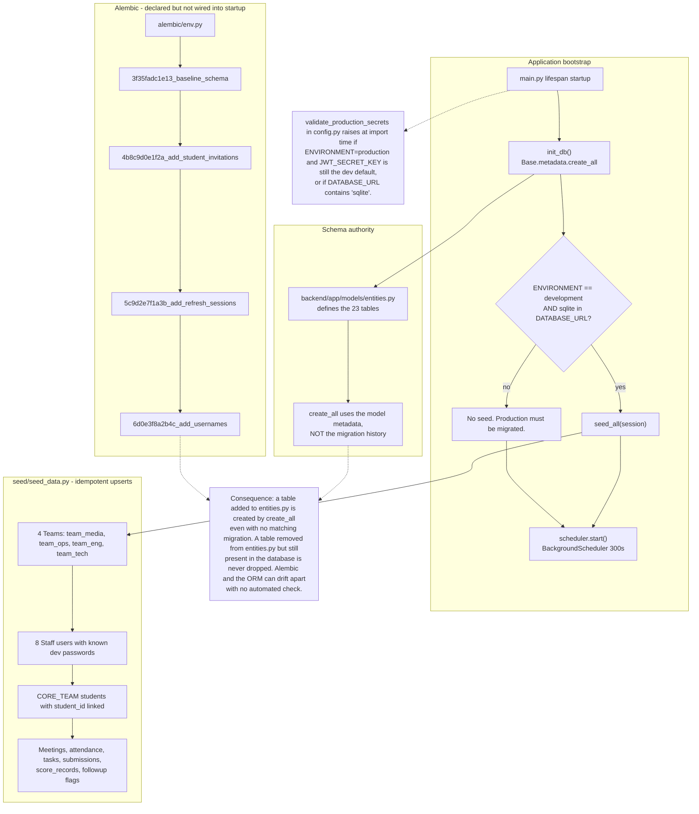
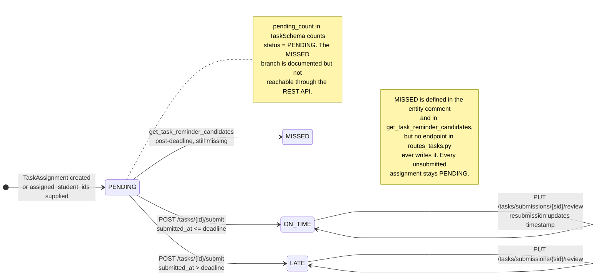
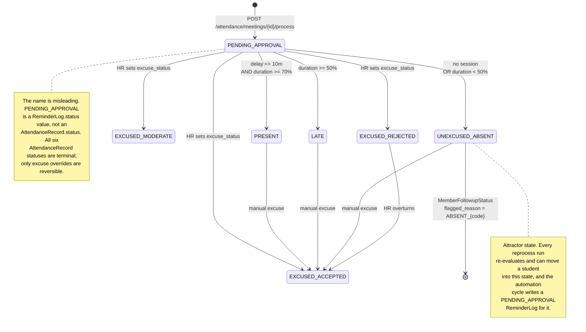
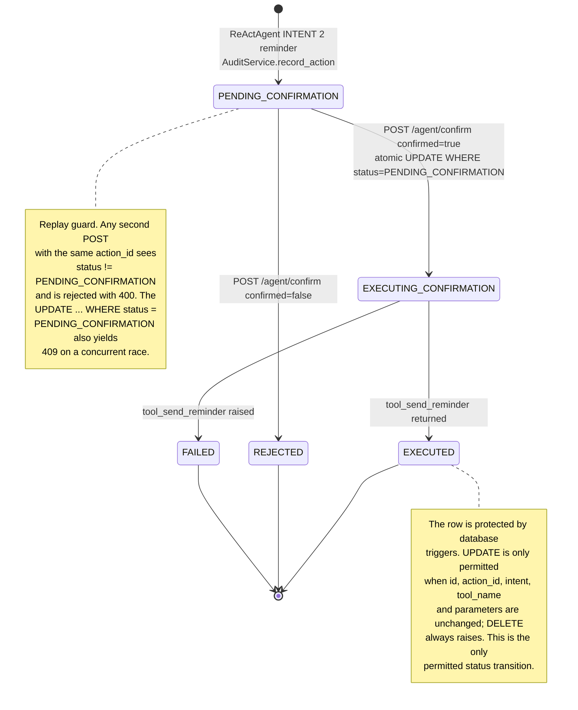
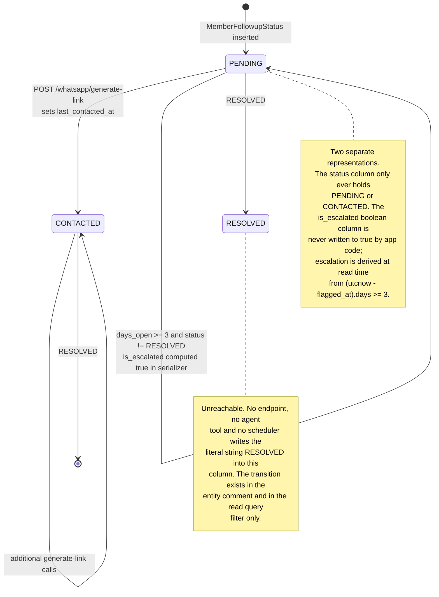

# 05 — Database

> All claims **[VERIFIED]** against `backend/app/models/entities.py`, `backend/app/core/database.py`, `backend/alembic/`, and every `select(...)` in `backend/app/` unless tagged.

## 1. Engine and access method

| Property | Development | Production |
|---|---|---|
| Engine | SQLite via `aiosqlite` | PostgreSQL via `asyncpg` |
| URL | `sqlite+aiosqlite:///./studentops.db` | `postgresql+asyncpg://...@aws-1-....pooler.supabase.com:6543/postgres` |
| ORM | SQLAlchemy 2.0 async (`DeclarativeBase`, `AsyncSession`) | Same |
| Raw SQL | Only `PRAGMA foreign_keys=ON` and `SELECT 1` | None |
| Session factory | `AsyncSessionLocal` with `expire_on_commit=False`, `autoflush=False` | Same |
| Pool | SQLite: `check_same_thread=False` | Postgres: `pool_pre_ping=True`, `pool_recycle=300`; prepared-statement caches disabled when the host contains `pooler.supabase.com` or `6543` |

**[VERIFIED]** `core/database.py:36-66`

`get_normalized_database_url` rewrites `postgres://` and `postgresql://` to `postgresql+asyncpg://`, and anchors relative SQLite paths to the `backend/` directory so every process shares one file. **[VERIFIED]** `core/database.py:14-33`

**Supabase is a hosting choice, not a code dependency.** `SUPABASE_URL`, `SUPABASE_PUBLISHABLE_KEY`, `SUPABASE_SECRET_KEY`, and `SUPABASE_JWKS_URL` are declared in `Settings` and `.env.example` but are **never read anywhere in `backend/app/`**. Authentication is local JWT + bcrypt, not Supabase Auth. There is no `supabase` Python package installed. **[VERIFIED]**

## 2. Entity-relationship diagram

```mermaid
erDiagram
    TEAMS ||--o{ USERS : "employs"
    TEAMS ||--o{ STUDENTS : "contains"
    TEAMS ||--o{ MEETINGS : "scopes"
    TEAMS ||--o{ TASKS : "scopes"
    TEAMS ||--o{ EVENTS : "scopes"
    USERS ||--o{ REFRESH_SESSIONS : "holds"
    USERS ||--o| STUDENTS : "linked via student_id"
    USERS ||--o{ STUDENTS : "assigned as HR"
    USERS ||--o{ MEETINGS : "responsible_user"
    USERS ||--o{ TASKS : "creates"
    USERS ||--o{ SUBMISSIONS : "grades"
    USERS ||--o{ SCORE_RECORDS : "grades"
    USERS ||--o{ MEMBER_FOLLOWUP_STATUSES : "owns flag"
    USERS ||--o{ WHATSAPP_CHAT_MESSAGES : "assigned_hr"
    USERS ||--o{ MEMBER_FEEDBACKS : "subject_hr"
    USERS ||--o{ MEMBER_FEEDBACKS : "reviewer"
    USERS ||--o{ MEMBER_QUESTIONS : "answers"
    USERS ||--o{ COMMITTEE_REPORTS : "submits"
    USERS ||--o{ AUTOMATION_SETTINGS : "configures"
    USERS ||--o{ STUDENT_INVITATIONS : "issues"

    STUDENTS ||--o{ STUDENT_INVITATIONS : "claims"
    STUDENTS ||--o{ MEETING_ASSIGNMENTS : "assigned to"
    STUDENTS ||--o{ PARTICIPANT_SESSIONS : "matched as"
    STUDENTS ||--o{ ATTENDANCE_RECORDS : "receives"
    STUDENTS ||--o{ TASK_ASSIGNMENTS : "assigned"
    STUDENTS ||--o{ SUBMISSIONS : "submits"
    STUDENTS ||--o{ SCORE_RECORDS : "scored"
    STUDENTS ||--o{ REMINDER_LOGS : "recipient"
    STUDENTS ||--o{ TASK_REMINDERS : "reminded"
    STUDENTS ||--o{ WHATSAPP_CHAT_MESSAGES : "conversation"
    STUDENTS ||--o{ MEMBER_FOLLOWUP_STATUSES : "flagged"
    STUDENTS ||--o{ MEMBER_FEEDBACKS : "author"
    STUDENTS ||--o{ MEMBER_QUESTIONS : "asks"

    MEETINGS ||--o{ PARTICIPANT_SESSIONS : "raw logs"
    MEETINGS ||--o{ ATTENDANCE_RECORDS : "produces"
    MEETINGS ||--o{ MEETING_ASSIGNMENTS : "assigns"
    TASKS ||--o{ TASK_ASSIGNMENTS : "assigns"
    TASKS ||--o{ SUBMISSIONS : "collects"
    TASKS ||--o{ TASK_REMINDERS : "reminds about"

    TEAMS {
        string id PK
        string name UK
        string code UK
        text description
        datetime created_at
    }
    USERS {
        string id PK
        string email UK
        string hashed_password
        string full_name
        string arabic_name
        string role
        string team_id FK
        string student_id FK
        boolean is_active
        datetime created_at
    }
    REFRESH_SESSIONS {
        string id PK
        string user_id FK
        string refresh_token_jti UK
        datetime expires_at
        datetime created_at
        datetime revoked_at
    }
    STUDENTS {
        string id PK
        string student_code UK
        string full_name
        string arabic_name
        string email UK
        string phone
        string university
        string role
        string status
        string team_id FK
        string assigned_hr_id FK
        datetime created_at
    }
    STUDENT_INVITATIONS {
        string id PK
        string student_id FK
        string token_hash UK
        string created_by_user_id FK
        datetime expires_at
        boolean is_used
        datetime used_at
        string used_by_user_id FK
        datetime created_at
    }
    MEETINGS {
        string id PK
        string meeting_code UK
        string title
        string topic
        datetime start_time
        datetime end_time
        int duration_minutes
        string meet_url
        string status
        int session_number
        string responsible_user_id FK
        string team_id FK
        datetime created_at
    }
    PARTICIPANT_SESSIONS {
        string id PK
        string meeting_id FK
        string raw_display_name
        string raw_email
        datetime join_time
        datetime leave_time
        int duration_seconds
        string matched_student_id FK
    }
    MEETING_ASSIGNMENTS {
        string id PK
        string meeting_id FK
        string student_id FK
        datetime assigned_at
    }
    ATTENDANCE_RECORDS {
        string id PK
        string meeting_id FK
        string student_id FK
        string status
        float match_confidence
        datetime first_join
        datetime last_leave
        float total_duration_minutes
        text excuse_reason
        string excuse_status
        string policy_version
        datetime recorded_at
    }
    TASKS {
        string id PK
        int task_number UK
        string title
        text description
        datetime deadline
        float max_score
        string score_rule
        string created_by_user_id FK
        string team_id FK
        datetime created_at
    }
    TASK_ASSIGNMENTS {
        string id PK
        string task_id FK
        string student_id FK
        datetime assigned_at
    }
    SUBMISSIONS {
        string id PK
        string task_id FK
        string student_id FK
        datetime submitted_at
        string status
        float score
        float technical_score
        string file_url
        text reviewer_notes
        datetime reviewed_at
        string graded_by_user_id FK
    }
    SCORE_RECORDS {
        string id PK
        string student_id FK
        string category
        float points
        float max_points
        string month
        string graded_by_user_id FK
        string notes
        string updated_by
        datetime created_at
    }
    EVENTS {
        string id PK
        string title
        text description
        string event_type
        datetime start_time
        datetime end_time
        string location
        string meet_url
        boolean is_mandatory
        datetime created_at
    }
    REMINDER_LOGS {
        string id PK
        string recipient_id FK
        string recipient_name
        string recipient_phone
        string channel
        text message_content
        string status
        datetime sent_at
        string trigger_source
    }
    TASK_REMINDERS {
        string id PK
        string task_id FK
        string student_id FK
        string channel
        int stage
        string status
        text message_text
        datetime sent_at
    }
    AGENT_ACTION_AUDITS {
        string id PK
        string action_id UK
        string user_id
        string intent
        string tool_name
        text parameters
        text result
        boolean requires_confirmation
        boolean confirmed
        string status
        datetime timestamp
    }
    MEMBER_FOLLOWUP_STATUSES {
        string id PK
        string student_id FK
        string hr_member_id FK
        string flagged_reason
        datetime flagged_at
        datetime last_contacted_at
        string status
        boolean is_escalated
        text notes
        datetime created_at
    }
    WHATSAPP_CHAT_MESSAGES {
        string id PK
        string openwa_message_id
        string student_id FK
        string assigned_hr_id FK
        string sender_type
        string sender_id
        string sender_phone
        string recipient_phone
        string message_type
        text content
        text media_url
        string media_filename
        string media_mimetype
        string status
        int ack_status
        string reply_to_message_id
        boolean is_edited
        text reactions
        text raw_payload
        datetime created_at
        datetime delivered_at
        datetime read_at
    }
    AUTOMATION_SETTINGS {
        string id PK
        string user_id FK "unique"
        boolean attendance_enabled
        int attendance_grace_minutes
        text attendance_message
        boolean task_pre_enabled
        int task_pre_hours
        text task_pre_message
        boolean task_post_enabled
        int task_post_delay_hours
        text task_post_message
        boolean whatsapp_enabled
        datetime updated_at
    }
    MEMBER_FEEDBACKS {
        string id PK
        string student_id FK
        string hr_member_id FK
        string hr_member_name
        string category
        text content
        datetime submitted_at
        string reviewed_by_user_id FK
        datetime reviewed_at
        string status
        text notes
    }
    MEMBER_QUESTIONS {
        string id PK
        string student_id FK
        string team_id FK
        string title
        text content
        string status
        datetime asked_at
        string answered_by_user_id FK
        text answer
        datetime answered_at
    }
    COMMITTEE_REPORTS {
        string id PK
        string team_id FK
        string submitted_by_user_id FK
        string report_title
        text metrics_summary
        text notes
        datetime submitted_at
        datetime acknowledged_at
    }
```

*All 23 tables with their primary keys, foreign keys, and cardinalities. Verified one-to-one against `__tablename__` declarations in `backend/app/models/entities.py`.*

Standalone source: [`diagrams/05-er-diagram.mmd`](diagrams/05-er-diagram.mmd)

## 3. Data dictionary

**ID prefixes** (all `String(36)` unless noted):

| Prefix | Table | Format |
|---|---|---|
| `team_` | `teams` | `team_{uuid8}` |
| `usr_` | `users` | `usr_{uuid12}` |
| `stu_` | `students` | `stu_{uuid12}` |
| `meet_` | `meetings` | `meet_{uuid10}`, code `sync_{uuid6}` |
| `sess_` | `participant_sessions` | `sess_{meeting8}_{epoch}_{idx}_{student_id}` |
| `att_` | `attendance_records` | `att_{meeting_id}_{student_id}` (deterministic) or `att_{uuid12}` |
| `task_` | `tasks` | `task_{uuid12}` |
| `sub_` | `submissions` | `sub_{uuid12}` |
| `score_` | `score_records` | `score_{uuid12}` / `score_bonus_{uuid10}` |
| `ta_`, `ma_` | assignments | `ta_{uuid12}`, `ma_{uuid12}` |
| `flag_`, `fol_` | `member_followup_statuses` | `flag_{uuid12}`, `fol_{uuid12}` |
| `fb_`, `q_`, `rep_`, `ev_`, `rem_`, `tr_`, `auto_`, `act_`, `aud_` | misc | various |

### `teams`

| Column | Type | Null | Default | Key | Meaning |
|---|---|---|---|---|---|
| `id` | String(36) | no | — | PK, indexed | `team_{uuid8}` |
| `name` | String(100) | no | — | **unique** | Display name |
| `code` | String(50) | no | — | **unique**, indexed | Short code, e.g. `MEDIA` |
| `description` | Text | yes | `""` | | Purpose |
| `created_at` | DateTime(tz) | yes | `utcnow()` | | Creation time |

Seeded: `team_media`, `team_eng`, `team_ops`, `team_tech`.

### `users`

| Column | Type | Null | Default | Key | Meaning |
|---|---|---|---|---|---|
| `id` | String(36) | no | — | PK | `usr_{uuid12}` |
| `email` | String(100) | no | — | **unique**, indexed | Login identifier |
| `hashed_password` | String(255) | no | — | | bcrypt, cost 12 |
| `full_name` | String(100) | no | — | | Latin name |
| `arabic_name` | String(100) | yes | `None` | | Arabic name |
| `role` | String(50) | yes | `"member"` | indexed? no | One of the eight role strings |
| `team_id` | String(36) | yes | `None` | FK → `teams.id`, indexed | Null for region and admin |
| `student_id` | String(36) | yes | `None` | FK → `students.id`, indexed | Link to the member record |
| `is_active` | Boolean | yes | `True` | | Deactivation flag |
| `created_at` | DateTime(tz) | yes | `utcnow()` | | |

`role` is a plain string, **not** a database enum. The `UserRole` SQLAlchemy `Enum` class in `entities.py:19-29` is defined but never applied to the column, and its members do not include `hr_admin` consistently. **[VERIFIED]**

### `refresh_sessions`

| Column | Type | Null | Default | Key | Meaning |
|---|---|---|---|---|---|
| `id` | String(36) | no | — | PK | `sess_{uuid12}` |
| `user_id` | String(36) | no | — | FK → `users.id` **CASCADE**, indexed | Owner |
| `refresh_token_jti` | String(36) | no | — | **unique**, indexed | The only persisted part of the refresh token |
| `expires_at` | DateTime(tz) | no | — | | Copied from the JWT `exp` |
| `created_at` | DateTime(tz) | yes | `utcnow()` | | |
| `revoked_at` | DateTime(tz) | yes | `None` | | Non-null means revoked |

### `students`

| Column | Type | Null | Default | Key | Meaning |
|---|---|---|---|---|---|
| `id` | String(36) | no | — | PK | `stu_{uuid12}` |
| `student_code` | String(20) | yes | `None` | **unique**, indexed | `ST-2026-{6 hex}`, auto-generated |
| `full_name` | String(100) | no | — | | Latin name |
| `arabic_name` | String(100) | no | — | indexed | Arabic name |
| `email` | String(100) | no | — | **unique**, indexed | Contact |
| `phone` | String(30) | no | — | **not unique** | Contact; drives WhatsApp targeting |
| `university` | String(100) | yes | `"Faculty of Engineering"` | | |
| `role` | String(50) | yes | `"Member"` | | Organisational role: Member, Head, Vice Head, Lead |
| `status` | String(20) | yes | `"ACTIVE"` | | ACTIVE / INACTIVE / PROBATION |
| `team_id` | String(36) | yes | `None` | FK → `teams.id`, indexed | Committee |
| `assigned_hr_id` | String(36) | yes | `None` | FK → `users.id`, indexed | The HR member who owns this member |
| `created_at` | DateTime(tz) | yes | `utcnow()` | | |

**`phone` has no unique constraint** even though `POST /api/students` and `PATCH /api/students/{id}/phone` both check for duplicates. A race allows duplicates, and `OpenWAProvider` resolves a student by phone. **[VERIFIED]**

**`role` here is a different concept from `users.role`.** `students.role` is the position within the committee; `users.role` is the platform permission tier. They share a column name and are unrelated.

### `student_invitations`

| Column | Type | Null | Default | Key | Meaning |
|---|---|---|---|---|---|
| `id` | String(36) | no | — | PK | `inv_{uuid12}` |
| `student_id` | String(36) | no | — | FK → `students.id` **CASCADE**, indexed | The profile being claimed |
| `token_hash` | String(64) | no | — | **unique**, indexed | SHA-256 hex of `inv_{urlsafe32}` |
| `created_by_user_id` | String(36) | yes | `None` | FK → `users.id`, indexed | Issuer |
| `expires_at` | DateTime(tz) | no | — | | Default now + 7 days |
| `is_used` | Boolean | no | `False` | | Single-use latch |
| `used_at` | DateTime(tz) | yes | `None` | | |
| `used_by_user_id` | String(36) | yes | `None` | FK → `users.id` | Claiming account |
| `created_at` | DateTime(tz) | yes | `utcnow()` | | |

### `meetings`

| Column | Type | Null | Default | Key | Meaning |
|---|---|---|---|---|---|
| `id` | String(36) | no | — | PK | `meet_{uuid10}` |
| `meeting_code` | String(50) | no | — | **unique**, indexed | `sync_{uuid6}`; the key sent to the attendance provider |
| `title` | String(150) | no | — | | |
| `topic` | String(200) | yes | `""` | | |
| `start_time` | DateTime(tz) | no | — | | |
| `end_time` | DateTime(tz) | no | — | | Computed from start + duration |
| `duration_minutes` | Integer | yes | `60` | | Denominator of the attendance percentage |
| `meet_url` | String(255) | yes | a hard-coded Google Meet URL | | |
| `status` | String(20) | yes | `"COMPLETED"` | | SCHEDULED / LIVE / COMPLETED |
| `session_number` | Integer | yes | `1` | | Ordinal |
| `responsible_user_id` | String(36) | yes | `None` | FK → `users.id`, indexed | Creator |
| `team_id` | String(36) | yes | `None` | FK → `teams.id`, indexed | Committee scope |
| `created_at` | DateTime(tz) | yes | `utcnow()` | | |

The `meet_url` default is a real-looking Google Meet URL for a demo session. Harmless in dev, misleading if it reaches production. **[VERIFIED]** `entities.py:137`

### `participant_sessions`

| Column | Type | Null | Default | Key | Meaning |
|---|---|---|---|---|---|
| `id` | String(36) | no | — | PK | Deterministic composite, see above |
| `meeting_id` | String(36) | no | — | FK → `meetings.id`, indexed | |
| `raw_display_name` | String(100) | no | — | | As reported by Meet |
| `raw_email` | String(100) | yes | `""` | | Often empty |
| `join_time` | DateTime(tz) | no | — | | |
| `leave_time` | DateTime(tz) | no | — | | |
| `duration_seconds` | Integer | yes | `0` | | |
| `matched_student_id` | String(36) | yes | `None` | FK → `students.id` | `None` when unmatched or ambiguous |

**No `created_at`** — this is the only table without one. **[VERIFIED]**

### `meeting_assignments`

| Column | Type | Null | Default | Key | Meaning |
|---|---|---|---|---|---|
| `id` | String(36) | no | — | PK | `ma_{uuid12}` |
| `meeting_id` | String(36) | no | — | FK → `meetings.id`, indexed | |
| `student_id` | String(36) | no | — | FK → `students.id`, indexed | |
| `assigned_at` | DateTime(tz) | yes | `utcnow()` | | |

**Unique constraint `uq_meeting_student_assignment` on `(meeting_id, student_id)`** — the only assignment table with one that actually prevents duplicates at the database level. **[VERIFIED]**

### `attendance_records`

| Column | Type | Null | Default | Key | Meaning |
|---|---|---|---|---|---|
| `id` | String(36) | no | — | PK | `att_{meeting_id}_{student_id}` when auto-created |
| `meeting_id` | String(36) | no | — | FK → `meetings.id`, indexed | |
| `student_id` | String(36) | no | — | FK → `students.id`, indexed | |
| `status` | String(30) | no | — | | The six policy outcomes |
| `match_confidence` | Float | yes | `1.0` | | IdentityMatcher confidence |
| `first_join` | DateTime(tz) | yes | `None` | | MIN(join_time) across sessions |
| `last_leave` | DateTime(tz) | yes | `None` | | MAX(leave_time) |
| `total_duration_minutes` | Float | yes | `0.0` | | SUM(seconds)/60 |
| `excuse_reason` | Text | yes | `None` | | Free text, member-supplied |
| `excuse_status` | String(30) | yes | `None` | | Manual override, preserved across reprocessing |
| `policy_version` | String(20) | yes | `"v1.0"` | | Which rule version produced the row |
| `recorded_at` | DateTime(tz) | yes | `utcnow()` | | |

**No unique constraint on `(meeting_id, student_id)`.** The deterministic ID prefix prevents duplicates for auto-created rows, but the manual-update path uses a random `att_{uuid12}`, so a race could create two rows for the same pair. **[VERIFIED]**

### `tasks`

| Column | Type | Null | Default | Key | Meaning |
|---|---|---|---|---|---|
| `id` | String(36) | no | — | PK | `task_{uuid12}` |
| `task_number` | Integer | yes | `None` | **unique**, indexed | `MAX+1` at create time — race-prone |
| `title` | String(150) | no | — | | |
| `description` | Text | yes | `""` | | Free text, **agent-readable** |
| `deadline` | DateTime(tz) | no | — | indexed | Drives ON_TIME vs LATE |
| `max_score` | Float | yes | `10.0` | | Ceiling enforced in `PUT .../review` |
| `score_rule` | String(100) | yes | a descriptive default | | Shown to HR, nulled for members |
| `created_by_user_id` | String(36) | yes | `None` | FK → `users.id`, indexed | Distinguishes HR-created from seeded |
| `team_id` | String(36) | yes | `None` | FK → `teams.id`, indexed | |
| `created_at` | DateTime(tz) | yes | `utcnow()` | | |

`created_by_user_id IS NOT NULL` is the discriminator for the fail-closed rule: an HR-created task with no assignments returns no reminder candidates, while a seeded task with no assignments falls back to all active students. **[VERIFIED]** `routes_tasks.py:47-59`

### `task_assignments`

| Column | Type | Null | Default | Key | Meaning |
|---|---|---|---|---|---|
| `id` | String(36) | no | — | PK | `ta_{uuid12}` |
| `task_id` | String(36) | no | — | FK → `tasks.id`, indexed | |
| `student_id` | String(36) | no | — | FK → `students.id`, indexed | |
| `assigned_at` | DateTime(tz) | yes | `utcnow()` | | |

**Unique `uq_task_student_assignment` on `(task_id, student_id)`.** **[VERIFIED]**

### `submissions`

| Column | Type | Null | Default | Key | Meaning |
|---|---|---|---|---|---|
| `id` | String(36) | no | — | PK | `sub_{uuid12}` |
| `task_id` | String(36) | no | — | FK → `tasks.id`, indexed | |
| `student_id` | String(36) | no | — | FK → `students.id`, indexed | |
| `submitted_at` | DateTime(tz) | yes | `None` | | |
| `status` | String(20) | yes | `"PENDING"` | | ON_TIME / LATE / PENDING / MISSED |
| `score` | Float | yes | `None` | | Technical score, 0–max_score |
| `technical_score` | Float | yes | `None` | | Mirrors `score` on review |
| `file_url` | String(255) | yes | `""` | | Deliverable link. **A bare string, not object storage** |
| `reviewer_notes` | Text | yes | `""` | | |
| `reviewed_at` | DateTime(tz) | yes | `None` | | |
| `graded_by_user_id` | String(36) | yes | `None` | FK → `users.id` | |

**No unique constraint on `(task_id, student_id)`.** The submit handler does `scalar_one_or_none()`, so a second concurrent submit raises rather than duplicating — but the failure mode is a 500, not a clean 409. **[VERIFIED]**

**`MISSED` is documented but never written.** No endpoint sets it. See the state diagram below.

### `score_records`

| Column | Type | Null | Default | Key | Meaning |
|---|---|---|---|---|---|
| `id` | String(36) | no | — | PK | |
| `student_id` | String(36) | no | — | FK → `students.id`, indexed | |
| `category` | String(50) | no | — | | GROUP_INTERACTION / SOCIAL_MEDIA / HIERARCHY_RULES / POLITE_CONDUCT / INTERACTION / BONUS |
| `points` | Float | no | — | | Awarded |
| `max_points` | Float | no | — | | 5 / 5 / 5 / 8 / 5 / 10 |
| `month` | String(7) | yes | `None` | indexed | `"YYYY-MM"` |
| `graded_by_user_id` | String(36) | yes | `None` | FK → `users.id` | |
| `notes` | String(255) | yes | `""` | | |
| `updated_by` | String(50) | yes | `"SYSTEM"` | | The grader's `full_name` |
| `created_at` | DateTime(tz) | yes | `utcnow()` | | |

**Unique `uq_score_records_student_category_month` on `(student_id, category, month)`.** With a nullable `month`, SQL treats NULLs as distinct, so multiple un-monthly rows for the same `(student, category)` can coexist. The update path queries `WHERE student_id, category[, month]` then calls `scalar_one_or_none()`, which raises `MultipleResultsFound` if that happens. **[VERIFIED]**

### `events`

| Column | Type | Null | Default | Key | Meaning |
|---|---|---|---|---|---|
| `id` | String(36) | no | — | PK | `ev_{epoch_seconds}` — **collision-prone** |
| `title` | String(150) | no | — | | |
| `description` | Text | yes | `""` | | |
| `event_type` | String(30) | yes | `"MEETING"` | | MEETING / DEADLINE / CAMP / WORKSHOP |
| `start_time` | DateTime(tz) | no | — | indexed | |
| `end_time` | DateTime(tz) | no | — | | |
| `location` | String(100) | yes | `"Google Meet"` | | |
| `meet_url` | String(255) | yes | `""` | | |
| `is_mandatory` | Boolean | yes | `True` | | |
| `created_at` | DateTime(tz) | yes | `utcnow()` | | |

`id` is `f"ev_{int(datetime.now().timestamp())}"` — two events created in the same second collide on the primary key. **[VERIFIED]** `calendar_service.py:58`

### `reminder_logs`

| Column | Type | Null | Default | Key | Meaning |
|---|---|---|---|---|---|
| `id` | String(36) | no | — | PK | |
| `recipient_id` | String(36) | yes | `None` | FK → `students.id` | |
| `recipient_name` | String(100) | no | — | | Denormalised |
| `recipient_phone` | String(30) | no | — | | Denormalised, **PII** |
| `channel` | String(20) | yes | `"WHATSAPP"` | | WHATSAPP / SMS / EMAIL / WHATSAPP_OFFICIAL |
| `message_content` | Text | no | — | | **Full message body, PII-adjacent** |
| `status` | String(20) | yes | `"SENT"` | | PENDING / SENT / FAILED / PENDING_APPROVAL / UNKNOWN_PENDING |
| `sent_at` | DateTime(tz) | yes | `utcnow()` | | Set at queue time, not at delivery |
| `trigger_source` | String(50) | yes | `"AI_AGENT"` | | **The idempotency key** |

The `status` column carries five distinct values across three code paths with **no validation**. **[VERIFIED]**

### `task_reminders`

| Column | Type | Null | Default | Key | Meaning |
|---|---|---|---|---|---|
| `id` | String(36) | no | — | PK | `tr_{uuid12}` |
| `task_id` | String(36) | no | — | FK → `tasks.id`, indexed | |
| `student_id` | String(36) | no | — | FK → `students.id`, indexed | |
| `channel` | String(20) | yes | `"WHATSAPP_OFFICIAL"` | | |
| `stage` | Integer | yes | `1` | | 1 = automated pre-deadline, 2 = post-deadline escalation |
| `status` | String(20) | yes | `"SENT"` | | SENT / DELIVERED / FAILED / PENDING_APPROVAL |
| `message_text` | Text | no | — | | |
| `sent_at` | DateTime(tz) | yes | `utcnow()` | | |

**No unique constraint on `(task_id, student_id, stage)`.** Idempotency is an application-level `SELECT` before insert, which races under concurrent scheduler instances. **[VERIFIED]**

### `agent_action_audits`

| Column | Type | Null | Default | Key | Meaning |
|---|---|---|---|---|---|
| `id` | String(36) | no | — | PK | `aud_{action_id}` |
| `action_id` | String(50) | no | — | **unique**, indexed | `act_{epoch_ms}` |
| `user_id` | String(50) | yes | `"hr_lead"` | | Overwritten with the real user on confirm |
| `intent` | String(100) | no | — | | QUERY_ATTENDANCE, SEND_REMINDER, LLM_CHAT, ... |
| `tool_name` | String(100) | no | — | indexed | |
| `parameters` | Text | yes | `"{}"` | | **JSON, contains PII. Immutable.** |
| `result` | Text | yes | `"{}"` | | JSON |
| `requires_confirmation` | Boolean | yes | `False` | | |
| `confirmed` | Boolean | yes | `True` | | |
| `status` | String(30) | yes | `"EXECUTED"` | | PENDING_CONFIRMATION / EXECUTING_CONFIRMATION / EXECUTED / REJECTED / FAILED |
| `timestamp` | DateTime(tz) | yes | `utcnow()` | | |

**`EXECUTING_CONFIRMATION` is not documented in the entity comment** but is the real intermediate status. And as noted in [03-ai-agent.md §6](03-ai-agent.md), a failure mid-send strands the row there. **[VERIFIED]**

### `member_followup_statuses`

| Column | Type | Null | Default | Key | Meaning |
|---|---|---|---|---|---|
| `id` | String(36) | no | — | PK | `flag_{uuid12}` or `fol_{uuid12}` |
| `student_id` | String(36) | no | — | FK → `students.id`, indexed | |
| `hr_member_id` | String(36) | no | — | FK → `users.id`, indexed | Owning HR member |
| `flagged_reason` | String(100) | no | — | | `ABSENT_{meeting_code}` or `OVERDUE_TASK` |
| `flagged_at` | DateTime(tz) | yes | `utcnow()` | | Basis for `days_open` |
| `last_contacted_at` | DateTime(tz) | yes | `None` | | Set by `generate-link` |
| `status` | String(30) | yes | `"PENDING"` | | PENDING / CONTACTED / RESOLVED / ESCALATED — only the first two are ever written |
| `is_escalated` | Boolean | yes | `False` | | **Never written `True` by app code** |
| `notes` | Text | yes | `""` | | |
| `created_at` | DateTime(tz) | yes | `utcnow()` | | |

**No unique constraint**, so the absenteeism path's `LIKE` pre-check is the only duplicate guard. **[VERIFIED]**

### `whatsapp_chat_messages`

| Column | Type | Null | Default | Key | Meaning |
|---|---|---|---|---|---|
| `id` | String(36) | no | — | PK | |
| `openwa_message_id` | String(100) | yes | `None` | indexed | **Deduplication key. Not unique.** |
| `student_id` | String(36) | no | — | FK → `students.id`, indexed | |
| `assigned_hr_id` | String(36) | yes | `None` | FK → `users.id`, indexed | |
| `sender_type` | String(20) | no | — | | HR / STUDENT / SYSTEM |
| `sender_id` | String(36) | yes | `None` | | user_id or student_id depending on `sender_type` |
| `sender_phone` | String(30) | no | — | | **PII** |
| `recipient_phone` | String(30) | no | — | | **PII** |
| `message_type` | String(30) | yes | `"text"` | | text / image / video / document / audio / reaction |
| `content` | Text | no | — | | |
| `media_url` | Text | yes | `None` | | **A base64 data URI for uploads** |
| `media_filename` | String(255) | yes | `None` | | |
| `media_mimetype` | String(100) | yes | `None` | | |
| `status` | String(20) | yes | `"pending"` | | pending / sent / delivered / read / failed |
| `ack_status` | Integer | yes | `0` | | 0 pending, 1 sent, 2 delivered, 3 read |
| `reply_to_message_id` | String(100) | yes | `None` | | The OpenWA id, not the local PK |
| `is_edited` | Boolean | yes | `False` | | |
| `reactions` | Text | yes | `"[]"` | | **JSON-in-Text**, not a relation |
| `raw_payload` | Text | yes | `None` | | Full inbound webhook JSON |
| `created_at` | DateTime(tz) | yes | `utcnow()` | **indexed** | |
| `delivered_at` | DateTime(tz) | yes | `None` | | |
| `read_at` | DateTime(tz) | yes | `None` | | |

Three modeling problems: (1) `openwa_message_id` is indexed but **not unique**, so the dedup relies entirely on a `SELECT` before insert; (2) `media_url` stores base64 blobs in a `Text` column — this table will grow without bound; (3) `reactions` and `raw_payload` are untyped JSON in `Text`. **[VERIFIED]**

### `automation_settings`

| Column | Type | Null | Default | Key | Meaning |
|---|---|---|---|---|---|
| `id` | String(36) | no | — | PK | `auto_{uuid12}` |
| `user_id` | String(36) | no | — | FK → `users.id`, **unique**, indexed | One row per HR user |
| `attendance_enabled` | Boolean | yes | `True` | | |
| `attendance_grace_minutes` | Integer | yes | `10` | | Silence window after a meeting |
| `attendance_message` | Text | yes | `None` | | Template |
| `task_pre_enabled` | Boolean | yes | `True` | | |
| `task_pre_hours` | Integer | yes | `24` | | Pre-deadline lead time |
| `task_pre_message` | Text | yes | `None` | | |
| `task_post_enabled` | Boolean | yes | `True` | | |
| `task_post_delay_hours` | Integer | yes | `2` | | Post-deadline delay |
| `task_post_message` | Text | yes | `None` | | |
| `whatsapp_enabled` | Boolean | yes | `True` | | |
| `updated_at` | DateTime(tz) | yes | `utcnow()`, `onupdate` | | |

### `member_feedbacks`

| Column | Type | Null | Default | Key | Meaning |
|---|---|---|---|---|---|
| `id` | String(36) | no | — | PK | `fb_{uuid12}` |
| `student_id` | String(36) | no | — | FK → `students.id`, indexed | Author |
| `hr_member_id` | String(36) | yes | `None` | FK → `users.id`, indexed | Subject of the complaint |
| `hr_member_name` | String(100) | yes | `None` | | Denormalised |
| `category` | String(50) | yes | `"HR_INTERACTION"` | | HR_INTERACTION / COMMUNICATION / ATTENDANCE_SUPPORT / BEHAVIOR_EVALUATION / CONDUCT / GENERAL_HR |
| `content` | Text | no | — | | **Free text, up to 2000 chars. Not agent-readable.** |
| `submitted_at` | DateTime(tz) | yes | `utcnow()` | | |
| `reviewed_by_user_id` | String(36) | yes | `None` | FK → `users.id` | |
| `reviewed_at` | DateTime(tz) | yes | `None` | | |
| `status` | String(20) | yes | `"SUBMITTED"` | | SUBMITTED / REVIEWED / ACTIONED |
| `notes` | Text | yes | `""` | | |

### `member_questions`

| Column | Type | Null | Default | Key | Meaning |
|---|---|---|---|---|---|
| `id` | String(36) | no | — | PK | `q_{uuid12}` |
| `student_id` | String(36) | no | — | FK → `students.id`, indexed | |
| `team_id` | String(36) | no | — | FK → `teams.id`, indexed | Denormalised for scoping |
| `title` | String(150) | no | — | | |
| `content` | Text | no | — | | Free text, 3–2000 chars |
| `status` | String(20) | yes | `"OPEN"` | | OPEN / ANSWERED |
| `asked_at` | DateTime(tz) | yes | `utcnow()` | | |
| `answered_by_user_id` | String(36) | yes | `None` | FK → `users.id` | |
| `answer` | Text | yes | `""` | | |
| `answered_at` | DateTime(tz) | yes | `None` | | |

### `committee_reports`

| Column | Type | Null | Default | Key | Meaning |
|---|---|---|---|---|---|
| `id` | String(36) | no | — | PK | `rep_{uuid12}` |
| `team_id` | String(36) | no | — | FK → `teams.id`, indexed | |
| `submitted_by_user_id` | String(36) | no | — | FK → `users.id`, indexed | The HR leader |
| `report_title` | String(150) | no | — | | |
| `metrics_summary` | Text | yes | `"{}"` | | **JSON snapshot** of `get_committee_summary` |
| `notes` | Text | yes | `""` | | |
| `submitted_at` | DateTime(tz) | yes | `utcnow()` | | |
| `acknowledged_at` | DateTime(tz) | yes | `None` | | Set by region head |

## 4. Enums and status values

No column uses a database enum. All are plain `String`, validated only where the handler bothers.

| Field | Values | Validated? |
|---|---|---|
| `users.role` | `region_hr_head`, `committee_hr_leader`, `committee_head`, `committee_hr_member`, `committee_member`, `hr_admin`, `team_lead`, `member` | **Yes**, by regex on `PATCH /auth/users/{id}/role` only. `register` ignores the input. |
| `students.role` | Any string, default `Member` | No |
| `students.status` | `ACTIVE`, `INACTIVE`, `PROBATION` | Coerced to `ACTIVE` if unrecognised on create |
| `meetings.status` | `SCHEDULED`, `LIVE`, `COMPLETED` | No |
| `events.event_type` | `MEETING`, `DEADLINE`, `CAMP`, `WORKSHOP` | No |
| `attendance_records.status` | `PRESENT`, `LATE`, `EXCUSED_ACCEPTED`, `EXCUSED_MODERATE`, `EXCUSED_REJECTED`, `UNEXCUSED_ABSENT` | Produced by the policy engine; **not** validated on manual update |
| `attendance_records.excuse_status` | Same six | No |
| `submissions.status` | `ON_TIME`, `LATE`, `PENDING`, `MISSED` | **`MISSED` is never written** |
| `score_records.category` | `GROUP_INTERACTION`, `SOCIAL_MEDIA`, `HIERARCHY_RULES`, `POLITE_CONDUCT`, `INTERACTION`, `BONUS` | No |
| `reminder_logs.status` | `PENDING`, `SENT`, `FAILED`, `PENDING_APPROVAL`, `UNKNOWN_PENDING` | No |
| `reminder_logs.channel` | `WHATSAPP`, `SMS`, `EMAIL`, `WHATSAPP_OFFICIAL` | No |
| `reminder_logs.trigger_source` | `AI_AGENT`, `EVENTBRIDGE`, `MANUAL`, `AUTOMATION_ATTENDANCE_{id}`, `AUTOMATION_TASK_PRE_{id}`, `AUTOMATION_TASK_POST_{id}`, `AUTOMATION_PRE_MEETING_{id}` | No |
| `task_reminders.stage` | `1` (automated), `2` (escalation) | No |
| `task_reminders.status` | `SENT`, `DELIVERED`, `FAILED`, `PENDING_APPROVAL` | No |
| `agent_action_audits.status` | `PENDING_CONFIRMATION`, `EXECUTING_CONFIRMATION`, `EXECUTED`, `REJECTED`, `FAILED` | No |
| `member_followup_statuses.status` | `PENDING`, `CONTACTED`, `RESOLVED`, `ESCALATED` | **Only `PENDING` and `CONTACTED` are ever written** |
| `member_followup_statuses.flagged_reason` | `ABSENT_{meeting_code}`, `OVERDUE_TASK` | Constructed, not validated |
| `member_feedbacks.status` | `SUBMITTED`, `REVIEWED`, `ACTIONED` | No |
| `member_feedbacks.category` | `HR_INTERACTION`, `COMMUNICATION`, `ATTENDANCE_SUPPORT`, `BEHAVIOR_EVALUATION`, `CONDUCT`, `GENERAL_HR` | No |
| `member_questions.status` | `OPEN`, `ANSWERED` | No |
| `whatsapp_chat_messages.sender_type` | `HR`, `STUDENT`, `SYSTEM` | No |
| `whatsapp_chat_messages.status` | `pending`, `sent`, `delivered`, `read`, `failed` | No |

**Recommendation:** convert `users.role`, `attendance_records.status`, `submissions.status`, and `score_records.category` to SQLAlchemy `Enum` (or check constraints). These are the four where an invalid value causes incorrect authorization or scoring rather than a cosmetic glitch.

## 5. Migrations and seed data

*How the schema is actually created versus how it is documented. Use it before adding a column.*

Standalone source: [`diagrams/05-migrations.mmd`](diagrams/05-migrations.mmd)

| Revision | Description |
|---|---|
| `3f35fadc1e13` | `baseline_schema` |
| `4b8c9d0e1f2a` | `add_student_invitations` |
| `5c9d2e7f1a3b` | `add_refresh_sessions` |
| `6d0e3f8a2b4c` | `add_usernames` |

**`init_db()` calls `Base.metadata.create_all`, not Alembic.** No `alembic upgrade head` runs at startup or in CI. `create_all` creates missing tables but never alters an existing one, so a column added to `entities.py` is silently **absent** from an existing database until a migration is run manually. This is the single most likely cause of a "works on my machine" failure. **[VERIFIED]** `core/database.py:87-91`, `main.py:36`

Seed data (`app/seed/seed_data.py`, 1036 lines) runs on every development startup and is written as idempotent upserts — `SELECT` then `add` or update. It creates 4 teams, 8 staff accounts plus generated core-team members, meetings, attendance, tasks, submissions, scores, and follow-up flags.

**Seeded credentials (development only, all in git):**

| Email | Password | Role |
|---|---|---|
| `region.head@studentops.org`, `ziad.region@studentops.org` | `head123` | `region_hr_head` |
| `admin@studentops.org` | `admin123` | `hr_admin` |
| `hr.leader@studentops.org` | `leader123` | `committee_hr_leader` |
| `media.head@studentops.org` | `lead123` | `committee_head` |
| `lead@studentops.org` | `lead123` | `team_lead` |
| `hr.member@studentops.org` | `hrmember123` | `committee_hr_member` |
| `member@studentops.org` | `member123` | `committee_member` |
| core-team generated | `member123` | `committee_member` |

These are gated by the `ENVIRONMENT == "development" and "sqlite" in DATABASE_URL` condition, so they cannot seed a production database. **[VERIFIED]**

**Backup and retention: none implemented.** No dump schedule, no point-in-time recovery config, no retention policy. Supabase supplies managed backups, but nothing in this repository configures or verifies them. **[UNKNOWN]** whether backups are enabled on the actual project.

## 6. Sensitive and PII fields

| Table | Field | Classification | Protection | Gap |
|---|---|---|---|---|
| `students` | `phone` | PII | Row scoping via `verify_student_access`; withheld from `committee_member` in agent tools | **Plaintext, no unique constraint, returned by 4 agent tools and `/api/students/{id}`** |
| `students` | `email` | PII | Same as phone | Plaintext; not returned by `list_students` |
| `students` | `full_name`, `arabic_name` | PII (mild) | Row scoping | |
| `users` | `email` | PII | Not exposed except to the owner and `hr_admin` via role update | |
| `users` | `hashed_password` | Secret | bcrypt cost 12 | Never in any response schema. Correct. |
| `score_records` | `points`, `notes` | Sensitive | 403 for `committee_member`; cohort scoping for `committee_hr_member` | `notes` is free text, potentially containing conduct assessments |
| `submissions` | `score`, `technical_score`, `reviewer_notes` | Sensitive | 403 for HR roles; field nulling for members | `reviewer_notes` may contain qualitative judgments |
| `submissions` | `file_url` | Confidential | Returned to the submitting member and to `committee_head`/`hr_admin` | A bare string; no access control on the underlying object |
| `attendance_records` | `excuse_reason` | Sensitive | Record-level scoping | Member-authored free text, no validation |
| `member_feedbacks` | `content` | **Highly sensitive** | 403 for `committee_head` and `committee_hr_member` | Unencrypted at rest; the subject HR member cannot see it, which is correct |
| `member_questions` | `content` | Mild | Row scoping | |
| `whatsapp_chat_messages` | `content`, `sender_phone`, `recipient_phone`, `media_url` | **Highly sensitive** | Assignment check in `WhatsAppService` | **Media is base64 in a `Text` column.** No size limit. `raw_payload` stores the full inbound JSON |
| `reminder_logs` | `recipient_phone`, `message_content` | PII | Role-scoped listing; members see own only | Returned verbatim to any in-scope HR role |
| `agent_action_audits` | `parameters`, `result` | **Contains PII** | `hr_admin` only | Stores full tool parameters including student ids and message bodies. No redaction, no TTL |
| `student_invitations` | `token_hash` | Secret | SHA-256, constant-time-irrelevant (lookup by hash) | Correct: raw token never stored |
| `refresh_sessions` | `refresh_token_jti` | Secret-ish | Unique index | Only the `jti` is stored. Correct. |

**Summary of PII protection:** row-level scoping everywhere, role gates on the sensitive collections, bcrypt for passwords, SHA-256 for invitation tokens, and server-side field nulling. **No encryption at rest, no column-level masking, no audit-log redaction, no retention policy on message content.**

## 7. Query hot-spots

### N+1 patterns

| Location | Pattern | Cost |
|---|---|---|
| `scoring_service.py:95-106` `get_all_summaries` | 1 query for students, then **3 queries per student** | 3N+1. Called by `GET /api/students/scoreboard/all` and the `get_scores` agent tool. The dominant scaling risk. |
| `routes_tasks.py:96-121` `list_tasks` | **3 queries per task** (assignment count, submissions, assignment count again) | 3M+1 where M = task count. The assignment count is fetched twice. |
| `auth.py:436-445` `list_teams` | 1 `COUNT` per team | N+1 on a small table |
| `attendance_service.py:161-167` | 1 `User` query per distinct `team_id` in the HR-leader fallback | Bounded by team count |
| `reports.py:44-90` `get_committee_summary` | 6 sequential aggregate queries | Fixed cost, acceptable |

**Recommended fix for `get_all_summaries`:** three grouped queries (`GROUP BY student_id` on `attendance_records`, `submissions`, and `score_records`) plus an in-memory assembly. Turns 3N+1 into 4.

### Missing indexes

Every FK and most filter columns are indexed, which is better than average. The gaps:

| Query | Needed index | Currently |
|---|---|---|
| `SELECT MAX(Task.task_number)` in `create_task` | none helps — needs a sequence | `task_number` is unique+indexed, which is the *cause* of the race, not a fix |
| `MemberFollowupStatus.flagged_reason LIKE '%ABSENT_{code}%'` | `flagged_reason` (prefix index would not help; the pattern is leading-wildcard) | **Not indexed.** Full scan of all flags per meeting reprocess. |
| `ReminderLog.trigger_source` equality in the idempotency pre-fetch | `trigger_source` | **Not indexed.** Full scan of the reminder log, which is the fastest-growing table. |
| `MemberFollowupStatus(student_id, status)` in `routes_whatsapp.py:246` | composite | `student_id` indexed, `status` not. Two-column filter uses one index. |
| `TaskReminder(task_id, student_id, stage)` in the scheduler | composite unique | **None.** Idempotency is an application `SELECT`. |
| `Submission(task_id, status)` in `get_task_reminder_candidates` | composite | Both indexed separately. |
| `WhatsAppChatMessage(student_id, created_at DESC)` for latest-message | composite | `student_id` and `created_at` indexed separately. The window function in `get_authorized_threads` benefits from the composite. |
| `CommitteeReport.submitted_at` for `ORDER BY ... DESC` | index | Not indexed. Small table. |
| `AttendanceRecord(meeting_id, status)` for the automation cycle | composite | Both indexed separately. |
| `Event(start_time)` — indexed. `Task(deadline)` — indexed. | | Both present. |

### The hot path, ranked

| Rank | Operation | Frequency | Cost |
|---|---|---|---|
| 1 | `GET /api/students/scoreboard/all` | Every dashboard load | **3N+1** |
| 2 | `GET /api/tasks` | Every task page load | **3M+1** |
| 3 | `run_cycle` (every 300 s) | Constant | Full scans on `reminder_logs` and `participant_sessions`; 2 `SELECT`s per student per task |
| 4 | `POST /api/attendance/meetings/{id}/process` | Per meeting | Loads **all** students for matching, then one query per distinct team |
| 5 | `get_current_user` | Every request | One indexed `SELECT` with `selectinload`. Fine. |
| 6 | `GET /api/whatsapp/threads` | Per inbox load | Well-optimised: window function + grouped counts, no N+1 |

**Note on `process_meeting_attendance`:** it selects every `Student` row into Python and then runs `IdentityMatcher` over all of them per raw session. That is O(sessions × students) in application memory, and it is not scoped to the meeting's team — the scoping only affects which students receive records, not which are matched. For a large organization this is the worst CPU profile in the system. **[VERIFIED]** `attendance_service.py:88-104, 120-140`

## 8. Data ownership

| Table | Written by | Also written by | Never written by |
|---|---|---|---|
| `teams` | `POST /api/auth/teams` (`hr_admin`) | seed | — |
| `users` | `register_user`, seed | `PATCH /auth/users/{id}/role`, `link_student_profile` | Agent |
| `refresh_sessions` | `register`, `login`, `refresh` | `logout`, `logout-all`, reuse detection | Agent |
| `students` | `POST /api/students` | `PATCH /api/students/{id}/phone` | Agent |
| `student_invitations` | `POST /students/{id}/invitation` | `register` and `link_student_profile` (mark used) | Agent |
| `meetings` | `POST /api/attendance/meetings` | seed | Agent |
| `participant_sessions` | `AttendanceService.process_meeting_attendance` only | — | Any endpoint |
| `meeting_assignments` | `POST /api/attendance/meetings` | — | Agent |
| `attendance_records` | `AttendanceService`, `PUT /attendance/.../status` | seed | Agent |
| `tasks` | `POST /api/tasks` | seed | Agent |
| `task_assignments` | `POST /api/tasks`, `POST /tasks/{id}/assign` | — | Agent |
| `submissions` | `POST /api/tasks/{id}/submit`, `PUT /tasks/submissions/{sid}/review` | `POST /api/tasks` (PENDING rows), `POST /tasks/{id}/assign` (PENDING rows), seed | Agent |
| `score_records` | `PUT /students/{id}/behavior-score` | `POST /students/{id}/bonus`, seed | Agent |
| `events` | `POST /api/calendar/events` | seed | Agent |
| `reminder_logs` | `AutomationEngine`, `ReminderService.send_reminders` | — | Agent directly (it goes through `ReminderService`) |
| `task_reminders` | `AutomationEngine.run_task_cycle` only | seed | Any endpoint |
| `agent_action_audits` | `AuditService.record_action`, `confirm_action` | — | Protected by triggers |
| `member_followup_statuses` | `AttendanceService`, `AutomationEngine`, `routes_whatsapp.generate-link` | seed | Agent |
| `whatsapp_chat_messages` | `WhatsAppService` (webhook, send, edit, reaction, sync) | — | Agent |
| `automation_settings` | `PUT /api/automation/settings` | seed | Agent |
| `member_feedbacks` | `POST /api/feedback` | `PATCH /feedback/{id}/status` | Agent |
| `member_questions` | `POST /api/questions` | `POST /questions/{id}/answer` | Agent |
| `committee_reports` | `POST /api/reports/submit-to-head` | `POST /reports/{id}/acknowledge` | Agent |

**The agent writes exactly two tables:** `agent_action_audits` (every turn) and `reminder_logs` (only after human confirmation, via `ReminderService`). It has no write path to any member, score, task, submission, or attendance table. That is the core structural safety property of the system. **[VERIFIED]**

## 9. Entity lifecycles

### Submission

*Submission status transitions, showing the one branch that is documented but unreachable.*

Standalone source: [`diagrams/05-state-submission.mmd`](diagrams/05-state-submission.mmd)

### Attendance record

*Policy outcomes and manual overrides. Note the node name is misleading — see the note.*

Standalone source: [`diagrams/05-state-attendance.mmd`](diagrams/05-state-attendance.mmd)

### Agent action

*The HITL state machine and the immutability guarantees on this table.*

Standalone source: [`diagrams/05-state-agent-action.mmd`](diagrams/05-state-agent-action.mmd)

### Follow-up flag

*The only two statuses actually written, and the derived escalation. `RESOLVED` is unreachable.*

Standalone source: [`diagrams/05-state-followup.mmd`](diagrams/05-state-followup.mmd)

## 10. Gaps and open questions

| # | Item | Severity |
|---|---|---|
| 1 | `init_db()` uses `create_all`, not Alembic. A column added to `entities.py` is silently absent from an existing database. No CI check compares the ORM to the migration head. | **High** |
| 2 | `ScoringService.get_all_summaries` is 3N+1 and is on the scoreboard and agent hot path. | **High** |
| 3 | `routes_tasks.list_tasks` is 3M+1 and fetches the assignment count twice. | Medium |
| 4 | `process_meeting_attendance` loads all students and matches every raw session against all of them, unscoped by team. O(sessions × students) in memory. | Medium |
| 5 | `students.phone` has no unique constraint despite duplicate checks in two handlers. | Medium |
| 6 | `whatsapp_chat_messages.media_url` stores base64 in `Text`, with no size limit. Unbounded growth. | Medium |
| 7 | `score_records` unique constraint is defeated by the nullable `month`. `scalar_one_or_none()` can raise. | Medium |
| 8 | No unique constraint on `attendance_records(meeting_id, student_id)` or `submissions(task_id, student_id)`. | Medium |
| 9 | `events.id` is `ev_{epoch_seconds}` — same-second collisions. | Low |
| 10 | `reminder_logs.trigger_source` and `member_followup_statuses.flagged_reason` are unindexed yet used in full-scan idempotency checks on the fastest-growing tables. | Medium |
| 11 | `TaskReminder` idempotency has no unique constraint. | Medium |
| 12 | No encryption at rest, no PII masking, no audit-log redaction, no retention policy on message content. | Medium |
| 13 | All status columns are unvalidated strings. Four would benefit from enums. | Low |
| 14 | `reminder_logs.status` carries five values across three code paths. | Low |
| 15 | `UserRole` enum class is defined but never applied; `hr_admin` handling is inconsistent. | Low |
| 16 | No backup or retention configuration in the repository. | **[UNKNOWN]** whether Supabase managed backups cover this project. |
| 17 | Seeded dev passwords are in git. Gated by environment, but they will work against any accidentally seeded database. | Low |
| 18 | `Meeting.meet_url` and `AttendanceRecord` id prefixes assume single-tenant deployment. | Low |
