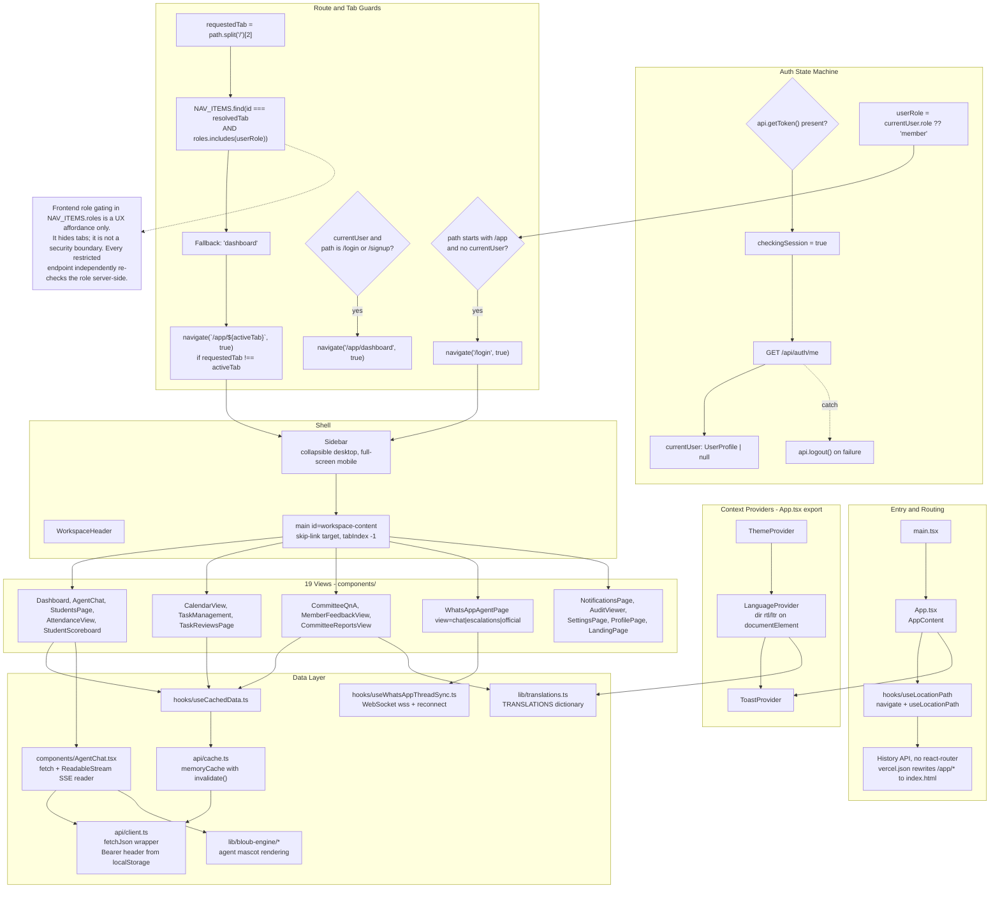

# 06 — Frontend

> All claims **[VERIFIED]** against `frontend/src/` unless tagged. ~18,200 lines of TypeScript/TSX across 60+ files.

## 1. Stack

| Concern | Choice | Source |
|---|---|---|
| Framework | React 19 | `package.json` |
| Language | TypeScript, strict | `tsconfig.json` |
| Build | Vite | `vite.config.ts` |
| Styling | Tailwind CSS, light-mode SaaS palette | `tailwind.config.js`, `index.css` |
| Icons | Lucide React | `package.json` |
| Routing | **None.** Hand-rolled History API | `hooks/useLocationPath.ts` |
| Server state | Hand-rolled `fetch` wrapper + in-memory cache | `api/client.ts`, `api/cache.ts` |
| Global state | React Context (3 providers) | `context/` |
| i18n | Static dictionary, no library | `lib/translations.ts` |
| Markdown | `MarkdownRenderer.tsx` | Agent responses |

**No React Router, no TanStack Query, no Zustand, no i18n library, no component library.** Every one of those is a hand-rolled module in `src/`. **[VERIFIED]**

## 2. Module map



*How a route becomes a rendered view, and where data enters the app. Use it to trace a new page from URL to component.*

Standalone source: [`diagrams/06-frontend-modules.mmd`](diagrams/06-frontend-modules.mmd)

## 3. Directory layout

```
frontend/src/
├── main.tsx                  Entry, mounts <App/>
├── App.tsx                   Providers + auth state machine + view switch
├── index.css                 Tailwind base, rtl-layout rules
├── api/
│   ├── client.ts             fetchJson wrapper + typed endpoint methods (393 lines)
│   ├── cache.ts              In-memory cache with invalidation
│   └── ...                   Barrel exports
├── components/
│   ├── ui/                   Button, Card, Badge, Modal, Menu, ProgressBar, MarkdownRenderer
│   ├── auth/                 AuthLayout, LoginPage, RegisterPage
│   ├── Sidebar.tsx           NAV_ITEMS definition + navigation (392 lines)
│   ├── WorkspaceHeader.tsx   Top bar, language/theme toggles (288 lines)
│   ├── bloub-engine/         Agent mascot (see §7)
│   └── ...                   19 view components
├── context/
│   ├── ThemeContext.tsx      Light/dark
│   ├── LanguageContext.tsx   en/ar, direction, document attributes
│   └── ToastContext.tsx      Transient notifications
├── hooks/
│   ├── useLocationPath.ts    History API routing
│   ├── useCachedData.ts      Cache-aware fetch hook
│   ├── useWhatsAppThreadSync.ts  WebSocket lifecycle
│   ├── useAgentMascotState.ts    Mascot expression state machine
│   └── ...
├── lib/
│   ├── translations.ts       TRANSLATIONS dictionary (212 lines)
│   ├── bloub-engine/         Mascot rendering engine (~2,800 lines)
│   └── ...
└── types/index.ts            Shared TS interfaces (373 lines)
```

## 4. Routing

### Mechanism

There is no router. `hooks/useLocationPath.ts` wraps `window.location.pathname` and `history.pushState`/`replaceState`, exposing `useLocationPath()` and `navigate(path, replace?)`. **`App.tsx` subscribes to `popstate` indirectly** — the hook re-reads on navigation. **[VERIFIED]**

Server-side, `vercel.json` rewrites `/app`, `/app/(.*)`, `/login`, `/signup`, `/signin`, `/sign-in`, `/sign-up`, `/register` to `/index.html` so a hard refresh or a direct link works.

### Route table

| Path | Rendered | Guard |
|---|---|---|
| `/` | `LandingPage` | none |
| `/login` | `LoginPage` | Redirects to `/app/dashboard` if already signed in |
| `/signup` | `RegisterPage` | Same |
| `/app/dashboard` | `Dashboard` | Requires `currentUser` |
| `/app/chat` | `AgentChat` | + role in NAV_ITEMS |
| `/app/students` | `StudentsPage` | + role |
| `/app/attendance` | `AttendanceView` | + role |
| `/app/scoreboard` | `StudentScoreboard` | + role (403 server-side) |
| `/app/calendar` | `CalendarView` | + role |
| `/app/tasks` | `TaskManagement` | + role |
| `/app/task-reviews` | `TaskReviewsPage` | + role |
| `/app/qna` | `CommitteeQnA` | + role |
| `/app/feedback` | `MemberFeedbackView` | + role |
| `/app/reports` | `CommitteeReportsView` | + role |
| `/app/inbox` | `WhatsAppAgentPage view="chat"` | + role |
| `/app/follow-ups` | `WhatsAppAgentPage view="escalations"` | + role |
| `/app/channel-settings` | `WhatsAppAgentPage view="official"` | + role (2 roles) |
| `/app/settings` | `SettingsPage` | + role |
| `/app/notifications` | `NotificationsPage` | + role |
| `/app/audit` | `AuditViewer` | + role (2 roles) |
| `/app/profile` | `ProfilePage` | + role |
| `/app/whatsapp` | Alias of `inbox` | Normalised at `App.tsx:33` |
| anything else | 404 block | |

Unknown `/app/*` tabs resolve to `'dashboard'` via `NAV_ITEMS.find(...)?.id || 'dashboard'`, then a `useEffect` rewrites the URL.

## 5. Role-based guards

`NAV_ITEMS` in `components/Sidebar.tsx:65-186` pairs each tab with an allowed-role array. `App.tsx:34` resolves the active tab and redirects if the user lacks the role.

```typescript
const activeTab: Tab =
  NAV_ITEMS.find(item => item.id === resolvedTab && item.roles.includes(userRole))?.id
  || 'dashboard';
```

**This is a UX affordance, not a security boundary.** It hides sidebar entries and rewrites URLs, but every restricted endpoint independently re-checks the role server-side (see [04-authorization.md](04-authorization.md)). A user who hand-edits the URL is redirected to the dashboard; a user who calls the API directly gets a 403.

| Tab | Roles |
|---|---|
| `dashboard`, `attendance`, `calendar`, `tasks`, `notifications`, `profile` | All eight |
| `chat`, `students`, `scoreboard`, `inbox`, `follow-ups` | The six HR/lead roles (no members) |
| `task-reviews` | `committee_head`, `hr_admin`, `team_lead` |
| `qna` | `committee_head`, `committee_member`, `member`, `committee_hr_leader`, `hr_admin`, `team_lead`, `region_hr_head` — **note: no `committee_hr_member`** |
| `feedback` | `committee_member`, `member`, `committee_hr_leader`, `region_hr_head`, `hr_admin` |
| `reports` | `committee_hr_leader`, `region_hr_head`, `hr_admin` |
| `channel-settings` | `region_hr_head`, `hr_admin` (`CHANNEL_ADMIN_ROLES`) |
| `audit` | `region_hr_head`, `hr_admin` |

**Divergence from the API:** `qna` omits `committee_hr_member`, but `GET /api/questions` explicitly includes them. An HR member can read the Q&A API but has no tab for it. **[VERIFIED]** `Sidebar.tsx:123` vs `routes_questions.py:94`

## 6. State management

### Context providers (3)

| Provider | Manages | Persistence |
|---|---|---|
| `ThemeProvider` | Light/dark mode | `localStorage` |
| `LanguageContext` | `en`/`ar`, `direction`, `isRtl`, `t()` | `localStorage` key `studentops_language` |
| `ToastProvider` | Transient notifications | none |

`LanguageContext` sets `document.documentElement.dir = 'rtl'|'ltr'` and `.lang`, and toggles a `rtl-layout` class on `<body>`. **[VERIFIED]** `LanguageContext.tsx:40-50`

### Auth state

A `useState` machine in `AppContent`, not a context. On mount, if a token exists, `api.getMe()` runs; on failure the app calls `api.logout()` and clears the user. The resolved `userRole` drives the tab resolution. **[VERIFIED]** `App.tsx:30-70`

### Server data

`api/client.ts` exposes a typed method per endpoint. `fetchJson` adds `Content-Type` and `Authorization: Bearer {localStorage token}`, throws `new Error(err.detail)` on non-2xx, and **clears stored auth on any 401**. **[VERIFIED]** `client.ts:70-93`

`api/cache.ts` is an in-memory cache with `invalidate(key)`. Mutating methods call it explicitly — `createStudent` invalidates `students`, `updateBehaviorScore` invalidates `scoreboard` and `students`. **[VERIFIED]**

**No token refresh.** The client stores only `access_token` and `user`; `refresh_token` is discarded at login. When the 30-minute access token expires, the next 401 clears the session and the user is bounced to `/login`. There is no silent-renewal path, even though the backend implements full rotation. **[VERIFIED]** `client.ts:104-116`

**Tokens live in `localStorage`** under `studentops_access_token` and `studentops_user` — readable by any XSS. Discussed in [04-authorization.md](04-authorization.md) finding 13.

## 7. Agent chat and the SSE consumer

`components/AgentChat.tsx` (398 lines) is the most intricate component.

### Send flow

1. Append a user message; optimistically append an empty streaming assistant message and resolve its index.
2. Create an `AbortController` stored in a ref, and `fetch` `${API_BASE}/agent/stream` with a Bearer header and an optional `conversation_id`.
3. On `!res.ok`, throw — 401 gets a specific "session expired" message.
4. `res.body.getReader()`, decode with `TextDecoder({stream: true})`, split on `\n\n`, keep the trailing partial.
5. For each `data: ` frame: `token` appends to a buffer flushed on a **40 ms timer**; `tool` / `done` / `error` flush immediately and mutate message state.

### Rendering

- `MarkdownRenderer.tsx` renders assistant text.
- `AgentMascot.tsx` + `lib/bloub-engine/` (~2,800 lines across 9 modules: `shape`, `face`, `expressions`, `states`, `decor`, `eyefit`, `cycles`, `engine`, `skins`) draw the mascot. `useAgentMascotState.ts` maps agent state to an expression.
- Tool traces render as chips showing `tool_name`, `status`, and `reasoning_summary`.
- A `done` event with `requires_confirmation: true` renders a Confirm and Send control wired to `api.confirmAction(action_id, confirmed)`.

**Only `/api/agent/stream` is used.** `api.sendAgentQuery` (the non-streaming `/agent/chat`) exists in the client but is not called by `AgentChat.tsx`.

## 8. i18n and RTL

### Mechanism

`lib/translations.ts` exports a `TRANSLATIONS` dictionary keyed by language. `LanguageContext` exposes `t(key)`. **212 lines** — a small, hand-maintained dictionary for static UI chrome.

**Content data is not translated.** Student names arrive with both `full_name` and `arabic_name`; components choose which to display. Backend-generated strings (agent responses, reminder templates, seeded data) carry both languages inline — e.g. the `DEFAULT_ATTENDANCE_TEMPLATE` is Arabic-only while `wa.me` links in `routes_whatsapp.py:196-250` are bilingual in one message. **[VERIFIED]**

### RTL

- `documentElement.dir` and `.lang` are set on language change.
- `rtl-layout` is toggled on `<body>`.
- Arabic inputs use `font-['Cairo']` and `dir="rtl"`.
- Layout is logical-property driven in most components.

**Verification needed:** RTL is applied globally but per-component correctness is not covered by the 9 test files, none of which exercise Arabic. **[VERIFIED]** by inspection of the test file list.

## 9. Real-time WhatsApp

`hooks/useWhatsAppThreadSync.ts` (154 lines) opens a WebSocket to `getWhatsAppWebSocketUrl()`:

```
wss://{host}{API_BASE}/whatsapp/ws?token={accessToken}
```

It handles the `"ping"` → `"pong"` keepalive, applies live message events to thread state, and reconnects. `handle_dialog`-style server disconnects with code 1008 (policy violation) are surfaced as an auth error. **[VERIFIED]** `client.ts:385-393`, `useWhatsAppThreadSync.ts`

**The token is in the query string**, so it is visible in `document.location` and any intermediary log. Mirrors the backend finding in [04-authorization.md](04-authorization.md) finding 3.

## 10. Tests

Nine Vitest / Testing Library files:

| File | Focus |
|---|---|
| `Auth.test.tsx` (293) | Login, register, session restore, logout |
| `WorkspaceHeader.test.tsx` (498) | Header controls, language/theme toggles |
| `WhatsAppChatWindow.test.tsx` (144) | Thread rendering |
| `WhatsAppAgentPage.test.tsx` (200) | Inbox and escalation views |
| `useWhatsAppThreadSync.test.tsx` (132) | WebSocket lifecycle |
| `StudentsPage.test.tsx` (144) | Student list and modals |
| `Dashboard.test.tsx` (132) | Stat rendering |
| `ProfilePage.test.tsx` (280) | Profile view |
| `Sidebar.test.tsx` (239) | Navigation and role filtering |

**Not covered:** `AgentChat.tsx` SSE consumption, the RTL layout, `MemoryRenderer`, `bloub-engine`, and the `useCachedData` invalidation logic. Per `AGENTS.md`, components that render both a desktop and a mobile variant require `getAllByText` in tests — the existing files follow this.

## 11. Gaps and open questions

| # | Item | Severity |
|---|---|---|
| 1 | No token refresh on the client. `refresh_token` is discarded at login, so every session hard-expires after `ACCESS_TOKEN_EXPIRE_MINUTES` (30 by default, 1440 in `.env.example`) and bounces the user to `/login`. The backend rotation is fully implemented and unused. | **High (UX)** |
| 2 | Tokens in `localStorage`, exposed to any XSS. No CSRF token, no httpOnly cookie option. | Medium |
| 3 | `AgentChat.tsx` SSE consumption is untested — the most complex client code in the app. | Medium |
| 4 | RTL is applied globally but never tested. | Medium |
| 5 | `App.tsx` is a single ~200-line switch with 19 conditional branches. A route table would be cleaner. | Low |
| 6 | `NAV_ITEMS.roles` for `qna` omits `committee_hr_member` while the API includes them. | Low |
| 7 | No error boundary. An exception in any view unmounts the whole app. | Medium |
| 8 | `api/cache.ts` invalidation is manual per call site; a new mutating endpoint that forgets to invalidate will serve stale data. | Low |
| 9 | `getWhatsAppWebSocketUrl()` puts the token in the URL. | Medium |
| 10 | `bloub-engine` is ~2,800 lines of procedural mascot rendering — a large share of the bundle for a decorative feature, with no code splitting. | Low |
| 11 | The WebSocket token is re-read from `localStorage` at connect time; a token expiring mid-connection is not detected until a message fails. | Low |
| 12 | No `React.lazy` — all 19 views and the mascot engine load in the initial bundle. | Low |
