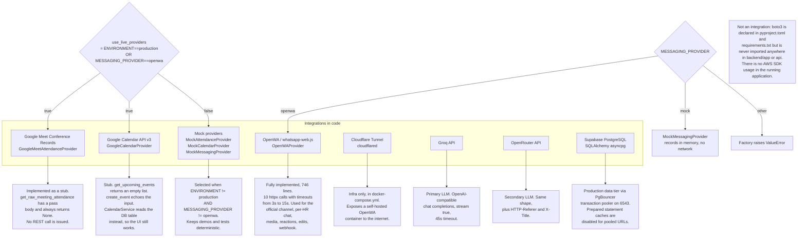

# 07 — External Integrations

> All claims **[VERIFIED]** against `backend/app/providers/`, `backend/app/services/`, and `docker-compose.yml` unless tagged.

## 1. Correction to the design notes

The brief states "The project uses the AWS SDK (boto3)". It does not.

`boto3>=1.35.0` is declared in `backend/pyproject.toml:15` and pinned to `1.43.80` in `backend/requirements.txt:19`, and `uv.lock` resolves it. But a search across `backend/app/` and `api/` finds **zero occurrences of `import boto3` or any boto3 API call**. No S3, no DynamoDB, no Secrets Manager, no STS. The only place `boto3` appears in the tree is inside `.venv/site-packages/` and `pydantic_settings`' optional `aws-secrets-manager` extra.

The four `SUPABASE_*` settings in `config.py:30-33` and `.env.example:18-21` are also **never read** by application code — Supabase is used purely as a hosted PostgreSQL provider reached through `DATABASE_URL`.

| Claim | Status |
|---|---|
| "The project uses the AWS SDK (boto3)" | **Incorrect.** Declared, never imported. **[VERIFIED]** |
| "Supabase" | A database host, not an API integration. No `supabase` package, no Auth, no Storage, no Realtime. **[VERIFIED]** |
| "Google Meet API" | A provider class exists with a **stub body**. No HTTP call. **[VERIFIED]** |
| "Google Calendar API" | Same — a provider class with stub bodies. **[VERIFIED]** |
| "WhatsApp" | Fully implemented against a self-hosted OpenWA gateway. **[VERIFIED]** |

## 2. Integration map



*Which integrations are real, which are stubs, and how the provider switch works. Use it before planning any integration work.*

Standalone source: [`diagrams/07-integrations.mmd`](diagrams/07-integrations.mmd)

## 3. Integration catalogue

| Integration | Module | State | Credentials | Network |
|---|---|---|---|---|
| OpenWA WhatsApp gateway | `providers/openwa_provider.py` (746 lines) | **Live** | `OPENWA_API_KEY`, `OPENWA_WEBHOOK_SECRET` | `OPENWA_API_URL` |
| Groq LLM | `agent/react_agent.py` | **Live** (when `GROQ_API_KEY` set) | `GROQ_API_KEY` | `GROQ_BASE_URL` |
| OpenRouter LLM | `agent/react_agent.py` | **Live** (fallback) | `OPENROUTER_API_KEY` | `OPENROUTER_BASE_URL` |
| Supabase PostgreSQL | `core/database.py` | **Live** | Embedded in `DATABASE_URL` | Port 6543 pooler |
| Google Meet | `providers/attendance_provider.py` | **Stub** | `GOOGLE_CLIENT_ID` / `GOOGLE_CLIENT_SECRET` (declared, unused) | none |
| Google Calendar | `providers/calendar_provider.py` | **Stub** | same | none |
| Cloudflare Tunnel | `docker-compose.yml` | **Infra only** | `CLOUDFLARE_TUNNEL_TOKEN` | Outbound tunnel |
| Mock providers | three files | **Live in dev** | none | none |

## 4. OpenWA (WhatsApp) — the only fully implemented integration

### Purpose

Three distinct functions:

1. **Official channel** — an organization-level WhatsApp number (`ops_official`) used for broadcasts and automated reminders.
2. **Per-HR chat** — each HR member gets their own session (`hr_{user.id}`) so conversations with their assigned members are separate from the official channel.
3. **Inbound webhook** — OpenWA pushes message, ack, reaction, and edit events to `POST /api/whatsapp/webhook`.

### Auth

| Mechanism | Value |
|---|---|
| Outbound | `OPENWA_API_KEY` sent as a header on every request to `OPENWA_API_URL` |
| Inbound | `OPENWA_WEBHOOK_SECRET` compared against the `X-Webhook-Secret` header |
| Pairing | QR code fetched from `GET /api/whatsapp/qr`, rendered in the UI, scanned by a phone |

**Webhook verification is a plain string comparison** (`provided_secret != configured_secret`) — not a constant-time compare. A timing side channel exists in principle; the practical risk over a network is low. **[VERIFIED]** `routes_whatsapp.py:508`

If `OPENWA_WEBHOOK_SECRET` is unset, the webhook returns 401 for every request rather than accepting unauthenticated traffic. That is the correct fail-closed behavior. **[VERIFIED]**

### Data exchanged

**Outbound:** phone number, message text, optional media as a base64 data URI, optional `reply_to_message_id`. **Inbound:** message id, sender phone, text, media metadata, timestamp, event type. The full inbound JSON is persisted verbatim in `whatsapp_chat_messages.raw_payload`. **[VERIFIED]**

**Phone resolution:** inbound `sender_phone` is normalized to E.164 by `format_phone_international` and matched against `students.phone`, then `student.assigned_hr_id` determines which HR member's socket receives the event. **[VERIFIED]** `whatsapp_service.py`

**Deduplication:** `openwa_message_id` is indexed but **not unique**. The upsert is a `SELECT` then insert-or-update, which races under concurrent webhook delivery. **[VERIFIED]**

### Timeouts and failure behavior

`openwa_provider.py` uses 10 separate `httpx` calls with explicit, short timeouts:

| Operation | Timeout |
|---|---|
| Status check | 4.0 s |
| QR fetch | 5.0 s |
| Send message | 3.0 s |
| Chat history | 4.0 s / 5.0 s |
| Media send | 10.0 s / 15.0 s |
| Reaction, edit | 6.0 s |

**Uncertain delivery is modelled explicitly.** `MessageDeliveryResult` carries `delivery_status` (`DELIVERED` / `UNKNOWN_PENDING` / `CONFIRMED_FAILED`) and `is_uncertain`. On a timeout, `POST /api/whatsapp/send-official` returns **HTTP 200 with `is_uncertain: true`** rather than 502, specifically so a client retry loop does not double-send. `ReminderService` maps this to `ReminderLog.status = "UNKNOWN_PENDING"`. This is a well-designed choice and is covered by `tests/unit/test_openwa_timeout_safety.py`. **[VERIFIED]**

**Outbound throttling:** `_throttle_outbound(min_interval=1.0, max_jitter=0.5)` sleeps between sends to avoid WhatsApp rate limits. **[VERIFIED]**

**Not implemented:** retry with backoff, a dead-letter queue, or delivery-status reconciliation beyond the ack events.

### Rate limits

**No application-level limit.** Throttling is a fixed 1 s ± 0.5 s sleep per outbound message. There is no quota, no circuit breaker, and no global concurrency cap. WhatsApp's own limits apply.

### Gateway deployment

```yaml
openwa:
  image: openwa/wa-automate:latest
  ports: ["2785:2785"]
  environment:
    - PORT=2785
    - AUTH_KEY=${OPENWA_API_KEY:-dev_openwa_key_change_in_prod}
  volumes: [openwa_data:/home/node/app/session]
```

The `openwa_data` volume persists the WhatsApp Web.js session, so the pairing survives restarts. **[VERIFIED]**

**`AUTH_KEY` defaults to `dev_openwa_key_change_in_prod` if `OPENWA_API_KEY` is unset.** In a production compose run without the variable set, the gateway comes up with a known key. **[VERIFIED]** `docker-compose.yml:12`

### Critical deployment constraint

`api/index.py` runs the app on Vercel serverless. **A Vercel function cannot reach a container on localhost:2785 of the developer's machine.** For a real deployment, either:

- Run the whole stack on a long-lived host, or
- Expose OpenWA publicly through the Cloudflare Tunnel and set `OPENWA_API_URL` to that public hostname.

The `tunnel` service in `docker-compose.yml` exists for this. **[INFERRED]** from the compose file plus `vercel.json`

## 5. LLM providers

### Groq (primary)

```
POST {GROQ_BASE_URL}/chat/completions
Authorization: Bearer {GROQ_API_KEY}
{"model": GROQ_MODEL, "messages": [...], "stream": true}
```

Default model `openai/gpt-oss-120b`. Timeout 45 s. SSE parsing reads `data: ` lines, breaks on `[DONE]`, and extracts `choices[0].delta.content`. Malformed chunks are skipped, not fatal. **[VERIFIED]**

If `GROQ_API_KEY` is unset, `stream_groq` returns immediately with zero tokens, which the caller correctly interprets as a failure and escalates to OpenRouter. **[VERIFIED]**

### OpenRouter (secondary)

Same shape, plus `HTTP-Referer: https://studentops.ai` and `X-Title: StudentOps AI`. Default model `nvidia/nemotron-3-super-120b-a12b:free`.

**Tier 3 is a local string, not a model.** If both providers fail, the agent yields a fixed bilingual message stating it is in local deterministic mode. It does not answer the question. **[VERIFIED]**

### Failure behavior

| Condition | Result |
|---|---|
| Groq raises | Falls through to OpenRouter |
| Groq returns 0 tokens | Falls through to OpenRouter |
| OpenRouter 429 | Retries Groq once |
| OpenRouter non-200 | Retries Groq once |
| All fail | Tier 3 fixed text |
| `call_openrouter` (non-streaming) raises | Returns `f"Local agent mode active: {str(e)}"` — **leaks the exception text** |

**No retry with backoff, no timeout on the first token (only on the whole request), no circuit breaker, no cost tracking.** The 45 s timeout applies to the entire stream, so a long generation can be cut off mid-answer. **[VERIFIED]**

### Rate limits

None enforced beyond `rate_limit_agent` (25/min per IP). Both providers are used with `:free` tier models, which have aggressive third-party limits — the code explicitly handles 429.

## 6. Google Meet and Calendar — stubs

### `GoogleMeetAttendanceProvider`

```python
async def get_raw_meeting_attendance(self, meeting_code: str) -> Optional[RawMeetingAttendance]:
    # If Google credentials are not configured, fallback gracefully or raise structured error
    try:
        # Google Meet REST API v2 conferenceRecords client can be invoked here
        pass
    except Exception as e:
        return None
    return None
```

**[VERIFIED]** `attendance_provider.py:40-48`. The `except` clause is unreachable and `credentials_path` is never populated from settings.

**Consequence:** in any environment where `use_live_providers` is true (i.e. `ENVIRONMENT=production`), `get_raw_meeting_attendance` returns `None`, so `process_meeting_attendance` finds no sessions, marks every assigned student `UNEXCUSED_ABSENT`, and creates a follow-up flag for each. **Running the live provider in production silently mass-flags the entire organization as absent.** **[INFERRED]** from `attendance_service.py:104-140` plus the stub.

### `GoogleCalendarProvider`

`get_upcoming_events` returns `[]`; `create_event` echoes its input. **[VERIFIED]** `calendar_provider.py:35-46`

**Consequence:** none, because `CalendarService.get_upcoming_events` reads the local `events` table and never delegates reads to the provider. Only `create_event` calls the provider, and it is a no-op. The calendar UI works entirely off the database.

### `GOOGLE_CLIENT_ID` / `GOOGLE_CLIENT_SECRET` / `GOOGLE_CALENDAR_ID`

Declared in `config.py:61-63` and `.env.example`, **never read** by any provider. No OAuth flow, no service-account credentials, no refresh-token handling exists.

## 7. Mock providers

| Provider | Behavior |
|---|---|
| `MockAttendanceProvider` | Two hard-coded meetings (`today_sync`, `camp_day_1`) with three participants each, one of whom is deliberately absent to demonstrate the absent path |
| `MockCalendarProvider` | Three events generated relative to `now()`: a sync today, a follow-up in 2 days, a deadline in 3 days |
| `MockMessagingProvider` | Records `sent_messages` in memory with `get_history()`; no network |

**Selection logic** (`tools.py:37-38`):

```python
use_live_providers = (
    settings.ENVIRONMENT.lower() == "production"
    or settings.MESSAGING_PROVIDER.lower() == "openwa"
)
```

So live providers are chosen in production **or** whenever messaging is set to openwa. This couples two unrelated concerns: setting `MESSAGING_PROVIDER=openwa` silently switches the **Google** providers to live too. **[VERIFIED]**

**Evaluated at import time.** Changing the setting requires a process restart. **[VERIFIED]**

`MockMessagingProvider` instances are created fresh by `get_messaging_provider()` on every call, so `get_history()` is per-call and the record is not retained across requests — the mock's history is effectively unobservable from the API. **[VERIFIED]**

## 8. Supabase

| Aspect | Value |
|---|---|
| Role | Hosted PostgreSQL only |
| Connection | `postgresql+asyncpg://...@aws-1-....pooler.supabase.com:6543/postgres` |
| Pooler | PgBouncer **transaction** mode |
| Driver adjustments | `statement_cache_size = 0` and `prepared_statement_cache_size = 0` when the host contains `pooler.supabase.com` or the URL contains `6543` |
| Pool | `pool_pre_ping=True`, `pool_recycle=300` |

**[VERIFIED]** `core/database.py:41-52`

`SUPABASE_URL`, `SUPABASE_PUBLISHABLE_KEY`, `SUPABASE_SECRET_KEY`, `SUPABASE_JWKS_URL` are declared and unused. No Supabase Auth (the app has its own bcrypt + JWT), no Supabase Storage (`file_url` is a bare string, not a storage key), no Supabase Realtime (the WebSocket is custom).

The `SUPABASE_SECRET_KEY` variable is a **server-side** secret that should not exist in a client context. It is declared but never used — remove it rather than populate it. **[VERIFIED]**

## 9. Data flow summary

| Integration | Student PII crosses? | Notes |
|---|---|---|
| OpenWA | **Yes** — phone numbers, message bodies, media | Persisted in `whatsapp_chat_messages` with no retention policy |
| Groq / OpenRouter | **Partially** — the LLM receives conversation history, which on the deterministic path contains no student data at all | Tool results are never appended to LLM history, so a member's name does not reach the model |
| Google Meet | Participant display names and emails | Stored raw in `participant_sessions`; the provider is a stub, so nothing is fetched |
| Google Calendar | Would exchange event titles and times | Stub |
| Supabase | Everything | Standard TLS on 6543 |

**The strongest data-minimization property: the LLM never sees student records.** On the deterministic path, tool results are formatted into Python strings, never sent to a model. On the LLM path, `history` contains only the user's own typed messages. **[VERIFIED]**

## 10. Gaps and open questions

| # | Item | Severity |
|---|---|---|
| 1 | `GoogleMeetAttendanceProvider` is a stub. In production `use_live_providers` is true, so every reprocess marks every student `UNEXCUSED_ABSENT` and creates a follow-up flag. A silent, organization-wide data corruption path. | **High (functional)** |
| 2 | `GoogleCalendarProvider` is a stub. Harmless because reads bypass it, but `create_event` silently does nothing to Google. | Medium |
| 3 | `boto3` is a declared dependency with no usage. Remove it, or finish the intended AWS work. | Low |
| 4 | The four `SUPABASE_*` settings are declared and never read. `SUPABASE_SECRET_KEY` in particular should not exist if unused. | Low |
| 5 | `docker-compose.yml` defaults `AUTH_KEY` to a known development string. A production compose run without the variable gets an open gateway. | **High (security)** |
| 6 | Webhook secret comparison is a plain `!=`, not `hmac.compare_digest`. | Low |
| 7 | `openwa_message_id` is indexed but not unique; webhook dedup races. | Medium |
| 8 | Media is base64 in a `Text` column with no size limit. | Medium |
| 9 | No retry, backoff, or circuit breaker for any external call. The LLM cascade is a one-shot chain. | Medium |
| 10 | The 45 s timeout covers the entire LLM stream, so long answers can be truncated. | Low |
| 11 | Provider selection happens at import time and couples the Google providers to `MESSAGING_PROVIDER`. | Medium |
| 12 | `MockMessagingProvider` is re-instantiated per request, so its history is unobservable. | Low |
| 13 | No delivery-status reconciliation job; `UNKNOWN_PENDING` messages are never resolved. | Low |
| 14 | OpenWA must be reachable from the deployment — impossible from Vercel serverless without a tunnel. | **High (deployment)** |
